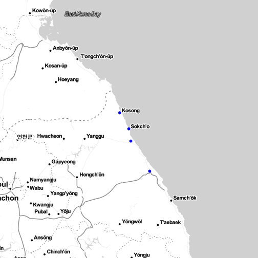

> ## 학습 목표 {.objectives}
>
> *  한국지명을 지리정보(위도, 경도)로 변환한다. [^geoCodingWithR]
> * `leaflet` 팩키지를 활용하여 지리정보를 시각화한다.

### 한국지명을 지리정보로 변환

#### 구글 지도정보 API 

한국지명을 전달하면 위도, 경도 정보를 반환하는 API로 [구글 지도 API](https://developers.google.com/maps/?hl=ko)를 사용한다.
`library(ggmap)` 팩키지를 불러오면 `geocode` 함수가 지명을 받아 위도, 경도 정보를 반환한다.


```r
library(ggmap)
library(ggplot2)
geocode(enc2utf8("속초"), source='google')
```

```
FALSE        lon      lat
FALSE 1 128.5918 38.20701
```

주소정보를 함께 출력하고자할 경우 `output="latlona"` 선택옵션을 추가한다.


```r
#geocode(enc2utf8("속초"), source='google', output="latlona")
geocode(enc2utf8("속초&language=ko"), source='google', output="latlona")
```

```
FALSE        lon      lat                address
FALSE 1 128.5918 38.20701 대한민국 강원도 속초시
```
`"속초"`를 `geocode` 함수 인자로 넣은 경우와 `"속초&language=ko"` 넣어 함께 넘긴 경우 한글주소로 출력되게 한다.

#### 다수 한글지명을 구글 지도 API 에 넘겨 위경도 정보 받아오기 

`mutate_geocode` 함수를 사용해서 위경도 정보를 일괄적으로 받아와서 R 객체로 저장한다.


```r
library(dplyr)
df <- data.frame(city=c("속초", "강릉", "양양", "간성"), stringsAsFactors = FALSE)
df.yd <- df %>% mutate_geocode(city)
```
영동지방 4개 지역에 대한 정보를 받아온다. 받아온 정보를 `df.yd` 데이터프레임에 저장하고 이를 활용하여 구글지도에 시각화를 한다.


```r
youngdongMap <- qmap(enc2utf8("속초"), zoom = 8, maptype = "toner-lite")

youngdongMap + geom_point(data = df.yd, aes(lon,lat), size = 2, colour="blue")
```



### `leaflet` 팩키지 


GoogleVis [^googlevis],  전세계 원자력 발전소 위치 [^powerplant]


[^googlevis]: [Plotting geo-spatial data on Google Maps in R](http://diggdata.in/post/51396519384/plotting-geo-spatial-data-on-google-maps-in-r)
[^powerplant]: [Nuclear Power plants](https://www.google.com/fusiontables/exporttable?query=select%20*%20from%201u4krB7NJ0Ppwzcd5h7uwOak3Reja4A7yVFIklw)
[^geoCodingWithR]: [GeoCoding with R](http://lumiamitie.github.io/r/geocoding-with-r-02/)
