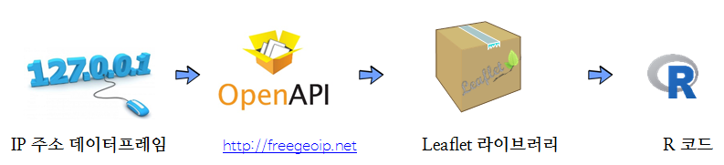

```{r  include = FALSE}
library(rjson)
source("tools/chunk-options.R")
knitr::opts_chunk$set(error = TRUE)
library(tidyverse)
```

> ## 학습 목표 {.objectives}
>
> * IP주소를 사용하여 접속위치를 시각적으로 표현한다.
> * IP 접속정보를 서비스 혹은 R 팩키지를 통해 위경도 정보로 변환한다.
> * `leaflet` 팩키지를 활용하여 인터랙티브 추가 분석을 실시한다.

## 1. 작업 흐름

IP주소 정보가 있으면 [GitHub freegeoip](https://github.com/fiorix/freegeoip) 혹은 
[freegeoip](http://freegeoip.net/) 웹서비스에 제공하는 오픈 API를 활용하여 위경도 정보로 변환하고 이를 
지리정보 시각화 팩키지를 활용하여 기능을 구현한다.

R 팩키지로 [IPtoCountry: Convert IP Addresses to Country Names or Full Location with Geoplotting](https://cran.r-project.org/web/packages/IPtoCountry/index.html)도 준비되어 있어
상황에 맞춰 활용하면 좋다. [freegeoip](http://freegeoip.net/)는 서비스 형태로 제공되고, [IPtoCountry](https://cran.r-project.org/web/packages/IPtoCountry/index.html)는 
데이터베이스가 통째로 설치된다는 점에서 차이가 있을 뿐 IP 주소를 받아 사람이 인식할 수 있는 익숙한 형태로 제공된다는 점에서는 차이가 없다.




## 2. API 서비스 활용방법

### 2.1. IP 주소에서 지리정보 추출 [^extract-geo-info-from-ip-address]

[^extract-geo-info-from-ip-address]: [Geolocate IP addresses in R](https://heuristically.wordpress.com/2013/05/20/geolocate-ip-addresses-in-r/)

IP 주소에서 지리정보를 추출한 R 함수는 다음과 같다.
`rjson` 팩키지를 사용해서 오픈 API의 정보를 받아오고 이를 데이터프레임으로 결과값을 받아온다.
`ip` 주소가 하나가 아닌 다수의 경우 각각의 정보를 행으로 받아와서 `rbind` 함수로 차곡차곡 쌓는 로직이다.

``` {r }
freegeoip <- function(ip, format = ifelse(length(ip)==1,'list','dataframe'))
{
    if (1 == length(ip))
    {
        # a single IP address
        require(rjson)
        url <- paste(c("http://freegeoip.net/json/", ip), collapse='')
        ret <- fromJSON(readLines(url, warn=FALSE))
        if (format == 'dataframe')
            ret <- data.frame(t(unlist(ret)))
        return(ret)
    } else {
        ret <- data.frame()
        for (i in 1:length(ip))
        {
            r <- freegeoip(ip[i], format="dataframe")
            ret <- rbind(ret, r)
        }
        return(ret)
    }
}   

freegeoip('221.153.21.29')
```

### 2.2. IP 정보를 `leaflet` 팩키지로 시각화

IP 정보를 `leaflet` 팩키지로 시각화하는 코드는 다음과 같다.

``` {r, geo-ip-leaflet}
# 데이터프레임을 생성
ip_df <- data.frame(date=c("2016-01-27", "2016-03-17", "2016-05-25"), ip_addr = c("125.139.114.72", "211.219.36.134", "121.187.179.223"), stringsAsFactors = FALSE)

# 위경도 정보를 오픈 API 요청 및 결과를 데이터프레임으로 저장
ip_geo_df <- freegeoip(ip_df$ip_addr)

#---------------------------------------------------------------------------------------------------
# IP 주소 위경도 정보 시각화
#---------------------------------------------------------------------------------------------------
suppressMessages(library(leaflet))
suppressMessages(library(ggmap))

ip_geo_df$latitude <- as.numeric(ip_geo_df$latitude)
ip_geo_df$longitude <- as.numeric(ip_geo_df$longitude)

m <- leaflet(data = ip_geo_df) %>% addTiles() %>%
  addMarkers(lng=~longitude, lat=~latitude, popup = ~as.character(ip), clusterOptions = markerClusterOptions())
m 

# library(htmlwidgets)
# saveWidget(widget=m,file="ip_addr_geo_info.html")
```

## 3. IPtoCountry 팩키지 데이터베이스 활용

### 3.1. `IPtoCountry` 팩키지 

`IPtoCountry` 팩키지는 [http://www.ip2location.com](http://www.ip2location.com)에서 제공하는 IP-Country 데이터베이스를 가져와서 제공하고 있다.
[IPtoCountry GitHub](https://github.com/gitronald/IPtoCountry) 사이트에 팩키지 활용에 대한 소품문(vignette)을 제공하고 있다.

- IP_split()
- IP_lookup()
- IP_country()
- IP_location()

`IPtoCountry` 팩키지를 활용하여 지리정보를 불러오는 방식은 `IP_location()` 함수에 IP 주소를 던지고 나서 결과값을 병합한다.
데이터프레임을 leaflet 에 던져 지리정보로 시각화한다.


``` {r iptocountry}
# 3. Combine IP country code ------------------------------------------------
library(IPtoCountry)
# devtools::install_github("gitronald/ip2locationData")
library(ip2locationData)


ip_country_map_df <- IP_location(ip_df$ip_addr)

ip_map_df <- bind_cols(ip_df, ip_country_map_df) %>% 
    mutate(lat = as.numeric(as.character(lat)),
           long = as.numeric(as.character(long)))

# 4. Leaflet 시각화 ----------------------------------------------------

m <- leaflet(data = ip_map_df) %>% 
    addTiles() %>% 
    addMarkers(lng=~long, lat=~lat, 
               popup = ~ as.character(paste0("<strong>IP & Info</strong><br><br>", 
                                             "&middot; IP_ADDR: ", ip_addr, "<br>", 
                                             "&middot; Country: ", country, "<br>", 
                                             "&middot; Region: ", region, "<br>", 
                                             "&middot; city:  ", city, "<br>",
                                             "&middot; zip:  ", zip, "<br>")), clusterOptions = markerClusterOptions())
m 
```

