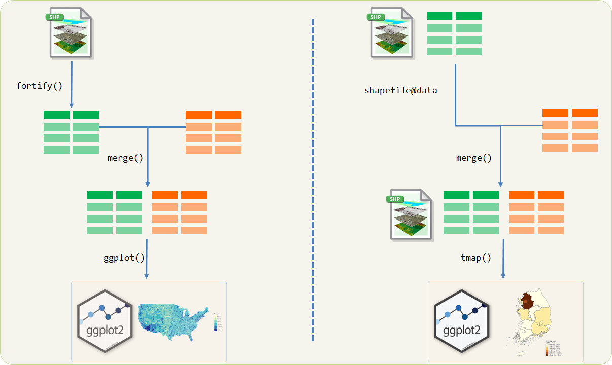

```{r  include = FALSE}
source("tools/chunk-options.R")
knitr::opts_chunk$set(error = TRUE)
```

> ## 학습 목표 {.objectives}
>
> *  공간자료(Spatial Data)와 자료구조를 이해한다.
> *  한국 주소명을 지리정보(위도, 경도)로 변환한다. [^geoCodingWithR]
> * `dplyr` 팩키지 `mutate_geocode` 위도경도 함수를 파이프연산자와 결합하여 코드를 간결화한다. 


## 1. 공간자료(Spatial Data)

좌표와 좌표기준계(coordinate reference system)를 활용하여 장소가 기술되는 자료를 공간자료(Spatial Data)라고 한다.
가장 흔히 알려진 좌표기준계는 위도와 경도를 활용하여 지구상 위치를 표식한 것이다.
보통 $x-$축 방향을 의미하는 경도(longitude)를 먼저 넣고 나서 $y-$축 방향을 나타내는 위도(latitude) 순으로 데이터를 분석한다.




공간자료를 R에서 작업하는 작업흐름은 크게 두가지가 있다.
이와 같은 작업흐름이 별도로 생겨나는 이유는 R 데이터프레임이 공간자료를 저장하기 적합하지 못하다는 내재적인 이유가 가장 크다.

- CSR(좌표기준계) 정보를 저장하는 방법이 데이터프레임에는 없다.
- 공간자료를 저장하기 위해서 반복적으로 데이터프레임에 저장하는 구조라 저장공간 낭비가 심하다.
- 공간자료를 표현하는 방법도 데이터프레임으로는 적절하지 못하다.

이런 이유로 인해서 `sp`, `raster` 팩키지를 데이터프레임과 붙여 사용한다. 즉, 지리정보는 `.shp` 파일에 담기고,
지도를 사용해서 정보로 표현하는 데이터는 데이터프레임에 담기게 된다. 따라서 데이터프레임 정보를 `.shp` 파일에 
녹여내기 위해서는 `merge()` 같은 병합연산자를 통해 합하는 과정이 수반된다. 

`.shp` 파일 중심으로 작업을 할 것인가? 데이터프레임 중심으로 작업을 할 것이냐에 따라 크게 두가지 작업흐름으로 나눠진다.

### 1.1. 데이터프레임 중심

지도관련 정보는 `.shp` 파일을 통해 얻고 이를 `fortify()` 함수를 사용해서 데이터프레임으로 변환한다.
이제 지도에 표시할 정보도 데이터프레임이고, `.shp` 파일도 데이터프레임이라 `left_join` 같은 병합 연산자를 
사용해서 통합 데이터프레임으로 생성시키고 나서 `ggplot` 그래픽 팩키지를 사용해서 마무리한다.

### 1.2. `.shp` 파일 중심

`.shp` 파일은 `shdf` 파일형태로 내부적으로 데이터프레임을 담고 있다. `@data` 명령어를 통해 접근할 수 있는데,
데이터프레임과 `.shp` 파일 `@data` 데이터프레임을 `merge()` 명령어로 병합시켜 데이터프레임이 포함된 `.shp` 파일을 생성시킨다.
그리고 나서 `tmap` 주제도를 활용하여 쉽게 시각화한다.

### 1. 지리정보 API - `geocode` 

데이터를 지리정보와 결합하여 제공할 경우 현상에 대한 이해, 예측, 통찰력을 얻을 수 있다.
데이터를 지리정보와 결합할 때, 가장 필요한 것이 주소정보에 위도와 경도 정보를 붙여 지도에 표시하게 된다.

주소정보가 제공되었을 때, 이에 해당되는 위도와 경도를 불러올 때 사용하는 것이 함수의 일종인 API다.
위경도 정보를 제공하는 업체로 구글, 네이버, 다음 등 여러 업체가 있다.

R에서 구글, 네이버, 다음등에서 제공하는 지리정보 API를 활용할 경우, 크게 두가지 방법이 존재한다. 
하나는 직접 구글, 네이버, 다음 지리정보 API 문서를 읽고 R코드로 작성하는 방식이 있고,
또 다른 하나는 `ggmap` 팩키지에서 이미 지리정보 API를 내재화해서 함수로 구현해 놓은 것을 호출해서 사용하는 방법이다.

한국주소를 전달하면 위도, 경도 정보를 반환하는 API로 [구글 지도 API](https://developers.google.com/maps/?hl=ko)를 기본으로 사용한다. 
`library(ggmap)` 팩키지를 불러오면 `geocode` 함수가 주소명을 받아 위도, 경도 정보를 반환한다.
하지만, Hadley Wickham이 관여한 팩키지는 [인코딩](encoding.html)으로 **utf-8**을 사용한다. 
따라서, 한국어는 `enc2utf8` 함수를 사용해서 인코딩을 바꿔 넣은 후에 `geocode` 함수에 인자로 넣어야 원하는 위도경도 정보를 반환받을 수 있다. 


``` {r geo-info, message=FALSE, warning=FALSE, comment=FALSE}
library(ggmap)
library(ggplot2)
geocode(enc2utf8("속초"), source='google')
```

주소정보를 함께 출력하고자할 경우 `output="latlona"` 선택옵션을 추가한다.

``` {r geo-info-call, message=FALSE, warning=FALSE, comment=FALSE}
#geocode(enc2utf8("속초"), source='google', output="latlona")
geocode(enc2utf8("속초&language=ko"), source='google', output="latlona")
```
`"속초"`를 `geocode` 함수 인자로 넣은 경우와 `"속초&language=ko"` 넣어 함께 넘긴 경우 한글주소로 출력되게 한다.


### 2. 한개 이상 주소정보에서 위도경도 정보 뽑아내기 

구글 지도 API를 사용할 경우, 무료로 이용할 수 있는 반면에 사용자의 오남용을 방지하기 위해서 어느 API 서비스도 마찬가지지만,
구글이나 API 서비스 제공자 임의로 API를 변경할 수 있고, 사용제한을 둔다.
현재 글을 작성하는 시점에서 구글 지도 API의 경우 일일 2,500 번 무료로 사용이 가능하다.

`geocodeQueryCheck(userType = "free")` 명령어를 사용하여 구글 지도 API 사용량을 확인할 수 있다.

``` {r geo-info-check}
geocodeQueryCheck(userType = "free")
```

경기도 및 강원도 3개 지점에 대한 위도경도 정보를 받아오는 경우, 먼저 데이터프레임을 생성하고 나서,
`enc2utf8()` 함수로 인코딩을 검증하고 나서 `geocode` API를 호출해서 위도경도 정보를 받아오면서
바로 데이터프레임에 붙인다.

``` {r geo-info-ggmap, message=FALSE, warning=FALSE, comment=FALSE}
library(ggmap)
library(ggplot2)
library(plyr)

geocodeQueryCheck(userType = "free")

kangwon.loc <- data.frame(addr=c("강원도 속초시 영랑동", 
                                 "경기도 의왕시 포일세거리로 73",
                                 "경기도 성남시 분당구 미금동"), stringsAsFactors = FALSE)

kangwon.loc$addr <- enc2utf8(kangwon.loc$addr)

kangwon.loc.latlon <- geocode(kangwon.loc$addr, source="google")

kangwon.loc.latlon <- with(kangwon.loc, data.frame(addr,
                                   laply(addr, function(val){geocode(val)})))

kangwon.loc.latlon  
```

`geocodeQueryCheck(userType = "free")` 명령어로 사용량이 3개 준 것을 확인할 수 있다.

``` {r geo-info-check2}
geocodeQueryCheck(userType = "free")
```

### 3. `dplyr` 함수를 활용한 더 간결한 코드

`dplyr`에서 제공하는 `mutate_geocode` 함수를 사용해서 위도경도 정보를 일괄적으로 받아와서 R 데이터프레임으로 저장한다.

``` {r message=FALSE, warning=FALSE, comment=FALSE}
library(dplyr)
kangwon.loc.dplyr <- kangwon.loc %>% mutate_geocode(addr)
kangwon.loc.dplyr
```

경기도와 강원도 3개 주소정보를 구글 지도 API 지역에 전달하여 위도와 경도정보를 받아와서 이를 데이터프레임에 붙인다.
받아온 정보를 `kangwon.loc.dplyr` 데이터프레임에 저장하고 이를 활용하여 구글지도에 시각화를 한다.

``` {r geo-info-qmap, message=FALSE, warning=FALSE, comment=FALSE}
kangwonMap <- qmap(enc2utf8("속초"), zoom = 8, maptype = "toner-lite")

kangwonMap + geom_point(data = kangwon.loc.dplyr, aes(lon,lat), size = 2, colour="blue")
```

[^geoCodingWithR]: [GeoCoding with R](http://lumiamitie.github.io/r/geocoding-with-r-02/)