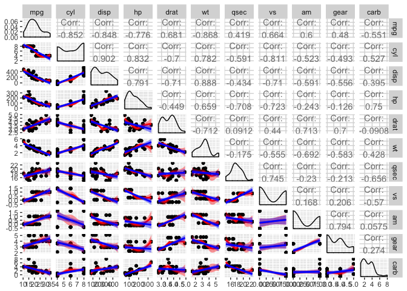
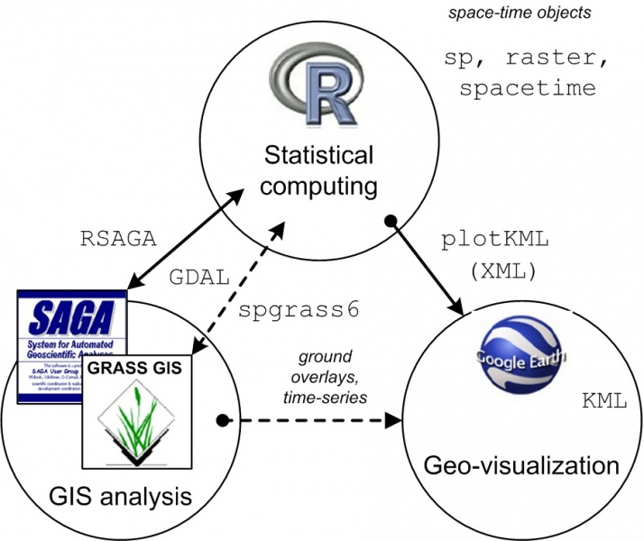

> ## <ed>•™<ec>Šµ 목표 {.objectives}
>
> *  지리정ë³<b4> <ec>‹œê°�í™”ë¥<bc> <ec>œ„<ed>•œ 기본 ê°œë…�<ec>�„ <ed>•™<ec>Šµ<ed>•œ<eb>‹¤.

[지<eb>�„<ed>•™(Cartography)](https://en.wikipedia.org/wiki/Cartography)<eb>Š” 지<eb>�„ë¥<bc> <ec> œ<ec>�‘<ed>•˜<eb>Š” ë°©ì‹�<ec>�´<eb>‹¤. <ed>Š¹<ec> •<ed>•œ 목ì �<ec>—� <eb>”°<eb>�¼ <ed>Š¹<ec>ˆ˜<ed>•œ 주제 <ed>˜¹<ec><9d>€ <eb>‚´<ec>š©ë§Œì�„ <eb>‚˜<ed><83>€<eb>‚´<ec>–´ 그린 지<eb>�„ë¥<bc> **[주제<eb>�„(Thematic Map)](https://ko.wikipedia.org/wiki/지<eb>�„<ec>�˜_종류)** <eb>�¼ê³<a0> <ed>•œ<eb>‹¤.  <ec>–´<eb>Š� <ec>‹œ<ec> �<ec>—�<ec>„œ<ec>�˜ <ec>�¼ê¸<b0> <ec>ƒ�<ed>™©<ec>�„ <eb>‚˜<ed><83>€<eb>‚¸ 기ìƒ�<eb>�„, <ec>š´<ec> „<ed>•  <eb>•Œ <ec>“°<ec>�´<eb>Š” <eb>�„ë¡œë�„, <ed>•­<ed>•´<ed>•  <eb>•Œ <ec>“°<ec>�´<eb>Š” <ed>•´<eb>�„, <ed>†µê³„ê°’<ec>�„ 지<eb>�„<ec>—� 그려 <eb>„£<ec><9d>€ <ed>†µê³<84> 지<eb>�„ <eb>“±<ec>�´ 좋ì<9d>€ <ec>‚¬ë¡€<eb>‹¤.

지리정보ë<a5><bc> <ed>‘œ<ed>˜„<ed>•˜ê¸<b0> <ec>œ„<ed>•´<ec>„œ<eb>Š” <eb>‹¤<ec>�Œê³<bc> ê°™ì<9d>€ 기본 <ec>š”<ec>†Œê°€ <ed>•„<ec>š”<ed>•˜<eb>‹¤.

1. `.shp` <ed>™•<ec>�¥<ec>��ë¥<bc> 갖는 지<eb>�„<ec> •ë³<b4> <ed>ŒŒ<ec>�¼
2. <eb><8c>€<ed>•œë¯¼êµ­<ec>—� <eb><8c>€<ed>•œ 기본 지리정ë³<b4>: <ec>œ„<eb>�„ ê²½ë�„ 

### 1. 지리정ë³<b4> <ed>ŒŒ<ec>�¼(SHP)

<eb><8c>€<ed>•œë¯¼êµ­ <ec>„¼<ec>„œ<ec>Š¤<ec>š© <ed>–‰<ec> •êµ¬ì—­ê²½ê³„(<ec>‹œêµ°êµ¬) <ec>��료는 [<ed>†µê³„ì<a7>€ë¦¬ì •ë³´ì„œë¹„스](http://sgis.kostat.go.kr/contents/shortcut/shortcut_05.jsp) <ec>‚¬<ec>�´<ed>Š¸<ec>—�<ec>„œ <ec>��료신ì²<ad><ec>�„ <ed>•˜ë©<b4> <ec>–»<ec>�„ <ec>ˆ˜ <ec>�ˆ<eb>‹¤. 그리ê³<a0>, <ec> œê³µë�˜<eb>Š” <ec>��<ec>„¸<ed>•œ <ed>˜•<ec>‹�<ec>—� <eb><8c>€<ed>•œ <ec> •ë³´ëŠ” *<ec>��료신ì²<ad>* &rarr; *<ec>��료제ê³<b5> 목ë¡�*<ec>�„ 참조<ed>•œ<eb>‹¤. <ed>˜¹<ec><9d>€, [Encaion](https://goo.gl/KyHR46) 구ê<b8>€ <eb>“œ<eb>�¼<ec>�´ë¸Œì—�<ec>„œ ì§�ì ‘ <eb>‹¤<ec>š´ë¡œë“œ ë°›ì�„ <ec>ˆ˜<eb>�„ <ec>�ˆ<eb>‹¤. <ed>†µê³„ì²­<ec>œ¼ë¡<9c> <ec>‹ ì²<ad><ed>•˜ë©<b4> <ec>Š¹<ec>�¸ê¹Œì<a7>€ <ec>ˆ˜<ec>�¼<ec>�´ <ec>†Œ<ec>š”<eb>�˜ë©<b0> <ed>–‰<ec> •ì²˜ë¦¬<ec>�¼ 기ì<a4>€<ec>œ¼ë¡<9c> 처리<eb>�˜ë©<b0> <eb>‹¤<ec>š´ë¡œë“œ ê°€<eb>Š¥<ed>•œ 기간<eb>�„ 1주ì�¼<ec>�´<eb>‹¤.

  * [GADM](http://www.gadm.org/) <eb>�°<ec>�´<ed>„°ë² ì�´<ec>Š¤<ec>—�<ec>„œ *Country*<ec>—�<ec>„œ **South Korea*<ec>�„ <ec>„ <ed>ƒ�<ed>•˜ê³<a0>, *File Format*<ec>—�<ec>„œ *Shapefile*<ec>�„ <ec>„ <ed>ƒ�<ed>•˜<ec>—¬ <eb>‹¤<ec>š´ë¡œë“œ<ed>•œ<eb>‹¤.
  * [DIVA-GIS](http://www.diva-gis.org/gdata) <ec>‚¬<ec>�´<ed>Š¸<ec>—�<ec>„œ<eb>�„ <ec>��<ec>œ ë¡œì�´ <ed>•œêµ<ad><ec>�„ <ed>�¬<ed>•¨<ed>•œ <ec>—¬<eb>Ÿ¬êµ<ad>ê°€ 지<eb>�„ë¥<bc> <eb>‹¤<ec>š´ë¡œë“œ ë°›ì�„ <ec>ˆ˜ <ec>�ˆ<eb>‹¤.

- [<ed>†µê³„ì<a7>€<ec>—­ê²½ê³„](http://sgis.kostat.go.kr/contents/shortcut/shortcut_05.jsp)
- [Global Administrative Areas](http://www.gadm.org/country)
- [<ed><8c>€ <ed>�¬<ed>�� GitHub](https://github.com/southkorea/southkorea-maps)

~~~ {.python}
FILEMAP = {
    'shp': [('skorea-shp.zip','http://biogeo.ucdavis.edu/data/gadm2/shp/KOR_adm.zip')],
    'kmz': [('skorea.kmz','http://biogeo.ucdavis.edu/data/gadm2/kmz/KOR_adm0.kmz'),
            ('skorea-provinces.kmz','http://biogeo.ucdavis.edu/data/gadm2/kmz/KOR_adm1.kmz'),
            ('skorea-municipalities.kmz','http://biogeo.ucdavis.edu/data/gadm2/kmz/KOR_adm2.kmz')],
    'r'  : [('skorea.RData','http://biogeo.ucdavis.edu/data/gadm2/R/KOR_adm0.RData'),
            ('skorea-provinces.RData','http://biogeo.ucdavis.edu/data/gadm2/R/KOR_adm1.RData'),
            ('skorea-municipalities.RData','http://biogeo.ucdavis.edu/data/gadm2/R/KOR_adm2.RData')]
~~~

### 2.지리정ë³<b4> <ec>‹œê°�í™”ë¥<bc> <ec>œ„<ed>•œ <eb><8c>€<ed>•œë¯¼êµ­ <ec> •ë³<b4>

<eb><8c>€<ed>•œë¯¼êµ­ 지<eb>�„<ec>—� ê´€<ed>•œ <ec>�¼ë°˜ì •ë³´ì�˜ ê²½ë�„범위<eb>Š” 124 -- 132, <ec>œ„<eb>�„범위<eb>Š” 33 -- 43 <ec>�´<eb>‹¤. 

> ### <eb><8c>€<ed>•œë¯¼êµ­ <ec>œ„<eb>�„<ec><99>€ ê²½ë�„ [^kor-lonlat] {.callout}
>
> #### <eb><8c>€<ed>•œë¯¼êµ­ <ec> „ì²<b4>
> - ê·¹ë�™: ê²½ìƒ�ë¶�ë�„ <ec>š¸ë¦‰êµ°<ec>�˜ <eb>�…<eb>�„ <eb>�™<eb>‹¨ <eb>�™ê²<bd> 131° 52<e2>€<b2>20", 
> - 극서: <ed>�‰<ec>•ˆë¶�ë�„ <ec>š©ì²œêµ° <ec>‹ <eb>�„ë©<b4> 마안<eb>�„ <ec>„œ<eb>‹¨ <eb>�™ê²<bd> 124° 11<e2>€<b2>45"
> - 극남: <ec> œì£¼ë�„ <eb>‚¨<ec> œì£¼êµ° <eb><8c>€<ec> •<ec>�� 마ë�¼<eb>�„ <eb>‚¨<eb>‹¨ ë¶�위 33° 06<e2>€<b2>40"
> - ê·¹ë¶�: <ed>•¨ê²½ë¶�<eb>�„ <ec>˜¨<ec>„±êµ<b0> <eb>‚¨<ec>–‘ë©<b4> ë¶�단 ë¶�위 43° 00<e2>€<b2>35"
>
> #### ë¶�í•œ <ec> œ<ec>™¸
> - ê·¹ë�™: ê²½ìƒ�ë¶�ë�„ <ec>š¸ë¦‰êµ°<ec>�˜ <eb>�…<eb>�„(<e7>�¨å³<b6>)ë¡<9c> <eb>�™ê²<bd> 131° 52<e2>€<b2>, 
> - 극서: <ec> „<eb>�¼<eb>‚¨<eb>�„ <ec>‹ <ec>•ˆêµ°ì�˜ <ec>†Œ<ed>�‘<ec>‚°<eb>�„(å°�黑山島)ë¡<9c> <eb>�™ê²<bd> 125° 04<e2>€<b2>, 
> - ê·¹ë¶�: ê°•ì›�<eb>�„ 고성êµ<b0> <ed>˜„<eb>‚´ë©<b4> <ec>†¡<ed>˜„진으ë¡<9c> ë¶�위 38° 27<e2>€<b2>, 
> - 극남: <ec> œì£¼ë�„ <eb>‚¨<ec> œì£¼êµ° 마ë�¼<eb>�„(馬羅å³<b6>)ë¡<9c> ë¶�위 33° 06<e2>€²ì�´<eb>‹¤.

#### 2.1 `rworldmap` <ed>Œ©<ed>‚¤ì§€ë¥<bc> <ed>™œ<ec>š©<ed>•œ 지<eb>�„ 그리ê¸<b0> 기초

지<eb>�„ê°€ 구해졌으ë©<b4> 범위ë¥<bc> <ed>•œ<ec> •<ed>•˜ê¸<b0> <ec>œ„<ed>•´ ê·¹ì �(extreme point) <ec> •ë³´ë<a5><bc> <ec>•Œ<ec>•„<eb>‚´<eb>Š” 것ì�´ 중요<ed>•˜<eb>‹¤.
[<eb>‚¨<ed>•œ 극단<ec> •ë³<b4>](https://en.wikipedia.org/wiki/Extreme_points_of_South_Korea)
<ec>œ„<ed>‚¤<ed>”¼<eb>””<ec>•„<ec>—�<ec>„œ <ed>™•<ec>�¸<ed>•œ ê·¹ì �<ec> •ë³´ë<a5><bc> <ec>‚¬<ec>š©<ed>•˜<ec>—¬ <eb>‚¨<ed>•œ<ed>•´ 지<eb>�„ë¥<bc> 그려본다. 

~~~{.r}
#install.packages(rworldmap)
library(rworldmap)
~~~

~~~{.output}
FALSE Error in library(rworldmap): there is no package called 'rworldmap'

~~~

~~~{.r}
library(ggmap)
korea.map <- getMap(resolution = "high")
~~~

~~~{.output}
FALSE Error in eval(expr, envir, enclos): could not find function "getMap"

~~~

~~~{.r}
south.korea.limits <- geocode(c(
  "Daegang-ri, Hyeonnae-myeon, County of Goseong, Gangwon",
  "Marado, Daejeong-eup, Seogwipo, Jeju",
  "Dokdo-ri,Ulleung-eup, County of Ulleung, North Gyeongsang",
  "Baengnyeongdo, Baengnyeong-myeon,    County of Ongjin, Incheon")
)  

south.korea.limits
~~~

~~~{.output}
FALSE        lon      lat
FALSE 1 128.3445 38.60602
FALSE 2 126.2522 33.22682
FALSE 3 131.8597 37.24397
FALSE 4 126.1783 37.21389

~~~

~~~{.r}
plot(korea.map,
     xlim = range(south.korea.limits$lon),
     ylim = range(south.korea.limits$lat),
     asp = 1
)
~~~

~~~{.output}
FALSE Error in plot(korea.map, xlim = range(south.korea.limits$lon), ylim = range(south.korea.limits$lat), : object 'korea.map' not found

~~~

[<eb>‚¨<ed>•œ 극단<ec> •ë³<b4>](https://en.wikipedia.org/wiki/Extreme_points_of_South_Korea) ì¤<91> <ec>„¬<ec>�„ <ec> œ<ec>™¸<ed>•œ 
본토ë¥<bc> 기ì<a4>€<ec>œ¼ë¡<9c> 지리정보ë<a5><bc> <ec>‹œê°�í™”<ed>•˜ë©<b4> <eb>‹¤<ec>�Œê³<bc> 같다.

~~~{.r}
south.korea.mainland.limits <- geocode(c(
  "Daegang-ri, Hyeonnae-myeon, County of Goseong, Gangwon",
  "Songho-ri, Songji-myeon, Haenam, South Jeolla",
  "Guryongpo-eup, Pohang, North Gyeongsang",
  "Mohang-ri, Sowon-myeon, Taean, Chungcheong")
)  
south.korea.mainland.limits
~~~

~~~{.output}
FALSE        lon      lat
FALSE 1 128.3445 38.60602
FALSE 2 126.5351 34.32605
FALSE 3 129.5471 35.98531
FALSE 4 126.1413 36.76856

~~~

~~~{.r}
plot(korea.map,
     xlim = range(south.korea.mainland.limits$lon),
     ylim = range(south.korea.mainland.limits$lat),
     asp = 1
)
~~~

~~~{.output}
FALSE Error in plot(korea.map, xlim = range(south.korea.mainland.limits$lon), : object 'korea.map' not found

~~~

[^kor-lonlat]: [<eb><8c>€<ed>•œë¯¼êµ­<ec>�˜ <ec>œ„<eb>�„<ec><99>€ ê²½ë�„ë¥<bc> <ec>•Œê³<a0> <ec>‹¶<ec>–´<ec>š”](http://tip.daum.net/question/3092152)

#### 2.2 `ggmap` <ed>Œ©<ed>‚¤ì§€ë¥<bc> <ed>™œ<ec>š©<ed>•œ 지<eb>�„ 그리ê¸<b0> 기초

`ggmap` APIë¥<bc> <ed>™œ<ec>š©<ed>•˜<ec>—¬ 지<eb>�„ë¥<bc> 그린<eb>‹¤.

~~~{.r}
library(ggmap)
# <U+653C><U+3E63>œ„치ëãå<U+3E35><U+623C><U+3E63> 지<U+653C><U+3E63> •<U+653C><U+3E64>•œ<U+653C><U+3E62>‹¤.
krLocation <- c(124.11, 33.06, 131.52, 43.00) #좌측<U+653C><U+3E64>•˜<U+653C><U+3E62>‹¨ê²½ë�„, 좌측<U+653C><U+3E64>•˜<U+653C><U+3E62>‹¨<U+653C><U+3E63>œ„<U+653C><U+3E62>�„, <U+653C><U+3E63>š°ì¸¡ìƒ�<U+653C><U+3E62>‹¨ê²½ë�„, <U+653C><U+3E63>š°ì¸¡ìƒ�<U+653C><U+3E62>‹¨<U+653C><U+3E63>œ„<U+653C><U+3E62>�„
southKrLocation <- c(125.04, 33.06, 131.52, 38.27)
#krLocation <- c(lon=126, lat=37) # <U+653C><U+3E62><U+383C><U+3E63>€<U+653C><U+3E64>•œë¯¼êµ­ <U+653C><U+3E63>„œ<U+653C><U+3E63>š¸
krMap <- get_map(location=krLocation, source="stamen", maptype="toner", crop=FALSE) #terrain, toner, watercolor
ggmap(krMap)
~~~

`googlemap`<ec>�´ <ec>œ„<eb>�„ê²½ë�„ 지<eb>�„중앙, `stamen`, `openstreetmap`, `cloudmade`<eb>Š” 
<ec>œ„<eb>�„ê²½ë�„ <ec>ƒ�<ec>��<ed>‘œê¸°ë<a5><bc> 권ì�¥<ed>•œ<eb>‹¤.

~~~{.r}
krMap <- get_map(location=krLocation, source="stamen", maptype="toner", crop=FALSE) #terrain, satellite, roadmap, hybrid, toner, watercolor
ggmap(krMap)
~~~

### 3. 지리정보처ë¦<ac> <ed>ˆ´ì²´ì�¸ [^1]

<99>€ Dockerê°€ <ec>„¤ì¹˜ë�œ <ec>š°ë¶„투 공용 <ec>�´ë¯¸ì<a7>€" width="40%" /> 

[^1]: http://spatial-analyst.net/wiki/index.php?title=Main_Page

- <ec>˜¤<ed>”ˆ GIS <ec>†Œ<ed>”„<ed>Š¸<ec>›¨<ec>–´
    - [System for Automated Geoscientific Analyses (SAGA GIS)](https://en.wikipedia.org/wiki/SAGA_GIS)
    - [Geographic Resources Analysis Support System (GRASS GIS)](https://en.wikipedia.org/wiki/GRASS_GIS)
- [TileMill](https://www.mapbox.com/tilemill/)
- KML 마í�¬<ec>—… <ec>–¸<ec>–´
    - [Keyhole Markup Language, KML](https://en.wikipedia.org/wiki/Keyhole_Markup_Language)

### 4. 지리정ë³<b4> <ec>‹œê°�í™” <ec>‚¬ë¡€

- 미국 <eb><8c>€<ec>„ (2012) [<eb>‰´<ec>š•<ed><83>€<ec>�„ì¦<88> President Map](http://elections.nytimes.com/2012/results/president)
- 미국 빈곤<ec>œ¨ <ec> •ë³<b4> <ec>‹œê°�í™” [The Topography of Poverty in the United States](http://www.cdc.gov/pcd/issues/2007/oct/07_0091.htm)
- [http://indiemapper.com/](http://indiemapper.com/app/learnmore.php?l=choropleth)

### 참고<ec>��ë£<8c>

- [Thematic Cartography and Geovisualization](http://www.amazon.com/Thematic-Cartography-Geovisualization-3rd-Edition/dp/0132298341)
- [Web Cartography: Map Design for Interactive and Mobile Devices](https://www.crcpress.com/Web-Cartography-Map-Design-for-Interactive-and-Mobile-Devices/Muehlenhaus/9781439876220)
- [R Development Translation Team (Korean)](http://www.openstatistics.net/)

### R <ec>–¸<ec>–´ 참고 <ec>›¹<ec>‚¬<ec>�´<ed>Š¸

- [spatial.ly](http://spatial.ly/r/)
- [Spatial data in R: Using R as a GIS](https://pakillo.github.io/R-GIS-tutorial/)
- [Introduction to Spatial Data and ggplot2](http://rpubs.com/RobinLovelace/intro-spatial)
- [Spatial analysis in R: <eb>�­ì»¤ìŠ¤<ed>„° <eb><8c>€<ed>•™](http://www.maths.lancs.ac.uk/~rowlings/Teaching/- Sheffield2013/index.html)
- [Notes on Spatial Data Operations in R](https://dl.dropboxusercontent.com/u/9577903/- broomspatial.pdf)
- [Making maps with R](http://www.molecularecologist.com/2012/09/making-maps-with-r/)
