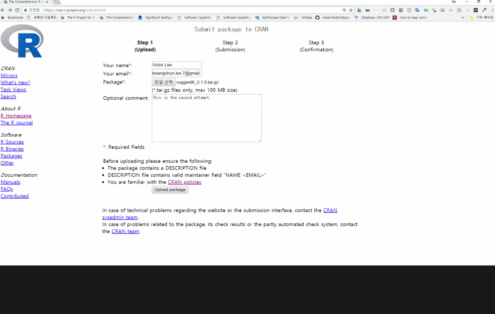

``` {r, include=FALSE}
source("tools/chunk-options.R")
knitr::opts_chunk$set(echo = TRUE, warning=FALSE, message=FALSE)
```

# `suggestK` 팩키지 {#suggest-cran}

`suggestK` 팩키지 제작이 완료되었다면 팩키지 배포를 위해 [CRAN](https://cran.r-project.org/)에 
제출한다. `install.packages("ggplot2")`처럼 팩키지를 설치할 때 사실 [CRAN](https://cran.r-project.org/)에 
등록된 팩키지를 가져와서 로컬 컴퓨터에 설치가 되는 것이다.

문제는 팩키지에 버그, 경고, 다양한 이슈 예를 들어 부족한 문서, 표준을 따르지 않는 팩키지명, 인코딩, 개발자 정보 등등
오픈소스 프로젝트를 진행할 때 헤아릴 수 없는 문제가 발생한다. 
다행히 [CRAN](https://cran.r-project.org/)에 등록된 팩키지는 앞서 언급한 다양한 문제가 없지는 않지만 나름대로 
오류를 최소화된 나름대로 검증된 팩키지라고 할 수 있다.

# CRAN 제출 사전준비 {#cran-setup}

[Submit package to CRAN](https://cran.r-project.org/submit.html)에 팩키지를 등록하기 위해서는 우선 몇가지 준비를 해야한다.
먼저 팩키지를 말아 하나의 `suggestK_0.1.0.tar.gz` 같은 형태로의 압축파일로 만들어야 한다.

### 제출용 압축파일 생성 {#cran-zip}

팩키지명 `suggestK`가 보이는 디렉토리로 이동하여 `R CMD build suggestK` 명령어를 넣게 되면 팩키지명과 함께 
버전이 붙어 압축파일이 생성된다.
`ls` 혹은 `dir`을 때렸을 때 다음과 같이 보이는 곳에서 `R CMD build suggestK` 명령어를 입력하게 되면 
`suggestK_0.1.0.tar.gz` 파일이 생성된다.

``` {r suggestK-build, eval=FALSE}
|- suggestK\
|- suggestK_0.1.0.tar.gz
```

### 제출용 압축파일 점검 {#cran-zip}

CRAN 팩키지 등록을 위해서는 까다로운 절차를 거쳐야 된다. 
코드에 버그가 없는 것은 물론이고, CRAN 정한 규칙을 따라야만 등록이 가능하다.
`--as-cran` 인자를 넣어 압축된 팩키지 점검명령을 내리게 되면 
CRAN에 팩키지 제출 과정과 동일하게 점검을 하여 
**ERROR**, **WARNING**, **NOTE**로 구분하여 점검결과를 알려준다.

``` {r suggestK-check, eval=FALSE}
R CMD check --as-cran suggestK_0.1.0.tar.gz
```

# CRAN 제출 {#cran-submit}

[Submit package to CRAN](https://cran.r-project.org/submit.html) 사이트를 통해서 팩키지를 제출한다.
개발자 정보를 넣고 필요한 경우 팩키지에 대한 기술을 하고 제출과정을 거치게 된다.
제출한다고 바로 CRAN 등록을 위한 점검에 들어가는 것이 아니고 전자우편인증 과정을 먼저 거치게 되고,
제출에 동의해야만 CRAN 등록을 위한 심사에 돌입하게 된다.

