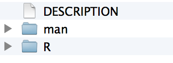
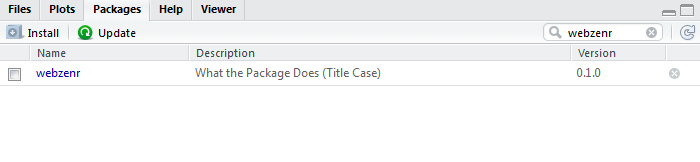

``` {r, include=FALSE}
source("tools/chunk-options.R")
knitr::opts_chunk$set(echo = TRUE, warning=FALSE, message=FALSE)
```

# R 팩키지 개발 환경설정 {#r-pkg-setup}

## R 팩키지 개발 툴체인 설치 {#r-pkg-toolchain} 

R 버젼이 3.2.0. 이상이며, 소스코드로부터 팩키지를 컴파일할 수 있는 `r-base-dev`이 설치되어 있어야 한다. 일반적으로 R 팩키지는 RStudio를 통해서 개발한다.

``` {r r-pkg-setup, eval=FALSE}
> install.packages("RCurl")
> install.packages("curl")
> install.packages("httr_1.0.0.tar.gz", repos = NULL, type = "source")
> install.packages(c("devtools", "roxygen2", "testthat", "knitr"))
> install.packages("rstudioapi")
> rstudioapi::isAvailable("0.98.1103")
> devtools::install_github("hadley/devtools")
> has_devel()

'/usr/lib/R/bin/R' --no-site-file --no-environ --no-save --no-restore CMD SHLIB foo.c 

gcc -std=gnu99 -I/usr/share/R/include -DNDEBUG
  -fpic  -g -O2 -fstack-protector --param=ssp-buffer-size=4 
  -Wformat -Werror=format-security -D_FORTIFY_SOURCE=2 -g  -c foo.c -o foo.o
gcc -std=gnu99 -shared -L/usr/lib/R/lib -Wl,-Bsymbolic-functions 
  -Wl,-z,relro -o foo.so foo.o -L/usr/lib/R/lib -lR
[1] TRUE
```

이제 R 팩키지 개발환경이 완성되었으니 `devtools::session_info()` 명령어로 R 시스템 정보를 살펴본다.

``` {r r-pkg-dry-run, eval=FALSE}
> library(roxygen2)
> library(testthat)
> devtools::session_info()
Session info ------------------------------------------------------------------------------------------
 setting  value                       
 version  R version 3.2.1 (2015-06-18)
 system   x86_64, linux-gnu           
 ui       RStudio (0.98.1103)         
 language (EN)                        
 collate  en_US.UTF-8                 
 tz       <NA>                        

Packages ----------------------------------------------------------------------------------------------
 package  * version    date       source                          
 crayon     1.3.0      2015-06-05 CRAN (R 3.2.1)                  
 devtools * 1.8.0.9000 2015-06-25 Github (hadley/devtools@5034b86)
 digest     0.6.8      2014-12-31 CRAN (R 3.2.1)                  
 magrittr   1.5        2014-11-22 CRAN (R 3.2.1)                  
 memoise    0.2.1      2014-04-22 CRAN (R 3.2.1)                  
 Rcpp       0.11.6     2015-05-01 CRAN (R 3.2.1)                  
 roxygen2 * 4.1.1      2015-04-15 CRAN (R 3.2.1)                  
 stringi    0.5-2      2015-06-22 CRAN (R 3.2.1)                  
 stringr    1.0.0      2015-04-30 CRAN (R 3.2.1)                  
 testthat * 0.10.0     2015-05-22 CRAN (R 3.2.1)                  
 xwmooc   * 0.0.0.9000 <NA>       local               
```

# R 팩키지 헬로월드 {#r-pkg-hello-world}

R 팩키지는 R코드, 데이터, 문서 등을 한 곳에 관리할 수 있는 장점이 있다. 

팩키지 "헬로월드"를 만드는 순서는 다음과 같다.

- RStudio IDE 우측 상단 **New Project** &rarr; **New Directory** &rarr; **R Package** 를 선택한다.
- 팩키지명을 넣어주고 코드 이력 및 버젼관리를 `Create a git repository`을 체크하여 Git 저장소 및 `Use packrate with this project`를 체크하여 팩키지 버젼도 함께 설정힌다.
- 'Ctrl + Shift + B'를 클릭하여 팩키지를 빌드하여 "헬로월드"를 찍어본다.

`library(팩키지명)`을 실행하여 팩키지를 불러오고 나서, `hello()` 함수를 찍어본다.

``` {r pkg-hello-world, eval=FALSE, message=FALSE, warning=FALSE}
# hello.R
# Hello, world!
#
# This is an example function named 'hello' 
# which prints 'Hello, world!'.
#
# You can learn more about package authoring with RStudio at:
#
#   http://r-pkgs.had.co.nz/
#
# Some useful keyboard shortcuts for package authoring:
#
#   Build and Reload Package:  'Ctrl + Shift + B'
#   Check Package:             'Ctrl + Shift + E'
#   Test Package:              'Ctrl + Shift + T'

hello <- function() {
  print("안녕, 대한민국!!!")
}

# 팩키지 실행
> library(data_science)
> hello()
[1] "안녕, 대한민국!!!"
```

## 최소실행가능한 R 팩키지 [^r-pkg-mvp]

[^r-pkg-mvp]: [Writing an R package from scratch](https://hilaryparker.com/2014/04/29/writing-an-r-package-from-scratch/)

R 팩키지를 가장 빨리 만드는 방법은 아마도 MVP 방식으로 개발한 것일 수도 있다.
[최소실행 가능한 제품(Minimum Viable Product, MVP)](https://en.wikipedia.org/wiki/Minimum_viable_product) 개념을 바탕으로 R 팩키지를 개발해 본다.


### 사전준비 {#hello-world-pkg-setup}

`roxygen2` 팩키지가 R 팩키지 개발에 꼭 필요하다. 이를 위해서 `roxygen2` 팩키지를 설치한다.

``` {r pkg-install-roxygen, eval=FALSE, message=FALSE, warning=FALSE}
devtools::install_github("klutometis/roxygen")
library(roxygen2)
```

### 함수와 주석 {#hello-world-pkg-function-comment}

R 팩키지는 코드를 공유하기 위한 목적으로 개발된 것으로, Hadley Wickham이 R 팩키지는 **코드를 공유하는 가장 쉬운 방법**이라는 비젼을 제시했다.
따라서 코드를 함수로 작성하고 함수에는 항상 주석이 함께 붙어 다닌다. 중요한 것을 한곳에 코드와 코드를 설명하는 주석을 함께 담아 놓게 되면 
유지보수를 비롯한 상당한 장점을 경험하게 된다. 나머지 부분은 기계가 알아서 해준다고 보면 쉽다.

먼저 R 스크립트를 함수로 작성한다. 고양이에 대한 사랑이 정상적으로 표현되는지 점검을 먼저 수행한다.


``` {r pkg-cat-function, eval=FALSE, message=FALSE, warning=FALSE}
cat_function <- function(love=TRUE){
    if(love==TRUE){
        print("I love cats!")
    }
    else {
        print("I am not a cool person.")
    }
}
```

고양이 R 함수를 작성하고 나서 주석을 `roxygen2`에서 요구하는 방식으로 작성하고 저장한다.

``` {r pkg-cat-comment, eval=FALSE, message=FALSE, warning=FALSE}
#' A Cat Function
#'
#' This function allows you to express your love of cats.
#' @param love Do you love cats? Defaults to TRUE.
#' @keywords cats
#' @export
#' @examples
#' cat_function()
 
cat_function <- function(love=TRUE){
    if(love==TRUE){
        print("I love cats!")
    }
    else {
        print("I am not a cool person.")
    }
}
```

`R`, `man` 디렉토리와 함께 `R` 폴더에 `cat_function.R`과 `hello.r` 함수가 존재하면 모든 준비가 끝났다.
`git`이나 관련된 다른 기능을 설치하면 추가로 디렉토리와 파일이 추가된다. 




### 팩키지 빌드 {#hello-world-pkg-build}

팩키지를 빌드하는 명령어는 `hello.r` 주석에 있는 'Ctrl + Shift + B' 단축키를 누르면 빌드가 되고,
library(팩키지명)으로 팩키지를 불러온다. 그러면 작성한 두 함수 `hello()`, `cat_function()`, `cat_function(love=FALSE)`를 실행하면 
실행결과도 확인이 가능하다.

'Ctrl + Shift + D' 단축키를 누르면 이론적으로 `man` 디렉토리 내부에 매뉴얼 문서(.Rd)를 생성하게 되지만 윈도우에서 잘 안 되는 경우가 있다.
필자의 경우 그렇다는 것이다. 절대로 당황하거나 포기하지말고 다음 명령어를 콘솔에서 실행하면 된다.

``` {r pkg-cat-compile, eval=FALSE, message=FALSE, warning=FALSE}
> devtools::document(roclets=c('rd', 'collate', 'namespace'))
Updating webzenr documentation
Loading webzenr
Writing cat_function.Rd
Warning: The existing 'NAMESPACE' file was not generated by roxygen2, and will not be overwritten.
```

요약하면, 'Ctrl + Shift + B' 단축키를 누르면 팩키지를 빌드하고 `library(팩키지명)`도 자동실행하여 개발된 팩키지 함수를 직접 테스트도 할 수 있다.
도움말 문서는 'Ctrl + Shift + D' 단축키가 먹지 않는 경우, `devtools::document(roclets=c('rd', 'collate', 'namespace'))` 명령어로 도움말도 함께 생성시킨다.


## 배포 팩키지 생성 [^Karl-Broman-package] {#hello-world-pkg-deployment}

[^Karl-Broman-package]: [R package primer](http://kbroman.org/pkg_primer/)

RStudio 개발환경을 활용하여 함수(`.R`)를 팩키지 내부에 담아내고, 사용법 문서(`.Rd`)를 생성하게 되면 이를 배포할 필요가 있다.
가장 먼저 로컬 컴퓨터에 `.tar.gz` 확장자를 갖는 팩키지를 생성시킨다.


### 콘솔에서 배포용 팩키지 생성시키는 방법 {#hello-world-pkg-console}

윈도우, 맥, 리눅스 터미널을 열고 개발되고 있는 팩키지 디렉토리로 이동한다.
그리고 나서 다음 명령어를 실행하면 팩키지가 `.tar.gz` 확장자를 갖는 압축파일 하나가 생성된다.

``` {r pkg-build-with-terminal, eval=FALSE, message=FALSE, warning=FALSE}
$ R CMD build webzenr
* checking for file 'C:\Users\......\webzenr/DESCRIPTION' ... OK
* preparing 'webzenr':
* checking DESCRIPTION meta-information ... OK
* checking for LF line-endings in source and make files
* checking for empty or unneeded directories
Removed empty directory 'webzenr/fig'
* looking to see if a 'data/datalist' file should be added
* building 'webzenr_0.1.0.tar.gz'
```

### RStudio에서 배포용 팩키지 생성시키는 방법 {#hello-world-pkg-deploy-rstudio}

RStudio에서 배포용 팩키지 생성시키는 방법은 다음과 같다.

``` {r pkg-build-with-rstudio, eval=FALSE, message=FALSE, warning=FALSE}
devtools::build()
```

### 개발한 팩키지 설치 {#hello-world-pkg-install}

개발된 팩키지를 설치하는 방법은 `.tar.gz` 압축파일로된 전달받은 팩키지를 설치하는 일반적인 방법과 동일한다.
윈도우, 맥, 리눅스 터미널에서는 다음 명령어를 실행한다.

``` {r pkg-install-with-terminal, eval=FALSE, message=FALSE, warning=FALSE}
$ R CMD INSTALL webzenr_0.1.tar.gz
```

RStudio를 사용할 경우 다음 명령어를 RStudio 스크립트 창이나 콘솔창에서 실행시킨다.

``` {r pkg-install-with-rstudio, eval=FALSE, message=FALSE, warning=FALSE}
> install.packages("C:/Users/....../webzenr_0.1.0.tar.gz", repos = NULL, type = "source")
* installing *source* package 'webzenr' ...
** R
** data
*** moving datasets to lazyload DB
** preparing package for lazy loading
** help
*** installing help indices
** building package indices
** testing if installed package can be loaded
*** arch - i386
*** arch - x64
* DONE (webzenr)
```


