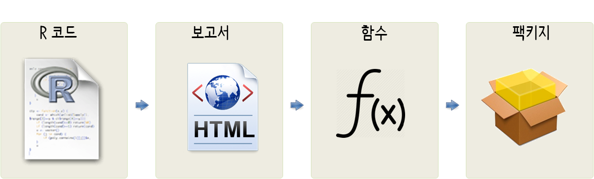
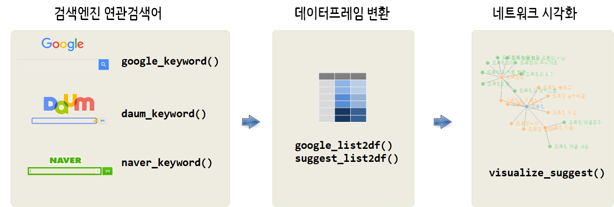
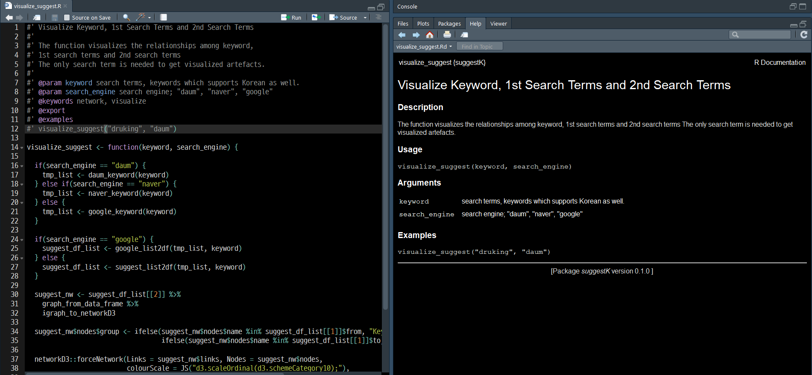

``` {r, include=FALSE}
source("tools/chunk-options.R")
knitr::opts_chunk$set(echo = TRUE, warning=FALSE, message=FALSE)
```

# 연관검색어 [^naver-search] [^daum-search] [^google-search] {#related-terms-overview}

[^naver-search]: [네이버](http://statkclee.github.io/politics/naver-related-search.html)
[^daum-search]: [다음](https://statkclee.github.io/ingest-data/daum-related-search.html) 
[^google-search]: [구글 제안(Google Suggest)](https://statkclee.github.io/ingest-data/google-suggest.html)

[네이버](https://www.naver.com/) 검색창에 검색어를 입력하게 되면 사용자들이 많이 검색하거나 
네이버에서 판단하여 도움이 될 수도 있는 검색어를 경우에 따라서 자동완성 기능을 동원해서 도움을 주고 있다.
[rdevteam](https://github.com/lovetoken/rdevteam)에서 개발한 팩키지는 네이버 연관검색어를 추출하여 네트워크 시각화를 통한
지원기능이 포함되어 있지만, 다음이나 구글이 빠져있는 것이 확인되었다.

6월 13일 제7차 지방선거에 임하는 많은 피선거권자를 비롯하여 선거에 관심이 많은 분들은 
검색어에 담긴 함의를 찾아 내고자 많은 고민을 하고 있다. 
지난 10년간에 걸쳐 네이버의 독점은 구글의 부상과 페이스북의 등장으로 리더쉽이 많이 손상되었다.

하지만, 여전히 검색어를 넣으면 이를 통해 연관되어 나오는 검색어를 통해 민심을 읽고 싶은 것도 사실이다.
이에 [네이버](https://www.naver.com/), [다음](https://www.daum.net/), [구글](https://www.google.com/) 검색엔진을 
대상으로 연관검색어를 빠르게 추출하여 시각화하여 실시간으로 검색어에 담긴 민심의 동향을 파악해보자.

# R스크립트 &rarr; 팩키지 {#suggestK-pkg}

다음, 네이버, 구글을 사용해서 검색어와 관련된 분석을 진행하고자 한다면 가장 먼저 
`.R` 코드로 스크립트를 작성하는 것으로 시작된다. 이를 통해 보고서 `.Rmd` 파일을 작성하게 되고 
이를 좀더 발전시키면 함수를 작성해야 한다. 
나만이 작성하는 것이 아니라 동료도 같이 활용할 수 있는 형태로 만들려면 팩키지 개발 형태로 나아가게 된다.



R 코드를 작성하고 이를 보고서로 담아내는 과정과 함수작성하는 방법은 다음 웹페이지를 참조한다.

- [네이버](http://statkclee.github.io/politics/naver-related-search.html)
- [다음](https://statkclee.github.io/ingest-data/daum-related-search.html) 
- [구글 제안(Google Suggest)](https://statkclee.github.io/ingest-data/google-suggest.html)

## `suggestK` 팩키지 헬로월드 {#suggestK-pkg-kickoff}

팩키지 `suggestK` 작성을 위해 시작하는 방법은 
[R 팩키지 헬로월드](https://statkclee.github.io/data-science/r-pkg-hello-world.html#2_r_%ED%8C%A9%ED%82%A4%EC%A7%80_%ED%97%AC%EB%A1%9C%EC%9B%94%EB%93%9C) 작성방법부터 시작한다.

- RStudio IDE 우측 상단 `New Project` &rarr; `New Directory` &rarr; `R Package` 를 선택한다.
- 팩키지명(`suggestK`)을 넣어주고 코드 이력 및 버젼관리를 `Create a git repository`을 체크하여 `Git 저장소` 및  `Use packrate with this project`를 
체크하여 팩키지 버젼도 함께 설정힌다.
- ’Ctrl + Shift + B’를 클릭하여 팩키지를 빌드하여 “헬로월드”를 찍어본다.

library(suggestK)을 실행하여 팩키지를 불러오고 나서, hello() 함수를 찍어본다.

`suggestK` 팩키지 다음과 같이 매우 단순한 모양을 하고 있다.
즉, 함수는 `R\` 디렉토리에 모아 놓고, 함수 사용법을 다룬 매뉴얼은 `man\` 디렉토리에 담겨진다.
그리고, 전반적인 `suggestK` 팩키지 사항은 `DESCRIPTION`, `NAMESPACE`에 기술된다.

``` {r suggestK-minimal, eval=FALSE}
|- suggestK
|  |- DESCRIPTION
|  |- NAMESPACE
|- R
|  |- hello.R
|- man
|  |- hello.Rd
```

## `suggestK` 함수 {#suggestK-pkg-function}

다음, 네이버, 구글 연관검색어를 긁어오는 것이 유사한 점도 있고, 다른 점도 있어 가능하면 
공용화할 수 있도록 함수를 작성한다.
다음과 네이버는 유사한 형태로 검색어를 넣었을 때 첫번째 연관검색어를 가져오는 함수를 작성하여 
이를 바탕으로 `suggest_list2df()` 함수를 통해 데이터프레임으로 변환시킨 후 마지막 단계로 
`visualize_suggest()` 함수로 시각화한다. 하지만, 구글은 API를 통해 연관검색어를 가져오고 
또한, 변환 결과가 데이터프레임이라 이를 준용하여 후속작업을 진행하는 함수를 별도 작성한다.
시각화는 `visualize_suggest()` 함수를 동일하게 사용한다.



함수 기능을 작성한 후에 모습은 다음과 같다.

``` {r suggestK-function, eval=FALSE}
|- suggestK
|  |- DESCRIPTION
|  |- NAMESPACE
|- R
|  |- daum_keyword.R
|  |- daum_keyword_R1.R
|  |- google_keyword.R
|  |- google_keyword_R1.R
|  |- google_list2df.R
|  |- naver_keyword.R
|  |- naver_keyword_R1.R
|  |- suggest_list2df.R
|  |- visualize_suggest.R
|- man
```

## `suggestK` 매뉴얼 {#suggestK-pkg-man}

다음, 네이버, 구글 연관검색어 가져오는 기능, 데이터프레임으로 변환시키는 기능,
네트워크 시각화하는 기능이 완성되면 다음 단계로 각 함수 매뉴얼을 작성한다.

Hadley Wickham 가라사대, R 팩키지는 코드를 공유하는 가장 쉬운 방법이라는 비젼을 제시했다. 
따라서 코드를 함수로 작성하고 함수에는 항상 주석이 함께 붙어 다닌다. 
중요한 것을 한곳에 코드와 코드를 설명하는 주석을 함께 담아 놓게 되면 유지보수를 비롯한 상당한 장점을 경험하게 된다. 
나머지 부분은 기계가 알아서 해준다고 보면 쉽다.

`roxygen2` 팩키지를 사용하여 함수에 주석을 달아 기술하게 되면 자동으로 `man` 디렉토리에 각 함수 도움말이 생긴다.
이때, 사용하는 명령어가 `devtools::document(roclets=c('rd', 'collate', 'namespace'))`이다. 
각 함수에 `roxygen2` 팩키지에 맞춰 마크다운으로 작성하게 되면 예를 들어,
`visualize_suggest()` 함수에 대응되는 `visualize_suggest.Rd` 도움말이 자동 생성된다.



``` {r suggestK-man, eval=FALSE}
|- suggestK
|  |- DESCRIPTION
|  |- NAMESPACE
|- R
|  |- daum_keyword.R
|  |- daum_keyword_R1.R
|  |- google_keyword.R
|  |- google_keyword_R1.R
|  |- google_list2df.R
|  |- naver_keyword.R
|  |- naver_keyword_R1.R
|  |- suggest_list2df.R
|  |- visualize_suggest.R
|- man
|  |- daum_keyword.Rd
|  |- daum_keyword_R1.Rd
|  |- google_keyword.Rd
|  |- google_keyword_R1.Rd
|  |- google_list2df.Rd
|  |- naver_keyword.Rd
|  |- naver_keyword_R1.Rd
|  |- suggest_list2df.Rd
|  |- visualize_suggest.Rd
```


<style>
div.blue { background-color:#e6f0ff; border-radius: 5px; padding: 10px;}
</style>
<div class = "blue">

다음과 같은 경고가 뜨는 경우가 있다. [^namespace-warning]

[^namespace-warning]: [NAMESPACE not generated by roxygen2. Skipped. - Confusion with Hadley book
](https://stackoverflow.com/questions/29135971/namespace-not-generated-by-roxygen2-skipped-confusion-with-hadley-book)

`Warning: The existing 'NAMESPACE' file was not generated by roxygen2, and will not be overwritten.`

절대 당황하지 말고 구글 검색을 통해 해법을 찾아본다.

1. `NAMESPACE` 파일을 백업하여 별도 이름으로 저장한다.
1. `NAMESPACE` 파일을 삭제한다. 왜냐하면 다시 생성할 것으로 자동생성된다.
1. `devtools::document(roclets=c('rd', 'collate', 'namespace'))` 명령어를 실행하면 `NAMESPACE` 파일이 다시 재생성된다.

</div>

## `suggestK` 소품문 [^kbroman-vignette] {#suggestK-pkg-vignette}

[^kbroman-vignette]: [R package primer - Writing vignettes](http://kbroman.org/pkg_primer/pages/vignettes.html)

팩키지 함수를 잘 작성하는 것도 중요하고, 작성된 함수에 주석을 잘 달아 문서화하는 것도 무척이나 중요하다.
하지만, 본인의 가슴에 손을 올려놓고 생각해보면 잘 안 읽는다. 
기껐해야 예제를 보고 복사해서 붙여넣는 수준이다. 미국도 그렇고 세상 어디에 가도 동일하다. 
따라서 소품문(Vignette)을 잘 작성하는 것이 생각보다 많은 사람들이 개발된 팩키지를 잘 사용하게 만드는 방법이 된다.

소품문은 R마크다운 문법에 맞춰 작성하면 된다. 다만, 처음 `devtools::use_vignette("suggestK-vignette")`와 같이 명령어를 입력하게 되면,
자동으로 `vignettes/` 디렉토리가 생성된다.
자동으로 `DESCRIPTION`에 `kintr`를 `Suggests`, `VignetteBuilder` 필드에 추가한다.
`vignettes/suggestK-vignette.Rmd`에 보고서를 작성한다는 기분으로 침착하게 작성해나가면 된다.

``` {r suggestK-vignette, eval=FALSE}
|- suggestK
|  |- DESCRIPTION
|  |- NAMESPACE
|- R
|  |- daum_keyword.R
|  |- daum_keyword_R1.R
|  |- google_keyword.R
|  |- google_keyword_R1.R
|  |- google_list2df.R
|  |- naver_keyword.R
|  |- naver_keyword_R1.R
|  |- suggest_list2df.R
|  |- visualize_suggest.R
|- man
|  |- daum_keyword.Rd
|  |- daum_keyword_R1.Rd
|  |- google_keyword.Rd
|  |- google_keyword_R1.Rd
|  |- google_list2df.Rd
|  |- naver_keyword.Rd
|  |- naver_keyword_R1.Rd
|  |- suggest_list2df.Rd
|  |- visualize_suggest.Rd
|- vignettes
|  |- suggestK-vignette.Rmd
```

소품문 YAML을 포함한 앞부분 다음과 같이 작성되는데 `devtools::use_vignette("suggestK-vignette")` 명령어를 
실행했기 때문에 자동생성된 것이다.

``` {r vignettes-yaml, eval=FALSE}
# ---
# title: "SuggestK Vignette"
# author: "Victor Lee"
# date: "`r Sys.Date()`"
# output: rmarkdown::html_vignette
# vignette: >
#   %\VignetteIndexEntry{Vignette Title}
#   %\VignetteEngine{knitr::rmarkdown}
#   %\VignetteEncoding{UTF-8}
# ---
# 
# ```{r setup, include = FALSE}
# knitr::opts_chunk$set(
#   collapse = TRUE,
#   comment = "#>"
# )
# knitr::opts_chunk$set(echo = TRUE, warning=FALSE, message=FALSE)
```

# `suggestK` Vignette  {#suggestK-pkg-vignette-raw}

The package crawls search terms from the major search engines in Korea; 
[daum](https://www.daum.net/), [naver](https://www.naver.com/) and [google](https://www.google.com/). The usage is straightforward.

1. select search engine function and run that function
    - daum: `daum_keyword()`
    - naver: `naver_keyword()`
    - google: `google_keyword()`
1. if you want to visualize search terms relationship, call `suggest_list2df())` function which will convert list data structure to dataframe.
1. call `visualize_suggest()` function which will transform native dataframe into network object automatically and visualize search term relationship; keyword, 1st search terms, and 2nd search terms. [networkD3](https://cran.r-project.org/web/packages/networkD3/index.html) is a main engine for the newtork visualization.

## Install 

You could install `suggestK` package through [Github](https://github.com/statkclee/suggestK).

``` {r install-suggestK}
devtools::install_github("statkclee/suggestK")
library(suggestK)
```

## Crawl Related Search Terms

### Daum

[daum](https://www.daum.net/) search engine provides very flexible related search results in that if a search term is not used frequently, it will return related keywrods quickly, but it could take a couple of minutes in some cases. 

`daum_keyword()` function returns list datatype such that it will be useful to see related keywords with the `jsonedit()` function in `listviewer` package.

In case of the multiple keyword such as "data scientist", you need to add `+` sign between two search keywords. Unless you add `+` sign, you will not get what you expect.
****

``` {r daum}
data_scientist <- daum_keyword("data+scientist")
str(data_scientist)
```

### Naver

[naver](https://www.naver.net/) search engine provides only 10 related keywords, which means that the search query can finish very quickly, but if you expect exhaustive related terms, it will give only partial keywords.

`naver_keyword()` function returns list datatype such that it will be useful to see related keywords with the `jsonedit()` function in `listviewer` package.

``` {r naver}
korea <- naver_keyword("korea")
str(korea)
```

### Google

[google](https://www.naver.net/) search engine provides only 10 related keywords such that google suggest query works really fast, but compared with Daum and Naver, **Google Suggest** works differently. You need to be careful when interpreting related terms.

`google_keyword()` function returns list datatype such that it will be useful to see related keywords with the `jsonedit()` function in `listviewer` package.

``` {r google}
korea <- google_keyword("korea")
```

## Convert list to dataframe

Once we have list data from the keyword search, it is necessary to convert list to dataframe. The subsequent data analysis, modeling, and visualization tasks prefer dataframe in most cases.

The `suggestK` package has two function for the same task because Korean and non-Korean search engines have different interfaces. `suggest_list2df()` function convert list from  NAVER and DAUM search terms to dataframe whereas `google_list2df()` function convert list from Google search terms to dataframe.

``` {r naver-daum-list2df}
suggest_list2df(data_scientist, "data+scientist")[[1]] %>% head()
```

In case of google, it works similarly.

``` {r google-list2df}
google_list2df(korea, "korea")[[1]] %>% head()
```

## Visualize

`visualize_suggest()` function enables to visualize Keyword, 1st Search Terms and 2nd Search Terms through `networkD3`.
To get visualized artefacts, pass the search term and search engine name to `visualize_suggest()` function which will automatically crawl search terms, convert data structure, visualize, and return the results.

``` {r visualize, fig.width=8, fig.height=8}
visualize_suggest("korea", "google")
```
