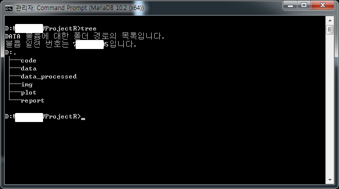
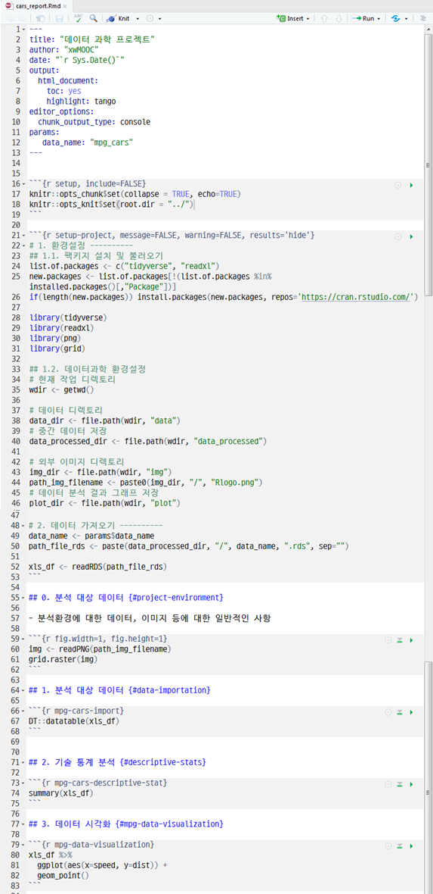

```{r setup, include=FALSE}
knitr::opts_chunk$set(echo = TRUE, warning = FALSE, message = FALSE, verbose =TRUE, cache = FALSE, fig.width=12, fig.height = 10)

# 0. 환경설정 ---------------
library(purrr)
library(tidyverse)
library(stringr)
library(DT)

```

## 1. 재현가능한 R 프로젝트 {#reproducible-r-project}

최근 R 커뮤니티에서 Jenny Bryan 교수가 `setwd()`, `rm(list = ls())` 사용을 금하고, 
프로젝트 + `here::here()` 사용을 포함한 다양한 대안을 제시하고 있다.

<blockquote class="twitter-tweet" data-lang="en"><p lang="en" dir="ltr">Blog post elaborating on my advice to avoid setwd() and rm(list = ls()) at top of an <a href="https://twitter.com/hashtag/rstats?src=hash&amp;ref_src=twsrc%5Etfw">#rstats</a> script.<br>Wow that really touched a nerve 😮<a href="https://t.co/YDvVUQOMKx">https://t.co/YDvVUQOMKx</a> <a href="https://t.co/b4SpNhBYUX">https://t.co/b4SpNhBYUX</a></p>&mdash; Jenny Bryan (@JennyBryan) <a href="https://twitter.com/JennyBryan/status/940436177219338240?ref_src=twsrc%5Etfw">December 12, 2017</a></blockquote>
<script async src="https://platform.twitter.com/widgets.js" charset="utf-8"></script>



## 2. 데이터 과학 프로젝트 자동화 [^ds-authoring-automation] [^minimal-r-project] {#ds-report}

[^minimal-r-project]: [A minimal Project Tree in R](https://talesofr.wordpress.com/2017/12/12/a-minimal-project-tree-in-r/)

[^ds-authoring-automation]: [데이터 과학을 위한 저작도구 - 보고서 자동화](https://statkclee.github.io/ds-authoring/ds-report-automation.html)

[A minimal Project Tree in R](https://aurora-mareviv.github.io/2017/12/minimal-project-tree-r/)를 바탕으로 팩키지를 사용하는 대신,
RStudio IDE를 기반으로 재현가능한 R 프로젝트를 만들어보는 것도 대안으로 생각할 수 있다.

[tidyverse - Project-oriented workflow](https://www.tidyverse.org/articles/2017/12/workflow-vs-script/)도 그렇구,
[here](https://cran.r-project.org/web/packages/here/index.html), [template](https://github.com/Pakillo/template), 
[ProjectTemplate](http://projecttemplate.net/getting_started.html) 팩키지도 동일한 목표를 다른 방식을 통해 찾아가는 것일 수도 있다.


## 3. R 프로젝트 개요 {#ds-project-environment}

재현가능한 데이터 과학을 위해서 핵심으로 다음 사항이 재현가능해야 한다.

- 데이터: `data`
- R 코드: `code`
- 중간 산출 데이터: `data-processed`
- 그래프(Plot): `plot`
- 마크다운 보고서 (이미지 포함): `report`

RStudio IDE를 통해 프로젝트를 생성하고 나서 `code`, `data`, `data-processed`, `img`, `report` 디렉토리를 순차적으로 생성시킨다.

``` {r r-project-tree, eval = FALSE}
+-project\  
  +-- code\
  +-- data\
  +-- data-processed\
  +-- plot
  +-- img\
  +-- report\
```

## 4. R 프로젝트 사례 {#ds-project-example}

### 4.1. 환경설정 {#ds-project-example-setup}

재현가능한 프로젝트를 시작하며 가장 먼저 환경설정 작업을 수행한다.

현재 작업 디렉토리 `wdir`를 지정하고, 순차적으로 
데이터 `data_dir`,
중간 데이터 `data_processed_dir`,
외부 이미지 디렉토리 `img_dir`,
데이터 분석 결과를 그래프로 저장하는 디렉토리 `plot_dir`,
보고서 디렉토리 `report_dir` 로 지정한다.

```  {r reproducible-r-project-example, eval=FALSE}
# 0. 개요 --------------- 
# 데이터 과학 프로젝트 시작 

# 1. 환경설정 ----------
## 1.1. 팩키지 설치 및 불러오기
list.of.packages <- c("tidyverse", "readxl")
new.packages <- list.of.packages[!(list.of.packages %in% installed.packages()[,"Package"])]
if(length(new.packages)) install.packages(new.packages, repos='https://cran.rstudio.com/')

library(tidyverse)
library(readxl)

## 1.2. 데이터과학 환경설정
# 보고서 Rmd 설정  
params <- NULL
params$dataname <- "mpg_cars"

# 현재 작업 디렉토리
wdir <- getwd() 
# 데이터 디렉토리
data_dir <- file.path(wdir, "data") # datadir <- paste(wdir, "/data", sep="") 설정보다 더 좋음.
# 중간 데이터 저장
data_processed_dir <- file.path(wdir, "data_processed")

# 외부 이미지 디렉토리
img_dir <- file.path(wdir, "img")
# 데이터 분석 결과 그래프 저장 
plot_dir <- file.path(wdir, "plot")

# 보고서 디렉토리
report_dir <- file.path(wdir, "report")
```

### 4.2. 데이터 가져오기 {#ds-project-example-setup-import}

데이터 가져오는 부분을 하드코딩하기 보다 앞서 설정한 `wdir`, `data_dir` 정보를 참조하여 데이터를 불러온다.

```  {r reproducible-r-project-example-run-import, eval=FALSE}
# 2. 데이터 가져오기 ------------------------
dataname <- params$dataname 
routexl <- paste(data_dir, "/", dataname, ".xlsx", sep="")
xls_dat <- read_excel(routexl, sheet = 1)
```

### 4.3. 데이터 분석, 모형개발 및 시각화 {#ds-project-example-setup-eda-model-viz}

본격적으로 데이터를 분석하기 앞서 전처리 작업을 통해 모형개발 및 시각화에 적합한 형태로 
데이터를 가공한다. 

```  {r reproducible-r-project-example-run-model-viz, eval=FALSE}
# 3. 데이터 전처리 ------------------------

xls_df <- xls_dat %>% 
  mutate(ratio = dist/speed)

# 4. 데이터 시각화 ------------------------

cars_g <- xls_df %>% 
  ggplot(aes(x=speed, y=dist)) +
  geom_point()

cars_g
```

### 4.4. 데이터 및 모형, 시각화 산출물 내보내기 {#ds-project-example-export}

`plot_dir`, `data_processed_dir` 앞서 정의한 디렉토리로 분석 결과 중간 데이터, 그래프, R 객체를 내보내어 저장한다.

```  {r reproducible-r-project-example-run-export, eval=FALSE}
# 5. 저장 및 내보내기  ------------------------
## 5.1. 이미지 저장 
plot_name <- "cars_g.png"
save_plot <- file.path(plot_dir, plot_name)

ggsave(save_plot)  # (see http://ggplot2.tidyverse.org/reference/ggsave.html)

## 5.2. 데이터 저장
save.image(file="data_processed/whole_env.RData")
saveRDS(xls_df, "data_processed/mpg_cars.rds")
```

## 5. 보고서 Rmd {#ds-project-example-rmd}

보고서를 작성하는 것도 유사하다. 다만 몇가지 사항에 대해서 사전 점검을 하는 것이 중요하다.

- YAML 헤더: `params`를 통해 `data_name` 을 비롯한 매개변수에 대한 설정을 수행한다. 
- 보고서 파일 루트 설정: `knitr::opts_knit$set(root.dir = "../")` 설정을 통해 `.Rmd` 파일이 위치한 곳이 아니라 프로젝트 위치를 루트로 동일하게 설정한다.



### 5.1. YAML 헤더 {#ds-project-example-rmd-yaml}

YAML 헤더에 기본적인 설정을 하고 데이터명(`mpg_cars`)을 매개변수(`params$data_name`)로 명시한다.

> ``` {r r-project-rmd-yaml, eval=FALSE}
> ---
> title: "데이터 과학 프로젝트"
> author: "xwMOOC"
> date: "`r Sys.Date()`"
> output:
>   html_document:
>     toc: yes
>     highlight: tango
> editor_options: 
>   chunk_output_type: console
> params:
>    data_name: "mpg_cars"
> ---
> ```

### 5.2. 루트 설정 {#ds-project-example-rmd-root}

보고서 `.Rmd` 파일은 `report` 디렉토리에 위치하고 있어 `root.dir`을 통해 별도로 프로젝트 루트를 설정한다.

> ``` {r r-project-rmd-knitr, eval=FALSE}
> knitr::opts_chunk$set(collapse = TRUE, echo=TRUE)
> knitr::opts_knit$set(root.dir = "../")
> ```

### 5.3. 환경설정  {#ds-project-example-rmd-configuration}

R 스크립트를 개발할 때와 동일한 환경을 구현하여 보고서에서 작성하는 결과가 흔들리지 않게 지정한다.

> ``` {r r-project-rmd-main, eval=FALSE}
> # 1. 환경설정 ----------
> ## 1.1. 팩키지 설치 및 불러오기
> list.of.packages <- c("tidyverse", "readxl")
> new.packages <- list.of.packages[!(list.of.packages %in% installed.packages()[,"Package"])]
> if(length(new.packages)) install.packages(new.packages, repos='https://cran.rstudio.com/')
> 
> library(tidyverse)
> library(readxl)
> library(png)
> library(grid)
> 
> 1.2. 데이터과학 환경설정
> 현재 작업 디렉토리
> wdir <- getwd() 
> 
> 데이터 디렉토리
> data_dir <- file.path(wdir, "data")
> 중간 데이터 저장
> data_processed_dir <- file.path(wdir, "data_processed")
> 
> 외부 이미지 디렉토리
> img_dir <- file.path(wdir, "img")
> path_img_filename <- paste0(img_dir, "/", "Rlogo.png")
> 데이터 분석 결과 그래프 저장 
> plot_dir <- file.path(wdir, "plot")
> 
> 2. 데이터 가져오기 ----------
> data_name <- params$data_name
> path_file_rds <- paste(data_processed_dir, "/", data_name, ".rds", sep="")
> 
> xls_df <- readRDS(path_file_rds)
> ```

### 5.4. 외부 이미지, 분석 대상 데이터, 기술통계 등  {#ds-project-example-rmd-main}

외부 이미지를 비롯한 필요한 설정도 동일하게 가져와서 데이터를 분석하고, 모형 개발, 시각화를 진행한다.

> ``` {r r-project-rmd-table-etc, eval=FALSE}
> img <- readPNG(path_img_filename)
> grid.raster(img)
> 
> 
> 1. 분석 대상 데이터 {#data-importation}
> 
> DT::datatable(xls_df)
> 
> 
> 2. 기술 통계 분석 {#descriptive-stats}
> 
> summary(xls_df)
> 
> 3. 데이터 시각화 {#mpg-data-visualization}
> 
> xls_df %>% 
>   ggplot(aes(x=speed, y=dist)) +
>   geom_point()
> ```


