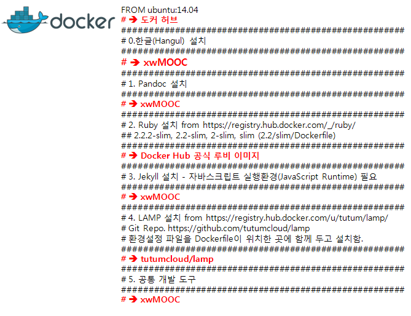

> ## 학습 목표
>
> *   Dockerfile 스크립트로 개발환경 구축을 자동화한다.
> *   정적 웹서비스 xwMOOC 개발 툴체인을 Dockerfile로 시연한다.

### 1. Docker Compose 설치

`docker-compose`를 설치하기 위해서는 `docker`가 설치되어 있어야 하고, `curl`이 필요하다.

~~~ {.input}
root@docker:~# curl -L https://github.com/docker/compose/releases/download/1.3.0/docker-compose-`uname -s`-`uname -m` > /usr/local/bin/docker-compose
root@docker:~# chmod +x /usr/local/bin/docker-compose
~~~

만약 "Permission denied" 오류가 나오면 `sudo -i`를 실행하고 다시 `docker-compose` 설치 명령을 실행한다.

~~~ {.input}
root@docker:~# docker-compose --version
~~~

~~~ {.output}
docker-compose version: 1.3.0
CPython version: 2.7.9
OpenSSL version: OpenSSL 1.0.1e 11 Feb 2013
~~~

### 2. xwMOOC 개발 툴체인 설치

[도커 허브(Docker Hub)](https://hub.docker.com/) 저장소에서 LAMP, Pandoc, Jekyll, Ruby, RStudio, Shiny 서버를 검색해서 설치한다.
이외에도 자바스크립트를 포함하여 여러 도구가 정적 웹서비스 제공에 필요하다.

> ### xwMOOC 개발 툴체인 {.callout}
> 
> 1. 한글
> 2. Pandoc
> 3. Jekyll, Ruby
> 4. LAMP
> 5. RStudio, Shiny 서버

#### 2.1. 한글 우분투 Dockerfile 생성

도커 자동화를 위해서 **Dockerfile** 스크립트를 작성한다. 먼저 `statkclee/hangul` 한글 우분투 이미지를 생성한다.
`docker build`가 생성 명령어가 되고 `-t`가 이미지명을 부여하게 되고 `.`은 디폴트 초기설정으로 `Dockerfile` 스크립트를 지정한다.

~~~ {.input}
root@dev:~/hangul# docker build -t statkclee/hangul .
~~~

~~~ {.input}
# xwMOOC 
FROM ubuntu:14.04

# Hangul Install
RUN apt-get update && apt-get install -y \
    language-pack-ko && \
    dpkg-reconfigure locales && \
    locale-gen ko_KR.UTF-8 && \
    /usr/sbin/update-locale LANG=ko_KR.UTF-8

ENV LANG=ko_KR.UTF-8
ENV LANGUAGE=ko_KR.UTF-8
ENV LC_ALL=ko_KR.UTF-8
~~~

`docker run -it` 명령어로 `/bin/bash`를 실행해서 내부 한글이 되는 컨테이너 내부로 들어가면 한글이 정상적으로 CLI 모드에서 작동되는 것을 확인한다.

~~~ {.input}
root@dev:~/hangul# docker run -it statkclee/hangul /bin/bash
root@2213b3f04bac:/# ls
~~~
~~~ {.output}
bin   dev  home  lib64  mnt  proc  run   srv  tmp  var
boot  etc  lib   media  opt  root  sbin  sys  usr  한글.txt
root@2213b3f04bac:/# cat 한글.txt
한글 사랑...
abc...
123
~~~

#### 2.2. Pandoc Dockerfile 설치

`Dockerfile`에 `Pandoc`을 설치한다. 하스칼 플랫폼을 이용한 방법도 있지만, `cabal`로 설치한다. `pandoc`을 환경변수 경로명에 추가한다.

~~~ {.input}
# xwMOOC 작업환경 설정 Dockerfile
FROM ubuntu:14.04

# Pandoc 설치
RUN apt-get update && apt-get install -y \
    zlib1g-dev \
    cabal-install
RUN cabal update && cabal install \
    alex \
    happy \
    pandoc \
    pandoc-citeproc
    
ENV PATH /root/.cabal/bin:$PATH
~~~

~~~ {.input}
root@dev:~/hangul# docker images
~~~

~~~ {.output}
REPOSITORY          TAG                 IMAGE ID            CREATED             VIRTUAL SIZE
statkclee/pandoc    latest              c731a1b37d60        51 seconds ago      1.342 GB
statkclee/hangul    latest              b00700f6fe97        About an hour ago   215.3 MB
ubuntu              14.04               6d4946999d4f        8 days ago          188.3 MB
~~~

~~~ {.input}
root@dev:~/hangul# docker run -it statkclee/pandoc /bin/bash
root@418652c231eb:/# pandoc -v
~~~ 

~~~ {.output}
pandoc 1.14.0.4
Compiled with texmath 0.8.2, highlighting-kate 0.6.
Syntax highlighting is supported for the following languages:
    abc, actionscript, ada, agda, apache, asn1, asp, awk, bash, bibtex, boo, c,
    ...
    yacc, yaml, zsh
Default user data directory: /root/.pandoc
Copyright (C) 2006-2015 John MacFarlane
Web:  http://johnmacfarlane.net/pandoc
This is free software; see the source for copying conditions.
There is no warranty, not even for merchantability or fitness for a particular purpose.
~~~

#### 2.3. 루비(Ruby)와 제킬(Jekyll) Dockerfile 설치

`Dockerfile`에 `Ruby`와 `jekyll`을 `Dockerfile` 스크립트로 설치한다. 

~~~ {.input}
# Ruby 설치 from https://registry.hub.docker.com/_/ruby/
# 2.2.2-slim, 2.2-slim, 2-slim, slim (2.2/slim/Dockerfile)

FROM ubuntu:14.04

ENV RUBY_MAJOR 2.2
ENV RUBY_VERSION 2.2.2

# some of ruby's build scripts are written in ruby
# we purge this later to make sure our final image uses what we just built
RUN buildDeps=' \
        autoconf \
        bison \
        gcc \
        libbz2-dev \
        libgdbm-dev \
        libglib2.0-dev \
        libncurses-dev \
        libreadline-dev \
        libxml2-dev \
        libxslt-dev \
        make \
        ruby \
    ' \
    && set -x \
    && apt-get update \
    && apt-get install -y --no-install-recommends $buildDeps \
    && rm -rf /var/lib/apt/lists/* \
    && mkdir -p /usr/src/ruby \
    && curl -SL "http://cache.ruby-lang.org/pub/ruby/$RUBY_MAJOR/ruby-$RUBY_VERSION.tar.bz2" \
        | tar -xjC /usr/src/ruby --strip-components=1 \
    && cd /usr/src/ruby \
    && autoconf \
    && ./configure --disable-install-doc \
    && make -j"$(nproc)" \
    && make install \
    && rm -r /usr/src/ruby \
    && apt-get purge -y --auto-remove $buildDeps

# skip installing gem documentation
RUN echo 'gem: --no-rdoc --no-ri' >> "$HOME/.gemrc"

# install things globally, for great justice
ENV GEM_HOME /usr/local/bundle
ENV PATH $GEM_HOME/bin:$PATH

ENV BUNDLER_VERSION 1.10.4

RUN gem install bundler --version "$BUNDLER_VERSION" \
    && bundle config --global path "$GEM_HOME" \
    && bundle config --global bin "$GEM_HOME/bin"

# don't create ".bundle" in all our apps
ENV BUNDLE_APP_CONFIG $GEM_HOME

CMD [ "irb" ]

# Jekyll 설치 - 자바스크립트 실행환경(JavaScript Runtime) 필요

RUN apt-get update -qq && \
    apt-get install -y nodejs npm && \
    npm install -g coffee-script && \
    ln -s /usr/bin/nodejs /usr/bin/node

RUN gem install --no-rdoc --no-ri jekyll kramdown

RUN apt-get install -y python-pip
RUN pip install pandocfilters
~~~

~~~ {.input}
root@dev:~/hangul# docker images
~~~

~~~ {.output}
REPOSITORY             TAG                 IMAGE ID            CREATED             VIRTUAL SIZE
statkclee/rubyjekyll   latest              6f4fac65d8c8        7 seconds ago       525.2 MB
statkclee/ruby         latest              943896407bed        42 minutes ago      376.8 MB
statkclee/pandoc       latest              c731a1b37d60        11 hours ago        1.342 GB
statkclee/hangul       latest              b00700f6fe97        13 hours ago        215.3 MB
ubuntu                 14.04               6d4946999d4f        8 days ago          188.3 MB
~~~

~~~ {.input}
root@dev:~/hangul# docker run -it statkclee/rubyjekyll /bin/bash
root@ae5c1183c93b:/# ruby -v
~~~

~~~ {.output}
ruby 2.2.2p95 (2015-04-13 revision 50295) [x86_64-linux]
~~~

~~~ {.input}
root@ae5c1183c93b:/# jekyll -v
~~~

~~~{.output}
jekyll 2.5.3
~~~

### 2.4. LAMP Dockerfile 설치

웹서비스 제공을 위해서 LAMP를 설치한다.
환경설정 스크립트는 GitHub 저장소 [https://github.com/tutumcloud/lamp](https://github.com/tutumcloud/lamp)에서 
가져온다. 또한 환경설정 파일은 Dockerfile이 위치한 곳에 함께 두고 설치한다.

~~~ {.input}
######################################################
# 4. LAMP 설치 from https://registry.hub.docker.com/u/tutum/lamp/
# Git Repo. https://github.com/tutumcloud/lamp
# 환경설정 파일을 Dockerfile이 위치한 곳에 함께 두고 설치함.
######################################################

## Install packages
ENV DEBIAN_FRONTEND noninteractive
RUN apt-get update && \
  apt-get -y install supervisor git apache2 libapache2-mod-php5 mysql-server php5-mysql pwgen php-apc php5-mcrypt && \
  echo "ServerName localhost" >> /etc/apache2/apache2.conf

## Add image configuration and scripts
ADD start-apache2.sh /start-apache2.sh
ADD start-mysqld.sh /start-mysqld.sh
ADD run.sh /run.sh
RUN chmod 755 /*.sh
ADD my.cnf /etc/mysql/conf.d/my.cnf
ADD supervisord-apache2.conf /etc/supervisor/conf.d/supervisord-apache2.conf
ADD supervisord-mysqld.conf /etc/supervisor/conf.d/supervisord-mysqld.conf

## Remove pre-installed database
RUN rm -rf /var/lib/mysql/*

## Add MySQL utils
ADD create_mysql_admin_user.sh /create_mysql_admin_user.sh
RUN chmod 755 /*.sh

## config to enable .htaccess
ADD apache_default /etc/apache2/sites-available/000-default.conf
RUN a2enmod rewrite

## Configure /app folder with sample app
RUN git clone https://github.com/fermayo/hello-world-lamp.git /app
RUN mkdir -p /app && rm -fr /var/www/html && ln -s /app /var/www/html

##Enviornment variables to configure php
ENV PHP_UPLOAD_MAX_FILESIZE 10M
ENV PHP_POST_MAX_SIZE 10M

## Add volumes for MySQL 
VOLUME  ["/etc/mysql", "/var/lib/mysql" ]

EXPOSE 80 3306
CMD ["/run.sh"]
~~~

### 2.5. xwMOOC Dockerfile 설치 파일

xwMOOC 개발 환경을 Dockerfile 스크립트를 설치한다.
xwMOOC 기존 가상컴퓨터 구축에 사용한 파일도 있지만, 이를 재사용하고, 
[도커허브](https://hub.docker.com/) 공식 이미지에 있는 `Dockerfile`을 받아 
`ubuntu:14.04`에서 출발해서 쌓아올린다.

~~~ {.input}
# xwMOOC 작업환경 설정 Dockerfile
FROM ubuntu:14.04

######################################################
# 0.한글(Hangul) 설치
######################################################

RUN apt-get update && apt-get install -y \
    language-pack-ko && \
    dpkg-reconfigure locales && \
    locale-gen ko_KR.UTF-8 && \
    /usr/sbin/update-locale LANG=ko_KR.UTF-8

ENV LANG=ko_KR.UTF-8
ENV LANGUAGE=ko_KR.UTF-8
ENV LC_ALL=ko_KR.UTF-8

######################################################
# 1. Pandoc 설치
######################################################

RUN apt-get update && apt-get install -y \
    zlib1g-dev \
    cabal-install
RUN cabal update && cabal install \
    alex \
    happy \
    pandoc \
    pandoc-citeproc

ENV PATH /root/.cabal/bin:$PATH

######################################################
# 2. Ruby 설치 from https://registry.hub.docker.com/_/ruby/
## 2.2.2-slim, 2.2-slim, 2-slim, slim (2.2/slim/Dockerfile)
######################################################

RUN apt-get update \
    && apt-get install -y --no-install-recommends \
        bzip2 \
        ca-certificates \
        curl \
        libffi-dev \
        libgdbm3 \
        libssl-dev \
        libyaml-dev \
        procps \
        zlib1g-dev \
    && rm -rf /var/lib/apt/lists/*

ENV RUBY_MAJOR 2.2
ENV RUBY_VERSION 2.2.2

# some of ruby's build scripts are written in ruby
# we purge this later to make sure our final image uses what we just built
RUN buildDeps=' \
        autoconf \
        bison \
        gcc \
        libbz2-dev \
        libgdbm-dev \
        libglib2.0-dev \
        libncurses-dev \
        libreadline-dev \
        libxml2-dev \
        libxslt-dev \
        make \
        ruby \
    ' \
    && set -x \
    && apt-get update \
    && apt-get install -y --no-install-recommends $buildDeps \
    && rm -rf /var/lib/apt/lists/* \
    && mkdir -p /usr/src/ruby \
    && curl -SL "http://cache.ruby-lang.org/pub/ruby/$RUBY_MAJOR/ruby-$RUBY_VERSION.tar.bz2" \
        | tar -xjC /usr/src/ruby --strip-components=1 \
    && cd /usr/src/ruby \
    && autoconf \
    && ./configure --disable-install-doc \
    && make -j"$(nproc)" \
    && make install \
    && rm -r /usr/src/ruby \
    && apt-get purge -y --auto-remove $buildDeps

# skip installing gem documentation
RUN echo 'gem: --no-rdoc --no-ri' >> "$HOME/.gemrc"

# install things globally, for great justice
ENV GEM_HOME /usr/local/bundle
ENV PATH $GEM_HOME/bin:$PATH

ENV BUNDLER_VERSION 1.10.4

RUN gem install bundler --version "$BUNDLER_VERSION" \
    && bundle config --global path "$GEM_HOME" \
    && bundle config --global bin "$GEM_HOME/bin"

# don't create ".bundle" in all our apps
ENV BUNDLE_APP_CONFIG $GEM_HOME

CMD [ "irb" ]

######################################################
# 3. Jekyll 설치 - 자바스크립트 실행환경(JavaScript Runtime) 필요
######################################################

RUN apt-get update -qq && \
    apt-get install -y nodejs npm && \
    npm install -g coffee-script && \
    ln -s /usr/bin/nodejs /usr/bin/node

RUN gem install --no-rdoc --no-ri jekyll kramdown

RUN apt-get install -y python-pip
RUN pip install pandocfilters

######################################################
# 4. LAMP 설치 from https://registry.hub.docker.com/u/tutum/lamp/
# Git Repo. https://github.com/tutumcloud/lamp
# 환경설정 파일을 Dockerfile이 위치한 곳에 함께 두고 설치함.
######################################################

## Install packages
ENV DEBIAN_FRONTEND noninteractive
RUN apt-get update && \
  apt-get -y install supervisor git apache2 libapache2-mod-php5 mysql-server php5-mysql pwgen php-apc php5-mcrypt && \
  echo "ServerName localhost" >> /etc/apache2/apache2.conf

## Add image configuration and scripts
ADD start-apache2.sh /start-apache2.sh
ADD start-mysqld.sh /start-mysqld.sh
ADD run.sh /run.sh
RUN chmod 755 /*.sh
ADD my.cnf /etc/mysql/conf.d/my.cnf
ADD supervisord-apache2.conf /etc/supervisor/conf.d/supervisord-apache2.conf
ADD supervisord-mysqld.conf /etc/supervisor/conf.d/supervisord-mysqld.conf

## Remove pre-installed database
RUN rm -rf /var/lib/mysql/*

## Add MySQL utils
ADD create_mysql_admin_user.sh /create_mysql_admin_user.sh
RUN chmod 755 /*.sh

## config to enable .htaccess
ADD apache_default /etc/apache2/sites-available/000-default.conf
RUN a2enmod rewrite

## Configure /app folder with sample app
RUN git clone https://github.com/fermayo/hello-world-lamp.git /app
RUN mkdir -p /app && rm -fr /var/www/html && ln -s /app /var/www/html

##Enviornment variables to configure php
ENV PHP_UPLOAD_MAX_FILESIZE 10M
ENV PHP_POST_MAX_SIZE 10M

## Add volumes for MySQL 
VOLUME  ["/etc/mysql", "/var/lib/mysql" ]

EXPOSE 80 3306
CMD ["/run.sh"]

######################################################
# 5. 공통 개발 도구 
######################################################

RUN apt-get install -y \
    git \
    libxml2-dev \
    python \
    build-essential \
    make \
    gcc \
    python-dev \
    locales \
    python-pip
~~~

### 3. 도커허브 푸쉬(Push)

작업한 이미지를 도커허브에 마치 GitHub에 작업 산출물을 저장하듯이 클라우드에 저장한다.
이를 위해서 먼저 도커 이미지의 **사용자명/이미지명** 형식에 맞춰 태그를 줘야 한다.
처음 도커허브에 푸쉬하는 경우 사용자명, 비밀번호, 전자우편주소를 확인한다.

~~~ {.input}
root@dev:~/hangul# docker push statkclee/xwmooc
The push refers to a repository [statkclee/xwmooc] (len: 1)
c731xxxxxxx: Image push failed

Please login prior to push:
Username: statkclee
Password:
Email: gildong@gmail.com
~~~

~~~ {.output}
WARNING: login credentials saved in /root/.docker/config.json
Login Succeeded
The push refers to a repository [statkclee/xwmooc] (len: 1)
c731a1b37d60: Image already exists
5f9029e97976: Image successfully pushed
de53599479e9: Image successfully pushed
b00700f6fe97: Pushing     32 B/32 B
b00700f6fe97: Image successfully pushed
c722f35f2615: Pushing     32 B/32 B
c722f35f2615: Image successfully pushed
8af0d14f5f9a: Image successfully pushed
5cb1a6663b55: Image successfully pushed
6d4946999d4f: Image already exists
9fd3c8c9af32: Image successfully pushed
435050075b3f: Image successfully pushed
428b411c28f0: Buffering to Disk
428b411c28f0: Image successfully pushed
Digest: sha256:c36cfc4b0c9467c3be9af5f9ff4e095960033cd7301d9c5a08e512f8c92d62fb
~~~

**태그가 없는 <none> 이미지 삭제** 

~~~ {.input}
root@dev:~# docker rmi $(docker images | awk '/^<none>/ {print $3}')
~~~
