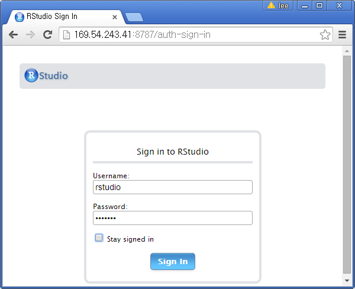
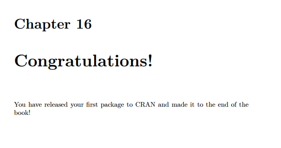
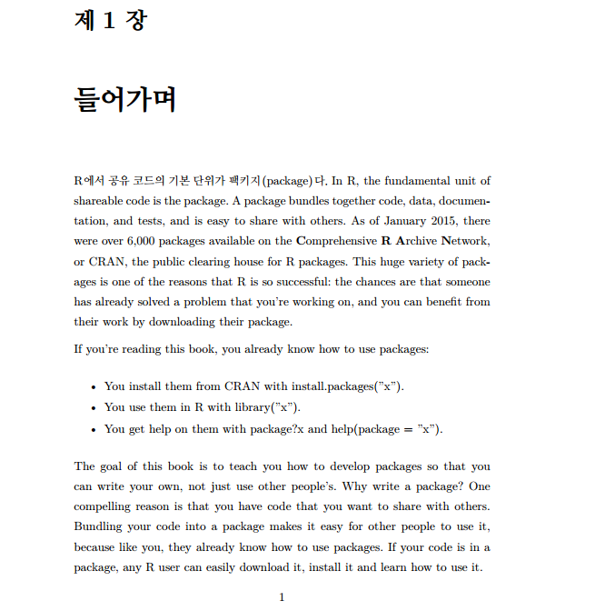

> ## 학습 목표 {.objectives}
>
> *   Hadley Wickham R 패키지 번역 플랫폼을 준비한다.
> *   데비안 기반으로 RStudio, Hadleyverse를 도커 환경으로 준비한다.
> *   마크다운으로 한글 번역을 한다.

### 1. 데비안 기반 RStudio 개발 플랫폼

데비안과 우분투를 초기 [RStudio](http://www.rstudio.com/)에서 도커 환경을 지원했으나, 
결국, 용량도 적으면서 오류도 적은 데비안만 도커 이미지로 제공하기로 결정했다. 자세한 사항 [Why not Ubuntu & Debian flavors?](https://github.com/rocker-org/rocker/wiki/FAQ) 참조바란다.

데비안 최신 버젼이 설치된 가상 컴퓨터를 한국에서 가장 가까운 홍콩 데이터센터에 주문해서 설치한다.

#### 1.1. 데비안 운영체제 설치된 가상 컴퓨터 준비

~~~ {.input}
root@r-pkg:~# uname -a
~~~

~~~ {.output}
Linux r-pkg 3.2.0-4-amd64 #1 SMP Debian 3.2.68-1+deb7u1 x86_64 GNU/Linux
~~~

#### 1.2. 도커를 설치한다.
커널 버젼이 3.1 이상 되기 때문에 바로 `wget`으로 내려받고 설치한다.
도커는 매우 활발한 공개 소프트웨어 프로젝트기 때문에 가능하면 최신 버젼을 설치한다.

~~~ {.input}
root@r-pkg:~# wget -qO- https://get.docker.com/ | sh
root@r-pkg:~# docker -v
~~~

~~~ {.output}
Docker version 1.7.0, build 0baf609
~~~

#### 1.3. `hadleyverse` 도커 이미지를 설치한다.

~~~ {.input}
root@r-pkg:~# docker pull rocker/hadleyverse
root@r-pkg:~# docker images
~~~

~~~ {.output}
REPOSITORY           TAG                 IMAGE ID            CREATED             VIRTUAL SIZE
rocker/hadleyverse   latest              a1b2b31f3d17        11 days ago         1.922 GB
~~~

#### 1.4. `hadleyverse` 도커 컨테이너 실행한다.

~~~ {.input}
root@r-pkgs:~# docker run -d -p 8787:8787 rocker/hadleyverse
~~~

### 2. 우분투 기반 RStudio 개발 플랫폼

#### 2.1. 데비안 운영체제 설치된 가상 컴퓨터 준비

~~~ {.input}
root@r-pkgs-ubuntu:~# uname -r
~~~

~~~ {.output}
Linux r-pkgs-ubuntu 3.13.0-51-generic #84-Ubuntu SMP Wed Apr 15 12:08:34 UTC 2015 x86_64 x86_64 x86_64 GNU/Linux
~~~

#### 2.2. 도커를 설치한다.
커널 버젼이 3.1 이상 되기 때문에 바로 `wget`으로 내려받고 설치한다.
도커는 매우 활발한 공개 소프트웨어 프로젝트기 때문에 가능하면 최신 버젼을 설치한다.

~~~ {.input}
root@r-pkgs-ubuntu:~# wget -qO- https://get.docker.com/ | sh
root@r-pkgs-ubuntu:~# docker -v
~~~

~~~ {.output}
Docker version 1.7.0, build 0baf609
~~~

#### 2.3. `hadleyverse` 도커 이미지를 설치한다.

~~~ {.input}
root@r-pkgs-ubuntu:~# docker pull rocker/hadleyverse
root@r-pkgs-ubuntu:~# docker images
~~~

~~~ {.output}
REPOSITORY           TAG                 IMAGE ID            CREATED             VIRTUAL SIZE
rocker/hadleyverse   latest              a1b2b31f3d17        11 days ago         1.922 GB
~~~

#### 2.4. `hadleyverse` 도커 컨테이너 실행한다.

~~~ {.input}
root@r-pkgs-ubuntu:~# docker run -d -p 8787:8787 rocker/hadleyverse
~~~

초기 사용자명과 비밀번호는 Username: `rstudio`, Password: `rstudio`다.

비밀번호 변경은 `Tools` &rarr; `Shell`을 클릭하고 명령 프롬프트에서 
`passwd`를 타이핑하여 현재 비밀번호와 변경할 비밀번호를 차례로 안내에 맞춰 입력하여 변경한다. 자세한 사항은 [웹 페이지](http://statistics.byu.edu/content/how-change-rstudio-password)를 참고한다.

### 3. R PKGS 번역 플랫폼 구축

#### 3.1. R Packages 번역 원본 GitHub에서 가져오기

`File` &rarr; `New Project` &rarr; `Version Contrl` &rarr; `Git`을 선택해서 *Clone Git Repository* 다음 정보를 입력한다.

- Repository URL: https://github.com/statkclee/r-pkgs.git
- Project directory name: r-pkgs
- Create project as subdirecotry of: ~

**Create Project** 버튼을 클릭한다.

#### 3.2. R Packages 번역 원본 PDF책으로 변환

##### 3.2.1. 마크다운 &rarr; Latex

GitHub에서 클론한 프로젝트 디렉토리에서 하위디렉토리로 **book** 디렉토리 밑으로 들어가면 `build-book.r`, `r-packages.tex` 파일이 있다. 마크다운으로 작성한 각 장을 `build-book.r`에서 빌드(build)하고 나서 `r-packages.tex` 파일에서 PDF 파일로 변환한다.

`build-book.r`을 실행하면 `bookdown`이 없다고 오류가 난다.

~~~ {.output}
> library(bookdown)
Error in library(bookdown) : there is no package called ‘bookdown’
~~~

`install.packages("bookdown")`은 설치가 되지 않으니 `bookdown` 팩키지 설치는 `devtools::install_github`을 이용한다.
RStudio 콘솔에서 GitHub에서 직접 `devtools::install_github("hadley/bookdown")` 명령어로 설치한다.

~~~ {.input}
> devtools::install_github("hadley/bookdown")
~~~

`lubridate` 팩키지가 설치되지 않은 경우 오류가 발생하니 만약 설치가 되어 있지 않다면 사전에 R 콘솔에서 `install.packages("lubridate")` 명령어로 설치한다.

~~~ {.input}
> install.packages("lubridate")
~~~

##### 3.2.2. Latex &rarr; PDF

`Rendering inst.rmd ... vignettes.rmd`를 통해서 Latex 파일로 변환은 되었다. **tex** 디렉토리가 만들어지고 그 내부에 PDF 변환을 위한 준비가 되었다. 하지만, **xelatex: not found** 오류가 난다. `xelatex`이 설치가 되지 않아서 우분투 쉘에서 `apt-get install texlive-xetex` 명령을 실행한다.

~~~ {.error}
> system("xelatex -interaction=batchmode r-packages ")
sh: 1: xelatex: not found
> system("xelatex -interaction=batchmode r-packages ")
sh: 1: xelatex: not found
~~~

> ### rocker/hadleyverse 컨테이너 작업 {.callout}
>
> `apt-get install texlive-xetex` 명령어를 컨테이너 내부에서 실행해야만 한다.  
>

`docker ps` 명령어를 통해서 실행중인 컨테이너 현황을 얻는다.

~~~ {.input}
root@r-pkgs-ubuntu:~# docker ps
~~~
 
~~~ {.output}
CONTAINER ID        IMAGE                COMMAND                PORTS                              NAMES
22655acc7eaa        rocker/hadleyverse   "/usr/bin/supervisor   1410/tcp, 0.0.0.0:8787->8787/tcp   reverent_feynman
~~~

`docker exec -it` 명령어를 통해서 컨테이너 내부로 들어가 `bash` 쉘에서 `apt-get update`, `apt-get install texlive-xetex` 명령어를 실행한다.

~~~ {.input}
root@r-pkgs-ubuntu:~# docker exec -it 22655acc7eaa bash
root@22655acc7eaa:/# apt-get update
root@22655acc7eaa:/# apt-get install texlive-xetex
~~~

### 4. 한글 laTeX 환경 설정

#### 4.1. `inconsolata` 폰트 설치 및 적용

`inconsolata` 폰트를 다운로드 받아서 설치한다. 

~~~ {.input}
root@22655acc7eaa:~# cd /usr/share/texlive/texmf-dist \
root@22655acc7eaa:~# wget http://mirrors.ctan.org/install/fonts/inconsolata.tds.zip \
root@22655acc7eaa:~# unzip inconsolata.tds.zip \
root@22655acc7eaa:~# rm inconsolata.tds.zip \
root@22655acc7eaa:~# echo "Map zi4.map" >> /usr/share/texlive/texmf-dist/web2c/updmap.cfg \
root@22655acc7eaa:~# mktexlsr \
root@22655acc7eaa:~# updmap-sys
~~~

그리고 나서, `r-packages.tex` 설정 파일에 주석처리하고, `\usepackage{zi4}`을 삽입한다.

~~~ {.input}
%\setmonofont[Mapping=tex-ansi]{Inconsolata}
\usepackage{zi4}
~~~

#### 4.2. 한글 LaTeX 설치

~~~ {.input}
root@22655acc7eaa:/# sudo apt-get install texlive-lang-cjk
~~~

#### 4.3. 한글 폰트 설치

~~~ {.input}
root@22655acc7eaa:/# sudo apt-get install fonts-nanum fonts-nanum-extra fonts-nanum-coding fonts-baekmuk fonts-unfonts-core fonts-unfonts-extra
~~~

#### 4.4. `r-packages.tex` Latex 환경파일 설정

`r-packages.tex` 파일에 다음 `kotex` 설정한다. 그리고 **RUN** 실행하면 모든 한글 번역 준비가 완료되었다.

~~~ {.input}
\usepackage[hangul]{kotex}
\kscntformat{chapter}{}{~장}
~~~

#### 4.4. LaTeX 설치

~~~ {.input}
root@csunplugged:~# apt-get update \
                    && apt-get install -y --no-install-recommends \
                      aspell \
                      aspell-en \
                      ghostscript \
                      imagemagick \
                      lmodern \
                      texlive-fonts-recommended \
                      texlive-humanities \
                      texlive-latex-extra \
                      texinfo
~~~

### 5. 도커 컨테이너 변경사항 저장

`docker ps` 명령어로 컨테이너 ID를 확인하고 `docker commit` 명령어로 커밋한다.
`-m` 옵션 플래그로 커밋 메시지를 저고, `-a` 옵션 플래그로 저자명을 적고, 컨테이너 ID와 `22655acc7eaa` 
저장 메시지를 남긴다.

~~~ {.input}
root@r-pkgs-ubuntu:~# docker ps
~~~

~~~ {.output}
CONTAINER ID  IMAGE              COMMAND              CREATED           PORTS                              NAMES
22655acc7eaa  rocker/hadleyverse "/usr/bin/supervisor About an hour ago 1410/tcp, 0.0.0.0:8787->8787/tcp   reverent_feynman
~~~

~~~ {.input}
root@r-pkgs-ubuntu:~# docker commit -m "setup English PDF" -a "Victor Lee" 22655acc7eaa statkclee/r-pkgs:v1
~~~

~~~ {.output}
9638bfca6ae73cfaf37ca5914137002cf7be0b24f716c7839d7c60f032091769
~~~

`docker push` 명령어와 함께 `statkclee/r-pkg` 이미지명을 적어주면 도커허브에 올라간다.

~~~ {.input}
root@r-pkgs-ubuntu:~# docker push statkclee/r-pkg
~~~

