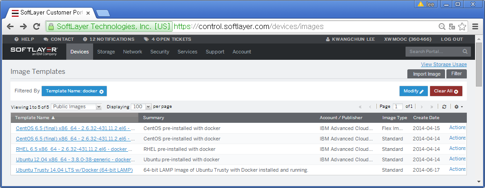
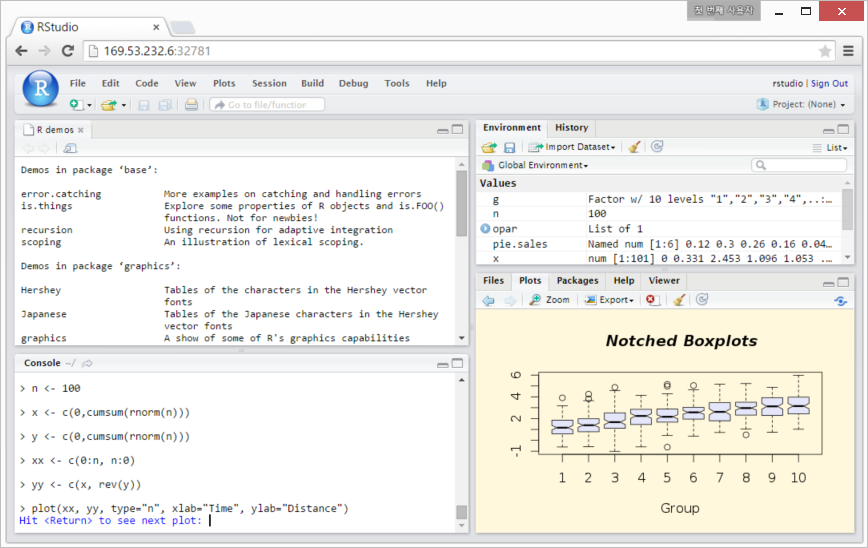
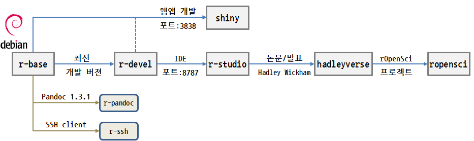
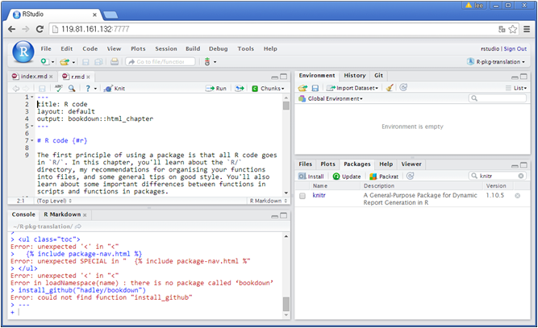

> ## 학습 목표 {.objectives}
>
> *   Softlayer 가상 컴퓨터와 공용 이미지 활용
> *   RStudio와 Shiny 서버 도커 설치
> *   데이터 과학 도커 개발 툴체인 구축

### 1. Softlayer 공용 도커 이미지

데이터 과학 제품개발을 위한 가상 컴퓨터를 준비하는 개략적인 개념을 보여준다. 이를 확장해서 좀더 유연한 사고 체계를 가지고 업무에 최적화된 데이터 과학 제품 개발을 위한 환경을 구축한다.

데이터 과학 제품개발 위한 가상 컴퓨터를 준비하기 위해서 일반적인 가상 컴퓨터를 준비해서 데이터 과학 제품 개발 툴체인을 구축하는 방법이 있고, Softlayer에서 준비한 도커가 설치된 공용 이미지에서 가상 컴퓨터를 준비하는 방법이 있다.

#### 1.1. 가상 컴퓨터 준비

파이썬 스크립트를 변경하여 CLI 쉘환경에서 가상 컴퓨터를 생성하게 한다.
좌측편의 파이썬 코드에서는 `nano` 텍스트 편집기를 열고 `hostname`에 `jekyll-dev`를 하드코딩한다.
하지만, 우측편의 가상컴퓨터를 생성하는 파이썬 프로그램은 `python vm-create.py jekyll-dev` 방식으로 
인자를 넘기게 되면 가상컴퓨터를 바로 주문하게 된다.

~~~ {.input}
import SoftLayer                                      : import sys
client = SoftLayer.create_client_from_env(            : import SoftLayer
         username="SLXXXXXX",                         : 
         api_key="7c7XXXXXX")                         : vmname = sys.argv[1]
                                                      : 
shiny_object = client['Virtual_Guest'].createObject({ : client = SoftLayer.create_client_from_env(
    'hostname': 'jekyll-dev',                         :          username="SLXXXXXX",api_key="7c7XXXXXX")
    'domain': 'xwmooc.net',                           : 
    'startCpus': 1,                                   : shiny_object = client['Virtual_Guest'].createObject({ 
    'maxMemory': 1024,                                :     'hostname': vmname,
    'hourlyBillingFlag': 'true',                      :     'domain': 'xwmooc.net',
    'operatingSystemReferenceCode': 'UBUNTU_LATEST',  :     'startCpus': 1,
    'localDiskFlag': 'true',                          :     'maxMemory': 1024, 
    'datacenter': { "name" : 'dal09'},                :     'hourlyBillingFlag': 'true',
    'local_disk': 25,                                 :     'operatingSystemReferenceCode': 'UBUNTU_LATEST',
    'public': 'true'                                  :     'localDiskFlag': 'true',
})                                                    :     'datacenter': { "name" : 'dal09'}, 
                                                      :     'local_disk': 25,  
                                                      :     'public': 'true'    
                                                      : }) 
~~~

도커를 설치하기 위해서는 운영체제로 **'UBUNTU_LATEST'**를 지정해야 한다. 
이제 가상 컴퓨터가 준비되었으니 도커(Docker)를 설치하자.

#### 1.2. 도커 설치된 이미지에서 가상 컴퓨터 준비

`Devices` &#8594; `Manage` &#8594; `Images`를 클릭하면 *Image Templates* 화면에 들어온다. 바로 아래 `Public Images`와 `Private Images`를 선택할 수 있다. 공용 `Public Images`를 클릭하고 나서 우측상단 `Filter`로 `Template Name`에 **docker**를 입력하면 CentOS, RHEL, Ubuntu 에 docker가 설치된 공용 이미지를 찾을 수 있다. 

LAMP와 Docker가 설치된 우분투 공용 이미지가 [xwMOOC](http://www.xwmooc.net) 프로젝트에 가장 적합하여 선택한다.

### 2. 데이터 과학 툴체인 구축

#### 2.1. RStuido 도커 이미지를 설치한다.

다양한 RStudio 도커가 있지만, 여기에서는 [rocker](https://github.com/rocker-org/rocker)를 사용한다. 먼저 `docker search rstudio` 명령어를 통해서 도커 RStudio 이미지를 검색한다. 

~~~ {.input}
root@docker-dev:~# docker search rstudio
~~~

~~~ {.output}
NAME                              DESCRIPTION                                     STARS     OFFICIAL   AUTOMATED
rocker/rstudio                                                                    26                   [OK]
opencpu/rstudio                   Docker image with opencpu and rstudio-server    5                    [OK]
h2sp/cent65-rstudio-server                                                        3                    [OK]
rocker/rstudio-daily                                                              2                    [OK]
mgymrek/docker-rstudio-server                                                     1                    [OK]
quantumobject/docker-rstudio      Rstudio server v0.98.1103                       1                    [OK]
dit4c/dit4c-container-rstudio                                                     1                    [OK]
thephilross/ubuntu-rstudio        RStudio Server                                  1
rhee/rstudio                                                                      0                    [OK]
twistedogic/rstudio               rstudio with codebox                            0                    [OK]
wieling/docker-rstudio-server                                                     0                    [OK]
joshamorrison/rstudio             RStudio                                         0
hibariba/rstudio-server                                                           0                    [OK]
ndslabs/rstudio                                                                   0
geraudster/rstudio-server         Docker image for RStudio Server                 0
eivantsov/rstudio                                                                 0
gmgall/rstudio                                                                    0
gchevalley/rstudio                                                                0
ohtaman/rstudio                                                                   0
dbuijs/rstudio                                                                    0
c3h3/rstudio-java                                                                 0                    [OK]
erasche/docker-rstudio-notebook   Docker RStudio container for use in Galaxy...   0                    [OK]
mccahill/rstudio                  RStudio in Docker with knitr, RMarkdown, a...   0                    [OK]
engines/rstudio                   Base image for rstudio applications for th...   0
mictech/rstudio                                                                   0                    [OK]
root@docker-dev:~#
~~~

`rocker/rstudio` 이미지를 다운로드 받아 사용한다. 로컬에 당연히 없기 때문에 다운로드 받아 자동으로 설치를 한다. `docker ps -l` 명령어로 포트번호 `32782`를 확인하고 `ifconfig eth01` 명령어로 IP주소와 조합해서 웹브라우져를 통해 RStudio에 로그인한다.
IP 주소는 `169.53.232.6` 이다.

~~~ {.input}
root@docker-dev:~# sudo docker run -d -P rocker/rstudio
~~~

~~~ {.output}
root@docker-dev:~# docker ps -l
CONTAINER ID        IMAGE                   COMMAND                CREATED             STATUS              PORTS                     NAMES
00c2e46f4132        rocker/rstudio:latest   "/usr/bin/supervisor   3 seconds ago       Up 2 seconds        0.0.0.0:32782->8787/tcp   thirsty_colden
~~~

~~~ {.input}
root@docker-dev:~# ifconfig eth01
~~~

~~~ {.output}
eth1      Link encap:Ethernet  HWaddr 06:28:dd:28:1e:e9
          inet addr:169.53.232.6  Bcast:169.53.232.15  Mask:255.255.255.240
          inet6 addr: fe80::428:ddff:fe28:1ee9/64 Scope:Link
          UP BROADCAST RUNNING MULTICAST  MTU:1500  Metric:1
          RX packets:397092 errors:0 dropped:0 overruns:0 frame:0
          TX packets:77367 errors:0 dropped:0 overruns:0 carrier:0
          collisions:0 txqueuelen:1000
          RX bytes:467772457 (467.7 MB)  TX bytes:15302535 (15.3 MB)
~~~

#### 2.2. Shiny 서버 도커 이미지를 설치

[도커 허브(DockerHub)](https://hub.docker.com/)에 올라간 공용 및 공식 도커 이미지를 검색해서 설치한다.

`docker search` 명령어로 *shiny*를 입력해서 Shiny 서버를 설치한다.
설치 명령어는 도커 이미지 중에서 가장 별(STARS)이 많은 *rocker/shiny*를 선택해서 
`docker pull rocker/shiny` 명령어를 실행한다. 로컬 컴퓨터에 *shiny* 이미지가 없으면 [도커 허브(DockerHub)](https://hub.docker.com/)에 접속해서 자동으로 설치한다.

~~~ {.input}
root@dev:~# docker search shiny
~~~
~~~ {.output}
NAME                           DESCRIPTION                                     STARS     OFFICIAL   AUTOMATED
rocker/shiny                                                                   12                   [OK]
quantumobject/docker-shiny     Shiny server : use to host and manage shin...   6                    [OK]
wch1/r-shiny-server                                                            3                    [OK]
raulkite/shiny                                                                 0                    [OK]
pshevtsov/shiny-server                                                         0                    [OK]
flaviobarros/shiny-wordcloud                                                   0                    [OK]
mdagost/shiny                  Modified version of shiny image to work wi...   0
wush978/tw-r-shiny             To show how to install shiny-server with c...   0                    [OK]
laurentj/shiny                 test                                            0                    [OK]
cannin/r-shiny-server                                                          0                    [OK]
root@dev:~#
~~~

~~~ {.input}
root@dev:~# docker pull rocker/shiny
~~~

~~~ {.output}
Pulling repository rocker/shiny
f984ee68848b: Download complete
511136ea3c5a: Download complete
d338bb63f151: Download complete

....

16583dad808c: Download complete
ae32e6c699a7: Download complete
Status: Downloaded newer image for rocker/shiny:latest
~~~

~~~ {.input}
root@dev:~# docker run --rm -p 3838:3838 rocker/shiny &
~~~

`docker run` 명령어로 `3838`번 포트로 설치한 *Shiny* 서버를 실행한다.

`docker images` 명령어를 통해서 설치된 도커 이미지를 확인한다.

~~~ {.input}
root@dev:~/pyr-cloudlayer# docker images
~~~

~~~ {.output}
REPOSITORY          TAG                 IMAGE ID            CREATED             VIRTUAL SIZE
jekyll/jekyll       latest              19216e6f694d        2 days ago          566.1 MB
rocker/shiny        latest              f984ee68848b        11 weeks ago        1.031 GB
jagregory/pandoc    latest              be6297221dd3        15 months ago       2.143 GB
~~~

`docker info` 명령어를 통해서 `docker` 현황을 파악한다.

~~~ {.input}
root@dev:~/pyr-cloudlayer# docker info
~~~

~~~ {.output}
Containers: 1
Images: 61
Storage Driver: aufs
 Root Dir: /var/lib/docker/aufs
 Backing Filesystem: extfs
 Dirs: 63
 Dirperm1 Supported: false
Execution Driver: native-0.2
Logging Driver: json-file
Kernel Version: 3.13.0-51-generic
Operating System: Ubuntu 14.04.2 LTS
CPUs: 2
Total Memory: 3.908 GiB
WARNING: No swap limit support
~~~

### 3. 데이터 과학 툴체인 구축

#### 3.1. r-base 도커 이미지 설치

~~~ {.input}
root@dev:~/r-base# docker search -s 5 r-base
~~~ 

~~~ {.output}
NAME            DESCRIPTION                                     STARS     OFFICIAL   AUTOMATED
rocker/r-base                                                   14                   [OK]
r-base          R is a system for statistical computation ...   10        [OK]
~~~

~~~ {.input}
root@dev:~/r-base# docker pull rocker/r-base
~~~

~~~ {.output}
latest: Pulling from rocker/r-base

8fb16fb6edea: Pull complete
....
1a7dbc64f1fa: Already exists
Digest: sha256:bb18bc42cba0a10543b234ebdfb2f1cd16c4c3c16118eb03aececc83601d7236
Status: Downloaded newer image for rocker/r-base:latest
~~~

#### 3.2. r-devel 도커 이미지 설치

~~~ {.input}
root@dev:~/r-base# docker search r-devel
~~~

~~~ {.output}
NAME                         DESCRIPTION                                     STARS     OFFICIAL   AUTOMATED
rocker/r-devel                                                               4                    [OK]
rocker/r-devel-san                                                           2                    [OK]
achubaty/r-spatial-devel     adds various R spatial/mapping tools to th...   0                    [OK]
brauner/r-devel                                                              0                    [OK]
achubaty/r-spades-devel      provides a testing environment for buildin...   0                    [OK]
rocker/r-devel-ubsan-clang                                                   0                    [OK]
~~~

~~~ {.input}
root@dev:~/r-base# docker pull rocker/r-devel
~~~

~~~ {.output}
latest: Pulling from rocker/r-devel

1dc1e7664dba: Pull complete
...
bf84c1d84a8f: Already exists
Digest: sha256:217cbce0b13fb857851d7fa3cc9cea91fe54807eedc7d04d970daab1afa753f3
Status: Downloaded newer image for rocker/r-devel:latest
~~~

#### 3.3. RStudio 도커 이미지 설치

~~~ {.input}
root@dev:~/r-base# docker search rstudio
~~~

~~~ {.output}
NAME                              DESCRIPTION                                     STARS     OFFICIAL   AUTOMATED
rocker/rstudio                                                                    27                   [OK]
opencpu/rstudio                   Docker image with opencpu and rstudio-server    7                    [OK]
rocker/rstudio-daily                                                              2                    [OK]
dit4c/dit4c-container-rstudio                                                     1                    [OK]
twistedogic/rstudio               rstudio with codebox                            1                    [OK]
quantumobject/docker-rstudio      Rstudio server v0.98.1103                       1                    [OK]
erasche/docker-rstudio-notebook   Docker RStudio container for use in Galaxy...   0                    [OK]
mccahill/rstudio                  RStudio in Docker with knitr, RMarkdown, a...   0                    [OK]
~~~

~~~ {.input}
root@dev:~/r-base# docker pull rocker/rstudio
~~~

~~~ {.output}
latest: Pulling from rocker/rstudio

39bb80489af7: Pull complete
...
6b08b6d8f893: Already exists
Digest: sha256:97d4cfc91f7946598918aca31f16b6ca1fc4313b3401624f96cd7c298fbf7b81
Status: Downloaded newer image for rocker/rstudio:latest
~~~

#### 3.4. hadleyverse 도커 이미지 설치

~~~ {.input}
root@dev:~/r-base# docker search hadleyverse
~~~

~~~ {.output}
NAME                  DESCRIPTION                                     STARS     OFFICIAL   AUTOMATED
rocker/hadleyverse                                                    14                   [OK]
mclose/hadleyverse    Based off of rocker/hadleyverse plus some ...   0
keynmol/hadleyverse                                                   0
~~~

~~~ {.input}
root@dev:~/r-base# docker pull rocker/hadleyverse
~~~

~~~ {.output}
latest: Pulling from rocker/hadleyverse

e6a76f29f586: Pull complete
...
6b08b6d8f893: Already exists
Digest: sha256:6399e3095c15d8ec3784f39883e51a785035211a59780ab49de85ddf10953877
Status: Downloaded newer image for rocker/hadleyverse:latest
~~~

#### 3.5. Shiny 도커 이미지 설치

~~~ {.input}
root@dev:~/r-base# docker search shiny
~~~

~~~ {.output}
NAME                           DESCRIPTION                                     STARS     OFFICIAL   AUTOMATED
rocker/shiny                                                                   12                   [OK]
quantumobject/docker-shiny     Shiny server : use to host and manage shin...   6                    [OK]
wch1/r-shiny-server                                                            3                    [OK]
raulkite/shiny                                                                 0                    [OK]
pshevtsov/shiny-server                                                         0                    [OK]
flaviobarros/shiny-wordcloud                                                   0                    [OK]
gmgall/shiny-server                                                            0                    [OK]
wush978/tw-r-shiny             To show how to install shiny-server with c...   0                    [OK]
laurentj/shiny                 test                                            0                    [OK]
cannin/r-shiny-server                                                          0                    [OK]
~~~

~~~ {.input}
root@dev:~/r-base# docker pull rocker/shiny
~~~

~~~ {.output}
Pulling repository rocker/shiny
f984ee68848b: Pulling dependent layers
...
ae32e6c699a7: Download complete
Status: Downloaded newer image for rocker/shiny:latest
~~~

#### 3.6. 데이터 과학 R 도커 이미지 

`docker images` 명령을 통해 R 기반 데이터 과학 툴체인을 준비한다. 

~~~ {.input}
root@dev:~/r-base# docker images
~~~

~~~ {.output}
REPOSITORY               TAG                 IMAGE ID            CREATED             VIRTUAL SIZE
statkclee/xwmooc         latest              72b57ba7acc3        8 hours ago         1.872 GB
rocker/r-devel           latest              2e6a9196129a        3 days ago          2.088 GB
rocker/r-base            latest              39e6925cc4e7        4 days ago          538.3 MB
debian                   testing             1a7dbc64f1fa        5 days ago          122.2 MB
debian                   jessie              bf84c1d84a8f        5 days ago          125.2 MB
ubuntu                   14.04               6d4946999d4f        8 days ago          188.3 MB
rocker/hadleyverse       latest              a1b2b31f3d17        9 days ago          1.922 GB
rocker/rstudio           latest              6b08b6d8f893        3 weeks ago         889.3 MB
rocker/shiny             latest              f984ee68848b        11 weeks ago        1.031 GB
~~~

#### 3.7. 데이터 과학 R 도커 컨테이너

`docker run` 명령어를 통해 도커 이미지를 실행한다. `-d` 옵션 플래그는 데몬으로 컨테이너를 실행한다는 의미다.
`rocker/shiny` 컨테이너를 띄우기 위해서 포트 번호를 `3838:3838`로 매칭하면 IP 주소와 연결해서 Shiny 서버에 웹 인터페이스 클라이언트로 접속한다. 일반 `rocker/rstudio` 컨테이너를 띄우려면 `8787` 포트를 이용하고 `rocker/hadleyverse`를 컨테이너를 띄울 경우 `7777` 포트를 이용한다.

~~~ {.input}
root@csunplugged:~# docker run -d rocker/r-base
root@csunplugged:~# docker run -d rocker/hadleyverse
root@csunplugged:~# docker run -d rocker/rstudio
root@csunplugged:~# docker run -d -p 3838:3838 rocker/shiny
root@csunplugged:~# docker run -d -p 8787:8787 rocker/rstudio
root@csunplugged:~# docker run -d -p 7777:8787 rocker/hadleyverse
root@csunplugged:~# docker ps
~~~

~~~ {.output}
CONTAINER ID   IMAGE             COMMAND              CREATED        STATUS        PORTS                    NAMES
ad612cf00400   rocker/rstudio    "/usr/bin/supervisor 5 seconds ago  Up 5 seconds  0.0.0.0:8787->8787/tcp   grave_newton
f06ab3779274   rocker/shiny      "/usr/bin/shiny-serv 45 seconds ago Up 44 seconds 0.0.0.0:3838->3838/tcp   adoring_banach
5c061b59b648   rocker/shiny      "/usr/bin/shiny-serv 2 minutes ago  Up 2 minutes  3838/tcp         trusting_kilby
4bd20ab7fcda   rocker/rstudio    "/usr/bin/supervisor 2 minutes ago  Up 2 minutes  8787/tcp         adoring_darwin
6adc5d769c03   rocker/hadleyverse"/usr/bin/supervisor 2 minutes ago  Up 2 minutes  1410/tcp, 8787/tcp       elegant_davinci
6adc5d769c03   rocker/hadleyverse"/usr/bin/supervisor 10 minutes ago Up 10 minutes 1410/tcp, 0.0.0.0:7777->8787/tcp kickass_fermat
~~~

`docker kill` 명령어로 프로세스를 삭제한다. 도커는 프로세스를 다룬다.

~~~ {.input}
root@csunplugged:~# docker kill 5c061b59b648
5c061b59b648
root@csunplugged:~# docker kill 4bd20ab7fcda
4bd20ab7fcda
~~~
~~~ {.output}
root@csunplugged:~# docker ps
CONTAINER ID  IMAGE               COMMAND              CREATED         PORTS                            NAMES
98a4a3c9b681  rocker/hadleyverse  "/usr/bin/supervisor 21 minutes ago  1410/tcp, 0.0.0.0:7777->8787/tcp kickass_fermat
ad612cf00400  rocker/rstudio      "/usr/bin/supervisor 29 minutes ago  0.0.0.0:8787->8787/tcp           grave_newton
f06ab3779274  rocker/shiny        "/usr/bin/shiny-serv 30 minutes ago  0.0.0.0:3838->3838/tcp           adoring_banach
6adc5d769c03  rocker/hadleyverse  "/usr/bin/supervisor 32 minutes ago  1410/tcp, 8787/tcp               elegant_davinci
~~~
