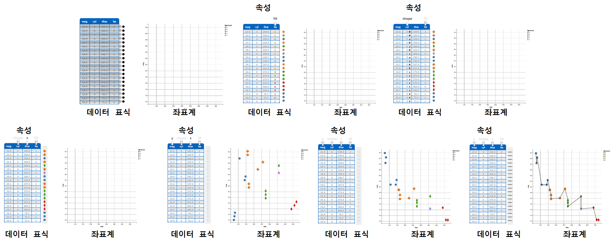

### 1. `ggvis` 개요 

[ggvis](http://ggvis.rstudio.com/)는 R의 강력한 데이터 분석엔진을 HTML5와 자바스크립트를 결합하여 인터랙티브 상호작용과 화면출력을 접목하고자 [Winston Chang](https://github.com/wch)이 주도되어 개발되었다. 물론 그래픽 문법(Grammer of Graphics)과 ggplot2에 기반하고 있다.

> ### `ggvis`가 바라본 그래프 {.callout}
>
> 그래프 = 데이터 + 좌표 시스템 + 표식 + 속성 + ...     
>
> Graph = `iris` + `cartesian` + `points` + `fill=`

[데이터 캠프(datacamp)](https://www.datacamp.com/courses/ggvis-data-visualization-r-tutorial) **Data Visualization in R with ggvis** 과정에 그래픽 문법 개념을 잘 설명하고 있다.

### 2. `ggvis` 예제

#### 2.1. `ggvis` 산점도와 평활선

`library(ggvis)` 명령어로 `ggvis` 라이브러리를 불러온다. 파이프 연산자를 사용해서 `mtcars` 데이터셋을 `ggvis` 함수에 넣어 차량무계(`wt`)와 연비(`mpg`)를 데카르트 좌표계에 넣고,
`layer_points()` 함수로 점을 찍고, `layer_smooths()` 함수로 평활선을 추가한다.

~~~{.r}
library(ggvis)
mtcars %>% ggvis(~wt, ~mpg) %>% 
           layer_points() %>% 
           layer_smooths()
~~~

<!--html_preserve-->

<nav class="ggvis-control">

<ul class="ggvis-dropdown">
<li>
Renderer: 
<a id="plot_id460137769_renderer_svg" class="ggvis-renderer-button" onclick="return false;" data-plot-id="plot_id460137769" data-renderer="svg">SVG</a>
 | 
<a id="plot_id460137769_renderer_canvas" class="ggvis-renderer-button" onclick="return false;" data-plot-id="plot_id460137769" data-renderer="canvas">Canvas</a>
</li>
<li>
<a id="plot_id460137769_download" class="ggvis-download" data-plot-id="plot_id460137769">Download</a>
</li>
</ul>
</nav>

<!--/html_preserve-->

#### 2.2. `ggvis` 선그림

`ggvis` 라이브러리로 선그림도 가능하다. 동일한 `mtcars` 데이터셋과 동일한 데카르트 좌표계를 사용해서 `ggvis` 함수에 넣어 차량무계(`wt`)와 연비(`mpg`)를 넣고,
`layer_lines()` 함수에 색상, 선폭, 선모양을 차별화해서 시각화한다.

~~~{.r}
mtcars %>% ggvis(~wt, ~mpg) %>% 
           layer_lines(stroke:="red", strokeWidth:=2, strokeDash:=6) %>% 
           layer_smooths()
~~~

<!--html_preserve-->

<nav class="ggvis-control">

<ul class="ggvis-dropdown">
<li>
Renderer: 
<a id="plot_id813305678_renderer_svg" class="ggvis-renderer-button" onclick="return false;" data-plot-id="plot_id813305678" data-renderer="svg">SVG</a>
 | 
<a id="plot_id813305678_renderer_canvas" class="ggvis-renderer-button" onclick="return false;" data-plot-id="plot_id813305678" data-renderer="canvas">Canvas</a>
</li>
<li>
<a id="plot_id813305678_download" class="ggvis-download" data-plot-id="plot_id813305678">Download</a>
</li>
</ul>
</nav>

<!--/html_preserve-->

#### 2.3. `ggvis` 히스토그램, 밀도 그래프, 막대 그래프

`ggvis` 라이브러리로 물론 히스토그램과 밀도(denstiy) 그래프도 가능하다. 동일한 `mtcars` 데이터셋과 동일한 데카르트 좌표계를 사용해서 `ggvis` 함수에 넣어 연비(`mpg`)만 넣고, 
`layer_histograms()` 함수에 `width=7`을 인자로 넣어 히스토그램을 완성한다. 

~~~{.r}
mtcars %>% ggvis(~mpg) %>% 
           layer_histograms(width=7)
~~~

<!--html_preserve-->

<nav class="ggvis-control">

<ul class="ggvis-dropdown">
<li>
Renderer: 
<a id="plot_id825545188_renderer_svg" class="ggvis-renderer-button" onclick="return false;" data-plot-id="plot_id825545188" data-renderer="svg">SVG</a>
 | 
<a id="plot_id825545188_renderer_canvas" class="ggvis-renderer-button" onclick="return false;" data-plot-id="plot_id825545188" data-renderer="canvas">Canvas</a>
</li>
<li>
<a id="plot_id825545188_download" class="ggvis-download" data-plot-id="plot_id825545188">Download</a>
</li>
</ul>
</nav>

<!--/html_preserve-->

`layer_densities()` 함수에 `fill:="orange"`로 색상 인자로 넘겨 밀도 그래프를 완성한다.

~~~{.r}
mtcars %>% ggvis(~mpg) %>% 
           layer_densities(fill:="orange")
~~~

<!--html_preserve-->

<nav class="ggvis-control">

<ul class="ggvis-dropdown">
<li>
Renderer: 
<a id="plot_id897982248_renderer_svg" class="ggvis-renderer-button" onclick="return false;" data-plot-id="plot_id897982248" data-renderer="svg">SVG</a>
 | 
<a id="plot_id897982248_renderer_canvas" class="ggvis-renderer-button" onclick="return false;" data-plot-id="plot_id897982248" data-renderer="canvas">Canvas</a>
</li>
<li>
<a id="plot_id897982248_download" class="ggvis-download" data-plot-id="plot_id897982248">Download</a>
</li>
</ul>
</nav>

<!--/html_preserve-->

`layer_bars()` 함수에 `fill:="orange"`로 색상 인자로 넘겨 막대 그래프를 완성한다.

~~~{.r}
mtcars %>% ggvis(~factor(cyl)) %>% 
           layer_bars(fill:="orange")
~~~

<!--html_preserve-->

<nav class="ggvis-control">

<ul class="ggvis-dropdown">
<li>
Renderer: 
<a id="plot_id254518347_renderer_svg" class="ggvis-renderer-button" onclick="return false;" data-plot-id="plot_id254518347" data-renderer="svg">SVG</a>
 | 
<a id="plot_id254518347_renderer_canvas" class="ggvis-renderer-button" onclick="return false;" data-plot-id="plot_id254518347" data-renderer="canvas">Canvas</a>
</li>
<li>
<a id="plot_id254518347_download" class="ggvis-download" data-plot-id="plot_id254518347">Download</a>
</li>
</ul>
</nav>

<!--/html_preserve-->

### 3. 인터랙티브 상호작용 시각화

`ggvis`에서는 다음 7가지 인터랙티브 상호작용 위젯을 지원한다.

* `input_checkbox()`
* `input_checkboxgroup()`
* `input_numeric()`
* `input_radiobuttons()`
* `input_select()`
* `input_slider()`
* `input_text()`

`input_radiobuttons` 라디오버튼을 사용해서 색상을 인터랙티브하게 변경할 수 있다.

~~~{.r}
mtcars %>% 
  ggvis(~mpg, ~wt,
        fill := input_radiobuttons(label="Choose color:",
                             choices=c("black", "red", "blue", "green"))) %>% 
  layer_points()
~~~

~~~{.output}
Warning: Can't output dynamic/interactive ggvis plots in a knitr document.
Generating a static (non-dynamic, non-interactive) version of the plot.

~~~

<!--html_preserve-->

<nav class="ggvis-control">

<ul class="ggvis-dropdown">
<li>
Renderer: 
<a id="plot_id346438119_renderer_svg" class="ggvis-renderer-button" onclick="return false;" data-plot-id="plot_id346438119" data-renderer="svg">SVG</a>
 | 
<a id="plot_id346438119_renderer_canvas" class="ggvis-renderer-button" onclick="return false;" data-plot-id="plot_id346438119" data-renderer="canvas">Canvas</a>
</li>
<li>
<a id="plot_id346438119_download" class="ggvis-download" data-plot-id="plot_id346438119">Download</a>
</li>
</ul>
</nav>

<!--/html_preserve-->

데이터프레임 변수에서 직접 값을 추출해서 `input_select` 선택값으로 선택하는 것도 가능하다.

~~~{.r}
mtcars %>% 
  ggvis(~mpg, ~wt, fill = input_select(label="Choose fill variable:",
                                      choices=names(mtcars), map=as.name)) %>% 
  layer_points()
~~~

~~~{.output}
Warning: Can't output dynamic/interactive ggvis plots in a knitr document.
Generating a static (non-dynamic, non-interactive) version of the plot.

~~~

<!--html_preserve-->

<nav class="ggvis-control">

<ul class="ggvis-dropdown">
<li>
Renderer: 
<a id="plot_id989713523_renderer_svg" class="ggvis-renderer-button" onclick="return false;" data-plot-id="plot_id989713523" data-renderer="svg">SVG</a>
 | 
<a id="plot_id989713523_renderer_canvas" class="ggvis-renderer-button" onclick="return false;" data-plot-id="plot_id989713523" data-renderer="canvas">Canvas</a>
</li>
<li>
<a id="plot_id989713523_download" class="ggvis-download" data-plot-id="plot_id989713523">Download</a>
</li>
</ul>
</nav>

<!--/html_preserve-->

### 4. `ggvis` 범례와 축서식 

`add_legend()` 함수를 통해 범례를 추가하고, `add_axis()` 함수를 통해 축서식을 설정한다.

~~~{.r}
mtcars %>% 
  ggvis(~mpg, ~wt, opacity := 0.6, 
        fill = ~factor(cyl))  %>%
  layer_points() %>%
  add_legend(c("fill"), title="실린더 유형") %>%
  add_axis("x", title = "Weight(차체 중량)")
~~~

<!--html_preserve-->

<nav class="ggvis-control">

<ul class="ggvis-dropdown">
<li>
Renderer: 
<a id="plot_id642770714_renderer_svg" class="ggvis-renderer-button" onclick="return false;" data-plot-id="plot_id642770714" data-renderer="svg">SVG</a>
 | 
<a id="plot_id642770714_renderer_canvas" class="ggvis-renderer-button" onclick="return false;" data-plot-id="plot_id642770714" data-renderer="canvas">Canvas</a>
</li>
<li>
<a id="plot_id642770714_download" class="ggvis-download" data-plot-id="plot_id642770714">Download</a>
</li>
</ul>
</nav>

<!--/html_preserve-->

~~~{.r}
  add_axis("y", title = "연비(mpg")
~~~

~~~{.output}
Error in vis$cur_vis: $ operator is invalid for atomic vectors

~~~

### 5. `ggvis` 척도(scale)

`ggvis` 척도를 다음 함수 5개를 사용해서 설정한다.

* `scale_datetime()`
* `scale_logical()`
* `scale_nominal()`
* `scale_numeric()`
* `scale_singular()`

~~~{.r}
mtcars %>% 
  ggvis(~wt, ~mpg, fill = ~disp, stroke = ~disp, strokeWidth := 2) %>%
  layer_points() %>%
  scale_numeric("fill", range = c("red", "yellow"))
~~~

<!--html_preserve-->

<nav class="ggvis-control">

<ul class="ggvis-dropdown">
<li>
Renderer: 
<a id="plot_id715352388_renderer_svg" class="ggvis-renderer-button" onclick="return false;" data-plot-id="plot_id715352388" data-renderer="svg">SVG</a>
 | 
<a id="plot_id715352388_renderer_canvas" class="ggvis-renderer-button" onclick="return false;" data-plot-id="plot_id715352388" data-renderer="canvas">Canvas</a>
</li>
<li>
<a id="plot_id715352388_download" class="ggvis-download" data-plot-id="plot_id715352388">Download</a>
</li>
</ul>
</nav>

<!--/html_preserve-->
