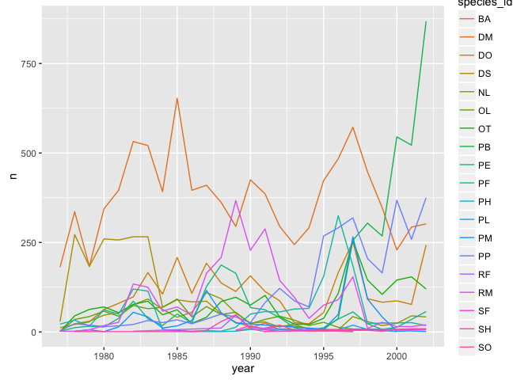
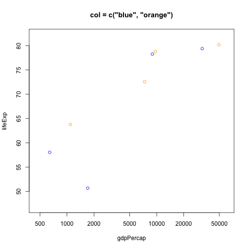
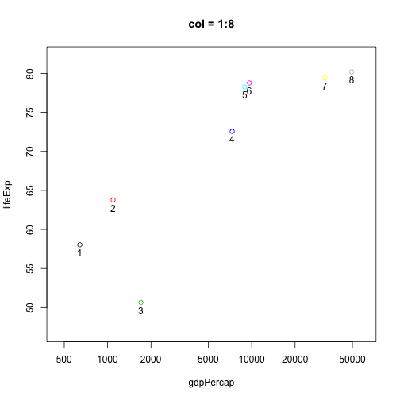
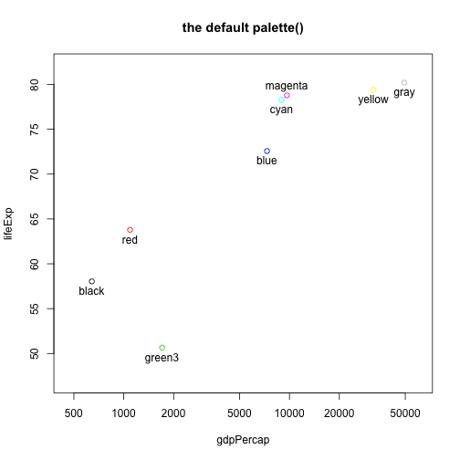
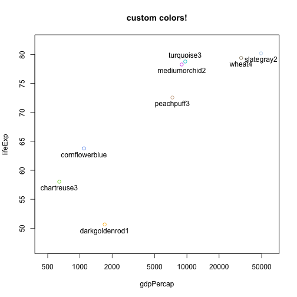
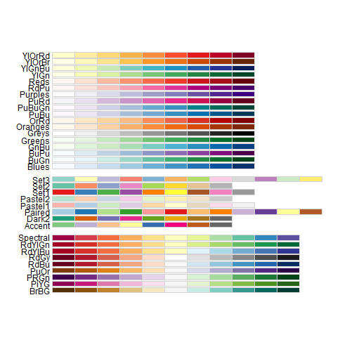
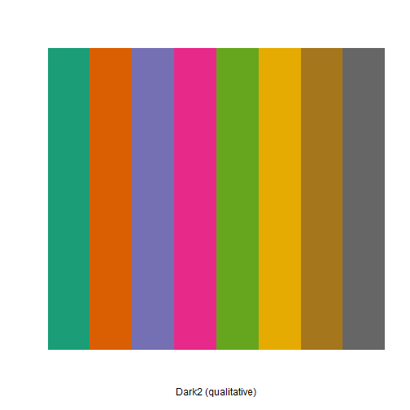
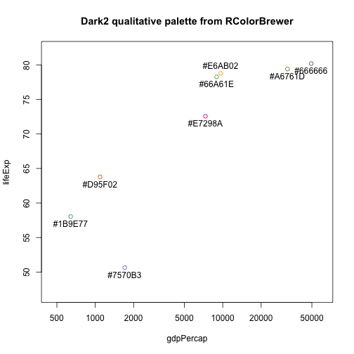
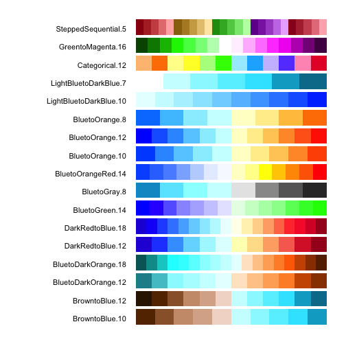

### 시각화 메커니즘[^viz-mechanism] 

크게보면 컴퓨터에서 색을 이해하고 표현하는 RGB 체계와 사람이 색을 인지하고 이해하는 HCL 체계로 나누어 진다.
2진수로 표현된 시각적 데이터는 RGB 16진수로 변환되어 모니터에 표시되고,
물리적 광자(photon)로 사람눈에 위치한 망막에 꽂히게 되고,
뇌에서 사람이 인지한 후에 이를 처리하여 시각적인 정보를 인식하게 된다.

따라서, 사람의 뇌에 인식할 수 있는 시각적인 정보로 데이터를 구성해야만 다양한 종류의 모니터를 통해 
효율적이고 효과적으로 정보가 전달될 수 있다.

[^viz-mechanism]: [A Better Default Colormap for Matplotlib, SciPy 2015, Nathaniel Smith and Stéfan van der Walt](https://www.youtube.com/watch?v=xAoljeRJ3lU&feature=youtu.be)

### 16진수 RGB 표색법

작은 양수나 크레파스 명칭 대신에, 일반적이고 컴퓨터가 읽어들일 수 있는 색상 표색법이 16진수 팔레트다.
RColorBrewer Dark2 팔레트가 실제로 저장된 방법이 다음에 나와 있다.

~~~{.r}
brewer.pal(n = 8, name = "Dark2")
~~~

~~~{.output}
Error in eval(expr, envir, enclos): 함수 "brewer.pal"를 찾을 수 없습니다

~~~

`#` 기호는 관례로 붙이는 것이고, 16진수 문자열을 다음과 같이 파싱한다:
`#rrggbb`에서 `rr`, `gg`, `bb` 각각은 적색, 녹색, 청색 채널에 대한 생상농도를 나타낸다.
각 색상은 2를 밑으로하는 16개 숫자를 나타내고, "16진수(hexadecimal)" 혹은 줄여서 헥스(hex)로 부른다.
다음에 밑을 10으로 하는 십진수와 16진수 비교표가 다음에 나와 있다.

예를 들어, 팔렛트 첫 색상이 `#1B9E77`으로 명세되어 있다. 따라서, 녹색 채널 색상농도는 `9E`가 된다.

$$
9E = 9 * 16^1 + 14 * 16^0 = 9 * 16 + 14 = 158
$$

무슨 뜻일까? 해당 채널의 가장 낮은 값은 `00`=0 이 되고, 
가장 높은 값은 `FF`=255 가 된다.

도움이 되는 기억해야될 중요한 사례가 다음에 나타나 있다.
적색, 녹색, 청색에 대한 강렬한 RGB 색상은 다음과 같다.

<!-- html table generated in R 3.2.3 by xtable 1.8-0 package -->
<!-- Mon Mar  7 11:07:12 2016 -->
<table border=1>
<tr> <th> color_name </th> <th> hex </th> <th> red </th> <th> green </th> <th> blue </th>  </tr>
  <tr> <td> blue </td> <td> #0000FF </td> <td align="right"> 0 </td> <td align="right"> 0 </td> <td align="right"> 255 </td> </tr>
  <tr> <td> green </td> <td> #00FF00 </td> <td align="right"> 0 </td> <td align="right"> 255 </td> <td align="right"> 0 </td> </tr>
  <tr> <td> red </td> <td> #FF0000 </td> <td align="right"> 255 </td> <td align="right"> 0 </td> <td align="right"> 0 </td> </tr>
   </table>

다음에 흑백, 회색을 표현한 것이 나타나 있다.

<!-- html table generated in R 3.2.3 by xtable 1.8-0 package -->
<!-- Mon Mar  7 11:07:12 2016 -->
<table border=1>
<tr> <th> color_name </th> <th> hex </th> <th> red </th> <th> green </th> <th> blue </th>  </tr>
  <tr> <td> white, gray100 </td> <td> #FFFFFF </td> <td align="right"> 255 </td> <td align="right"> 255 </td> <td align="right"> 255 </td> </tr>
  <tr> <td> gray67 </td> <td> #ABABAB </td> <td align="right"> 171 </td> <td align="right"> 171 </td> <td align="right"> 171 </td> </tr>
  <tr> <td> gray33 </td> <td> #545454 </td> <td align="right"> 84 </td> <td align="right"> 84 </td> <td align="right"> 84 </td> </tr>
  <tr> <td> black, gray0 </td> <td> #000000 </td> <td align="right"> 0 </td> <td align="right"> 0 </td> <td align="right"> 0 </td> </tr>
   </table>

"grey" 회색으로 치환하게 되면, "gray"를 보게되는 어느 곳에서나 동일한 결과를 얻게 됨에 주목한다.
모든 채널을 최대값으로 하면 흰색, 모든 채널을 최소값으로 하면 검정색이 된다.

> ### R에서 색상을 지정하는 방법 {.callout}
> 
> - **양의 정수**: `palette()`함수로 조작하거나 검색한 현재 색상 팔레트에 인덱스를 사용.
> - **색상 명칭**: `colors()` 함수로 검색된 색상
> - **16진수 문자열**: 16진수로 구성된 3개조에 추가해서, 알파 투명도를 나타내는 네번째 채널을 넣어 
> 16진수 4개조로 구성된 생상표로 확장하기도 한다.

`rgb()`, `col2rgb()`, `convertColor()` 함수도 유용하니, 자세한 내용은 도움말을 참조한다.

### 대안 RGB 색상모형, HCL

RGB 색공간과 색상모형이 유일무이하고 가장 최고는 아니다.
컴퓨터 화면에 색상을 표현하는데는 자연스럽지만, 일부 영역에서 색상을 선택하는 
작업에는 이런 모형을 적용하기 어렵다.
예를 들어, 사람이 구별하기는 쉽지만, 인지적으로 색상별로 비교되는 생각으로 구성된
정성적인 팔레트를 만들어 내는 방법은 명확하지 않다.
컴퓨터에 사용되는 색상을 기술하는데 RGB를 사용하지만, 
**사람이 색상체계를 구축하는 색공간에 RGB체계를 사용할 이유는 없다.**
이점은 사람과 컴퓨터가 다른 것이고, 이를 인정해야만 된다.

색상모형은 일반적으로 RGB와 마찬가지로 세가지 차원으로 구성된다.
이는 망막에 세가지 다른 수용체를 인간이 갖는 생리적 사실에 기인한다.
RGB와 인간 시각 체계에 대한 자세한 정보는 [블로그](http://manyworldstheory.com/2013/01/15/my-favorite-rgb-color/)를
참고한다.
색상모형의 차원이 사람이 인식할 수 있는 식별가능한 정보량에 더 가까이 부합되면 될수록, 더욱 유용하다.
이런 부합성이 사려깊게 작성된 팔레트 생성을 가능하게 하고, 더불어 특정한 특성을 갖는 색공간에 대한 길을 연다.
RGB 색체계는 인간의 인식체계와 일치성이 떨어진다.
적색, 녹색, 청색광을 탐지할 수 있는 광수용체를 갖기 때문에, 
색을 *인지하는 체험*이 RGB 방식으로 분해된다는 것을 의미하지 않는다.
적색과 녹색을 섞은 것으로 황색을 인식하는 체험을 했는가?
물론 아니다. 생리학적인 현실은 그렇다.
또다른 RGB 대안 모형이 HSV(Hue-Saturation-Value, 색상-채도-명도)모형이다.
불행하게도, 색을 선택하는데 문제가 많은데, 이유는 색상이 서로 중첩되는 차원을 갖기 때문이다.

사람이 인지하기 좋은 색모형은 무엇일까? CIELUV 와 CIELAB 이 가장 잘 알려진 사례다.
CIELUV의 변종인 HCL(Hue-Chroma-Luminance, 색상-채도-휘도) 모형[^dt-hcl]을 좀더 살펴보자.
Zeileis와 동료들이 R 사용자를 위한 팩키지로 멋지게 작성했다.
`colorspace` R 팩키지에 딸려있고, HCL 색상모형을 탐색하고 이용하는데 도움을 준다.
마지막으로, HCL 색모형이 `ggplot2`에 `RColorBrewer`와 마찬가지로 잘 녹여져있다.

[^dt-hcl]: [알아봅시다 - 디스플레이 화질 구성 요소](http://www.dt.co.kr/contents.html?article_no=2014110702101832742001)

> ### HCL 색상모형의 세가지 차원 {.callout}
> 
> - **색상(Hue)** : 색상은 일반적으로 "색상이 뭐지?"라고 생각할 때 생각나는 것이다. 이해가 바로되는 쉬운 것이다!
>   각도로 주어지고 따라서 0 에서 360 까지 값을 갖는데, 무지개 도넛을 상상하면 된다.
> - **채도(Chroma)** : 채도는 색상이 얼마나 순수한지 혹은 생생한지 나타낸다. 특정 색상이 회색과 섞일 수록,
>   채도는 떨어진다. 가장 낮은 값은 0 으로 회색 그자체에 대응되고, 최대값은 휘도에 따라 변한다.
> - **휘도(Lumiance)** : 휘도는 명도(brightness), 명도(Lightness), 광도(intensity), 명도(value)와 관련된다.
>   낮은 휘도는 어두움을 의미하고, 진짜 검정색은 휘도가 0 이다. 높은 휘도는 밝음을 의미하고, 진짜 흰색은 휘도가 1 이다.

저자는 채도와 휘도를 이해하고 구별하는데 힘든 시간을 보냈다. 위에서 살펴봤듯이, 색체계는 서로 독립된 것이 아니고,
3차원 HCL 공간에 기이한 모형으로 정보를 제공하고 있다.

위캠의 `ggplot2` 책에 나온 6.6 그림이 HCL 색공간을 이해하는데 도움이 된다.

위캠 책에 언급된 내용을 다시 적으면 다음과 같다: 각 측면, 창은 휘도에 따라 가장 낮은 값에서 높은 값 순으로
HCL 공간을 슬라이스로 나누어 도식화한 것을 보여주고 있다.
0 과 100 극단 휘도값은 생략되었는데, 이유는 각각 검은 점과 흰점으로 나타나기 때문이다.
슬라이스 내부에, 중심은 채도가 0 으로, 회색에 대응된다. 슬라이스 끝쪽으로 이동하면, 
채도가 증가하고, 색상이 더 순색에 가까워지고 농도가 짖어진다. 색상은 각도로 매핑된다.

`colorspace` 팩키지에 가치있는 기여는 아마도 함수를 사용해서 색상공간을 합리적 방식으로 색공간을 이리저리 돌아다닐 수 있게 만든 것이다.
이와는 대조적으로 `RColorBrewer` 팩키지가 제공하는 팔레트는 정교하게 제작되었지만, 불행히도 고정이다.

인지기반 색상체계를 사용하는 것에 대한 옹호 사례와 더불어 색공간에 0 이 자리하는 것을 알려주는 중요성을 시연하고 있다.

- ["Why Should Engineers and Scientists Be Worried About Color?"](http://www.research.ibm.com/people/l/lloydt/color/color.HTM)

### R 기본 시각화 

`gapminder` 데이터를 불러온다.

~~~{.r}
suppressPackageStartupMessages(library(dplyr))
library(gapminder)
str(gapminder)
~~~

~~~{.output}
Classes 'tbl_df', 'tbl' and 'data.frame':	1704 obs. of  6 variables:
 $ country  : Factor w/ 142 levels "Afghanistan",..: 1 1 1 1 1 1 1 1 1 1 ...
 $ continent: Factor w/ 5 levels "Africa","Americas",..: 3 3 3 3 3 3 3 3 3 3 ...
 $ year     : int  1952 1957 1962 1967 1972 1977 1982 1987 1992 1997 ...
 $ lifeExp  : num  28.8 30.3 32 34 36.1 ...
 $ pop      : int  8425333 9240934 10267083 11537966 13079460 14880372 12881816 13867957 16317921 22227415 ...
 $ gdpPercap: num  779 821 853 836 740 ...

~~~

#### 기본 도식화 기호를 속이 꽉찬 원으로 변경

다음에 나오는 색상 시연 프로그램은 속이 꽉찬 원으로 기호를 기본디폴트 설정하면 더욱 효과적이다.
기본 R 그래픽으로 한정하고자 `par()` 설정을 사용한다.
`par()` 함수는 기본 R 그래픽 매개변수를 설정하고 조회하는 함수다. 인터랙티브 세션 혹은 일반 R 스크립트로 다음 명령어를 실행한다.

~~~{.r}
## how to change the plot symbol in a simple, non-knitr setting
opar <- par(pch = 19)
~~~

기술적으로, 대입연산자가 필요하지만, 명시적으로 표현하는 것은 좋은 코딩 습관이다.
상기 명령어는 일석이조의 효과를 갖는다:

1. 속이 꽉찬 원을 기본디폴트 설정 기호로 변경한다. R에서 19 가 코드번호다.
   (제도에 사용되는 모든 기호에 대한 일부 표본을 아래에 링크해놨다.)
2. 기존 환경설정을 저장한다. 이번 경우에 기본디폴트 그래픽 매개변수가 `opar`에 저장되었다.

`par()` 함수를 통해 그래픽 매개변수를 변경하게 되면, 원래 값이 반환되고, `opar` 변수에 대입되어
잡아내게 된다. 학습 마지막 단계에서, `opar` 변수를 사용해서 원래 상태로 되돌린다.

**큰 그림으로 보면**, R 세션에 영향을 주는 숨겨진 것들에 대한 최초 기본디폴트 환경설정 상태를 되돌리는 것은 
좋은 습관이다. 본인 코드를 다른 사람에게 안기는 경우 이런 습관은 예의바르고 정중한 관례가 된다.
R 사막 동떨어진 섬에 거주하고 있지만, 이런 관습이 납기를 얼마 남기지 않은 한밤중에 사소하지만 미칠 것같은 난제를 예방하는 
효과도 있다.

`knitr`에서 그림이 처리되는 방식 때문에, R 마크다운 문서 전체에 걸쳐 기본디폴트 제도 기호를 변경하는 것은 
더욱 복잡하다. 이 문제를 저자가 해결한 방식을 살펴보려면, 
[GitHub 페이지](https://github.com/STAT545-UBC/STAT545-UBC.github.io/blob/master/block018_colors.rmd)에 나와 있는 숨겨진 코드 덩어리를 
참고한다.

#### 기본 색상표와 기본설정 팔레트

시연목적으로 `gapminder` 데이터에서 일부 작은 표본 데이터가 필요하다.
2007 년부터 8 개국에 대한 데이터를 뽑아 1 인당 GDP로 행기준으로 정렬한다.
`jdat` 데이터를 살펴보자.

~~~{.r}
jdat
~~~

~~~{.output}
Source: local data frame [8 x 6]

     country continent  year lifeExp      pop  gdpPercap
      (fctr)    (fctr) (int)   (dbl)    (int)      (dbl)
1    Eritrea    Africa  2007  58.040  4906585   641.3695
2      Nepal      Asia  2007  63.785 28901790  1091.3598
3       Chad    Africa  2007  50.651 10238807  1704.0637
4    Jamaica  Americas  2007  72.567  2780132  7320.8803
5       Cuba  Americas  2007  78.273 11416987  8948.1029
6 Costa Rica  Americas  2007  78.782  4133884  9645.0614
7    Germany    Europe  2007  79.406 82400996 32170.3744
8     Norway    Europe  2007  80.196  4627926 49357.1902

~~~

R 기본 `graphics` 팩키지에서 `plot()` 함수를 사용해서 간단한 산점도를 그려본다.

~~~{.r}
j_xlim <- c(460, 60000)
j_ylim <- c(47, 82)
plot(lifeExp ~ gdpPercap, jdat, log = 'x', xlim = j_xlim, ylim = j_ylim,
     main = "Start your engines ...")
~~~

이름을 지정해서 색상을 명시적으로 명세할 수 있는데, 한개 이상 색상명을 문자벡터로 전달한다.
점 8 개에 색상이 필요한데, 적은 색상명을 전달하게 되면 재활용이 일어난다.
즉, `plot()` 제도함수에 `col=` 인자로 한개 혹은 두개 색상만 명세하면 다음과 같이 된다.

~~~{.r}
plot(lifeExp ~ gdpPercap, jdat, log = 'x', xlim = j_xlim, ylim = j_ylim,
     col = "red", main = 'col = "red"')
plot(lifeExp ~ gdpPercap, jdat, log = 'x', xlim = j_xlim, ylim = j_ylim,
     col = c("blue", "orange"), main = 'col = c("blue", "orange")')
~~~

작은 양의 정수로 색상을 명세할 수 있는데, 현재 팔레트에 인덱스로 해석되고, `palette()` 함수로 인덱스 값을 확인할 수 있다.
정수와 색상명을 라벨로 그림에 추가했다. 기본디폴트 설정된 팔레트는 색상이 8개다. 
이것이 데이터에서 8 개국을 선정한 이유다. 기본설정 팔레트는 사실 엉망이다.

~~~{.r}
plot(lifeExp ~ gdpPercap, jdat, log = 'x', xlim = j_xlim, ylim = j_ylim,
     col = 1:n_c, main = paste0('col = 1:', n_c))
with(jdat, text(x = gdpPercap, y = lifeExp, pos = 1))
plot(lifeExp ~ gdpPercap, jdat, log = 'x', xlim = j_xlim, ylim = j_ylim,
     col = 1:n_c, main = 'the default palette()')
with(jdat, text(x = gdpPercap, y = lifeExp, labels = palette(),
                pos = rep(c(1, 3, 1), c(5, 1, 2))))     
~~~

대신에 본인이 정의한 색상벡터를 사용할 수도 있다.
저자가 의도적으로 가장 모범사례를 모형화했다: 맞춤형 색상을 사용하려면, 
정확하게 한 장소에 객체를 저장하고, 도식화하는 제도 호출, 범례생성 같은 시점에 해당 객체를 사용한다.
이런 방식이 맞춤형 색상표를 가지고 노는데 용이하다.

~~~{.r}
j_colors <- c('chartreuse3', 'cornflowerblue', 'darkgoldenrod1', 'peachpuff3',
             'mediumorchid2', 'turquoise3', 'wheat4', 'slategray2')
plot(lifeExp ~ gdpPercap, jdat, log = 'x', xlim = j_xlim, ylim = j_ylim,
     col = j_colors, main = 'custom colors!')
with(jdat, text(x = gdpPercap, y = lifeExp, labels = j_colors,
                pos = rep(c(1, 3, 1), c(5, 1, 2)))) 
~~~

#### 이용가능한 색상은? 기호와 선유형은?

R이 "peachpuff3" 색상을 알 것이라고 상상이라도 했겠는가?
`colors()` 함수를 사용해서 657 개 내장된 색상명칭을 살펴본다.

~~~{.r}
head(colors())
~~~

~~~{.output}
[1] "white"         "aliceblue"     "antiquewhite"  "antiquewhite1"
[5] "antiquewhite2" "antiquewhite3"

~~~

~~~{.r}
tail(colors())
~~~

~~~{.output}
[1] "yellow"      "yellow1"     "yellow2"     "yellow3"     "yellow4"    
[6] "yellowgreen"

~~~

히지만, 색상을 화면으로 볼 수 있는 것이 훨씬더 흥미롭다. 
많은 사람들이 색상, 기호, 선유형에 대한 문제를 다루었고 작업 결과를 인터넷에 공개했다.
일부 사례가 다음에 나와 있다:

- 색상명을 [흰색 배경](https://stat545-ubc.github.io/img/r.col.white.bkgd.pdf)과 
  [검은색 배경](https://stat545-ubc.github.io/img/r.col.black.bkgd.pdf)에 표현했다. (PDF 파일)
- [첫 30 개 제도 기호](https://stat545-ubc.github.io/img/r.pch.pdf)   (PDF 파일)
- Paul Murrell [R Graphics 1판, 3장](https://www.stat.auckland.ac.nz/~paul/RGraphics/chapter3.html)
  그림 3.6 에 맞춤형 선유형과, 그림 3.10 에 제도 기호가 나와 있다.
- Earl F. Glynn 이 제작한 R 내장된 색상명에 대한 [훌륭한 참고자료](http://research.stowers-institute.org/efg/R/Color/Chart/)  

### RColorBrewer

색상선택이 가장 논란이 많고, 이리저리 만지작 거리면서 정말 많은 시간을 보내는 분야다.
지리학자이며 생상 전문가 [Cynthia Brewer](http://en.wikipedia.org/wiki/Cynthia_Brewer) 교수가
출판과 웹에서 사용되는 색상표를 제작했고, 이는 [RColorBrewer](http://cran.r-project.org/web/packages/RColorBrewer/index.html)
팩키지에 반영되어 있다. 팩키지를 설치하고 사용하면 된다. 연관된 전체 팔레트를 살펴보는 명령어는 `display.brewer.all()` 이다.

~~~{.r}
#install.packages("RColorBrewer")
library(RColorBrewer)
display.brewer.all()
~~~

팔레트는 종류가 많지만 다음 세가지 범주에 속한다. 위에서 아래부터 다음과 같다.

- **순차적(sequential)** : 낮은 것에서 높은 것으로 한쪽 극단이 흥미롭고 반대쪽 극단이 재미없는 것을 시각화하는데 매우 좋다.
  예를 들어 p-값, 상관계수 (주의: 상관계수 1 이 흥미로운 것은 양수를 가정했다)
- **정량적(quantitative)** : 순서가 없는 범주형 자료를 시각화할 때 유용하다. 예를 들어, 국가나 대륙.
  특수한 "쌍을 이룬" 팔레트가 있다; 예를 들어, 곡물 밀 유형같이 실험이 아닌 요인, 실험군과 대조군 같은 이진 실험 요인.
- **발산하는(diverging)** : 극단의 음수에서 극단의 양수까지 범위를 같는 것을 시각화하는데 유용한다.
  이런 데이터는 극단의 값이 중간에 위치한 덜 흥미로운 지점을 지난다. 예를 들어, t-통계량, z-점수, 상관계수가 이에 속한다.

명칭을 명세해서 RColorBrewer 팔렛트 하나만 볼 수 있다.

~~~{.r}
display.brewer.pal(n = 8, name = 'Dark2')
~~~

`n` 갯수를 지정(3--8)해야 된다는 점에서, 솔직히 팩키지가 다소 투박하다. 하지만 어쩔 수 없이 그래야만 된다.

장인정신이 뭍어 나는 `peachpuff3` 색상표 대신에 RColorBrewer 에서 선택해서 맞춤형 색상을 지정하여 명세하자.
색상은 맞춤형 색상표에 따라 색상을 칠하게 되지만, 색상에 딸린 명칭은 기대한 바가 아니다. 다음 학습주제에서 이를 다룰 것이다.

~~~{.r}
j_brew_colors <- brewer.pal(n = 8, name = "Dark2")
plot(lifeExp ~ gdpPercap, jdat, log = 'x', xlim = j_xlim, ylim = j_ylim,
     col = j_brew_colors, main = 'Dark2 qualitative palette from RColorBrewer')
with(jdat, text(x = gdpPercap, y = lifeExp, labels = j_brew_colors,
                pos = rep(c(1, 3, 1), c(5, 1, 2)))) 
~~~

### viridis

2015년 Stéfan van der Walt 와 Nathaniel Smith는 파이썬 `matplotlib` 팩키지에 사용될
새로운 색상 지도를 설계했고, [SciPy 2015](https://www.youtube.com/watch?v=xAoljeRJ3lU&feature=youtu.be)에서 발표했다.
`viridis` 팩키지로 인해 R에 4가지 신규 팔레트가 추가되었다. [CRAN](https://cran.r-project.org/web/packages/viridis/index.html)과,
[GitHub](https://github.com/sjmgarnier/viridis)에서 팩키지를 만날 수 있다.

> `viridis` 색상표는 완벽하게 균등하게 지각되도록 설계되었고, 정규형식에서나 흑백으로 전환되었을 때도 마찬가지다.
> 또한 색망을 갖는 독자도 올바르게 지각될 수 있도록 설계되었다.

아직 나온지 얼마되지 않아서, 자세한 사항은 `viridis` 팩키지를 설치하고 [소품문](https://cran.r-project.org/web/packages/viridis/vignettes/intro-to-viridis.html_document)을
읽고 직접 경험하기 바란다.

### 색맹을 갖는 사람

`dichromat` 팩키지([CRAN](http://cran.r-project.org/web/packages/dichromat/))는 
2색시자에 대한 효과적인 색상조합을 선택하는데 도움이 된다.

~~~{.r}
# install.packages("dichromat")
library(dichromat)
~~~

`colorschems` 목록에는 17 가지 색상조합이 담겨있는데, 적색과 녹색을 구별하는 능력이 없거나 예외적인
시력을 갖는 2색시자에게 적합하다.

`dichmat()` 함수는 색상을 변환해서 다른 형태의 색맹에 근사적인 효과를 구현할 수 있어서,
후보 색상조합에 대한 효과를 평가할 수 있게 한다. 
`data("dalton")` 명령어는 256 색상 팔레트를 표현하는 객체를 생성하는데,
정상 시야로 표현되는 것과, 적록(red-green) 색맹과 청녹(green-blue) 생맹으로 표현되는 것이다.

### 환경 정리

~~~{.r}
par(opar)
~~~

### 참고문헌

- Achim Zeileis, Kurt Hornik, Paul Murrell (2009). Escaping RGBland: Selecting Colors for Statistical Graphics. 
  Computational Statistics & Data Analysis, 53(9), 3259-3270 [PDF](http://eeecon.uibk.ac.at/~zeileis/papers/Zeileis+Hornik+Murrell-2009.pdf)
- `colorspace` [소품문](http://cran.r-project.org/web/packages/colorspace/vignettes/hcl-colors.pdf)
- Earl F. Glynn, Stowers Institute for Medical Research
    + `colors()` 함수로 활용가능한 색상명칭 [참고자료](http://research.stowers-institute.org/efg/R/Color/Chart/)
    + ["Using Color in R"](http://research.stowers-institute.org/efg/Report/UsingColorInR.pdf) 강연.
- Many Worlds Theory 블로그 포스트 [My favorite RGB color](http://manyworldstheory.com/2013/01/15/my-favorite-rgb-color/)
- Hadley Wickham, "ggplot2: Elegant Graphics for Data Analysis" Springer (2009)
    + [SpringerLink](http://ezproxy.library.ubc.ca/login?url=http://link.springer.com.ezproxy.library.ubc.ca/book/10.1007/978-0-387-98141-3/page/1)
    + [ggplot2 도움말 문서](http://docs.ggplot2.org/current/)
    + [저자 웹사이트](http://ggplot2.org/book/)
    + [ggplot2 공식 페이지](http://ggplot2.org/)
- Bernice E. Rogowitz and Lloyd A. Treinish, 
  "[Why Should Engineers and Scientists Be Worried About Color?](http://www.research.ibm.com/people/l/lloydt/color/color.HTM)", 
  IBM Research.

