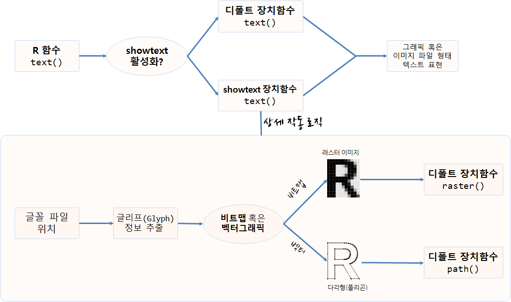

```{r, include=FALSE}
source("tools/chunk-options.R")
library(ggplot2)
library(scales)
library(tidyverse)
library(showtext) # 글꼴, install.packages("showtext")
library(extrafont)
loadfonts()
options(warn=-1)
```

> ## 학습 목표 [^showtext-font] {.objectives}
>
> * R 그래프에 한글 글꼴을 적용한다.
> * `extrafont`와 `showtext` 팩키지를 활용하여 한글 글꼴을 사용한다.

[^showtext-font]: [showtext: Using Fonts More Easily in R Graphs](https://cran.rstudio.com/web/packages/showtext/index.html)


## 1. 한글글꼴 `showtext` 팩키지

[extrafont](https://github.com/wch/extrafont) 팩키지를 통해 한자를 포함한 한글을 처리할 수 있었으나,
[extrafont](https://github.com/wch/extrafont)는 트루타입폰트(`.ttf`)를 PDF 그래픽 장치에 초점을 맞춰 개발이 되었다.
따라서, 데이터과학 최종산출물이 책이 아닌 경우 여러가지 면에서 다양한 한글 글꼴을 표현하는데 있어 한계가 있다.

새로 개발된 [showtext](https://cran.rstudio.com/web/packages/showtext/index.html) 팩키지는 `Ghostscript`같은 
외부 소프트웨어를 활용하지 않고도 다양한 (그래픽) 글꼴을 지원한다. 
[showtext](https://cran.rstudio.com/web/packages/showtext/index.html)로 R 그래프를 생성할 때,
다양한 글꼴(TrueType, OpenType, Type 1, web fonts 등)을 지원한다.



사용자가 그래프프에 텍스트를 넣기 위해 R 함수에서 `text()`를 호출할 때 `showtext`가 활성화 되어 있으면
`showtext` 팩키지 `text()` 함수를 호출해서 그래픽 혹은 이미지 파일에 텍스트를 표현하고 그렇지 않는 경우는 디폴트 장치함수
`text()` 함수를 호출하게 되어 있다.

내부적으로 상세 작동 로직은 글꼴 위치를 파악해서 글리프(glyph) 정보를 추출하고 비트맵 형식, 벡터그래픽 형식에 따라서
비트맵일 경우 `raster()` 장치함수를 호출하고, 벡터그래픽인 경우 `path()` 장치함수를 호출해서 기능을 수행한다.

## 2. 한글 폰트 그래프 사용

### 2.1. 환경설정

`extrafont` 팩키지 `loadfonts()` 함수를 통해 `.ttf` 파일 정보를 확인한다. 
아직 [구글 글끌](http://www.google.com/fonts) 페이지에서 한글 글꼴을 지원하지 않고 있다.

``` {r showtext-font-setup, eval=FALSE}
# 0. 환경설정 --------------------------------------------------------------------------
library(ggplot2)
library(scales)
library(tidyverse)
library(showtext) # 글꼴, install.packages("showtext")
library(extrafont)
loadfonts()
```

### 2.2. 구글 글꼴 설치 및 기본 그래픽 

``` {r showtext-showtext-install, warn=FALSE, message=FALSE}
# 1. 기본(Base) 그래픽 --------------------------------------------------------------------------

## Loading Google fonts (http://www.google.com/fonts)
font.add.google("Gochi Hand", "gochi")
font.add.google("Schoolbell", "bell")

## Automatically use showtext to render text
showtext.auto()

set.seed(123)
## Manually open a graphics device if you run this code in RStudio
## x11()
hist(rnorm(1000), breaks = 30, col = "steelblue", border = "white",
     main = "", xlab = "", ylab = "")
title("Histogram of Normal Random Numbers", family = "bell", cex.main = 2)
title(ylab = "Frequency", family = "gochi", cex.lab = 2)
text(2, 70, "N = 1000", family = "bell", cex = 2.5)
```

### 2.3. ggplot 글꼴 활용

`ggplot`을 통해 showtext 활용 기본 작업흐름을 살펴본다.

1. 글꼴을 적재한다.
1. 그래픽 장치를 연다
1. `showtext`를 통해 텍스트를 표시한다고 지정한다.
1. 그래프를 그린다.
1. 장치를 닫는다.

``` {r showtext-showtext-ggplot}
# 2. ggplot 그래픽 --------------------------------------------------------------------------

dat <- data.frame(cond = factor(rep(c("A","B"), each=200)), 
                  rating = c(rnorm(200),rnorm(200, mean=.8)))

font.add.google("Schoolbell", "bell")

showtext.begin()

ggplot(dat, aes(x=rating)) + 
  geom_histogram(binwidth=.5)+ 
　annotate("text", 1, 2.1, family = "bell", size = 15, color="red", label = "histogram")
showtext.end()
```

### 2.4. 한글 글꼴 그래픽으로 표현

로컬 컴퓨터에 저장된 `.ttf` 파일을 사용자 지정해서 가져온 후 이를 `ggplot`에 반영하여 
한글을 R 그래프에 적용한다.

``` {r showtext-showtext-korean}
# ３. 한글 그래픽 --------------------------------------------------------------------------
## 나눔펜　스크립트
font.add("NanumBarunGothic", "NanumBarunGothic.ttf")

showtext.auto()

p <- ggplot(NULL, aes(x = 1, y = 1)) + ylim(0.8, 1.2) +
  theme(axis.title = element_blank(), axis.ticks = element_blank(),
        axis.text = element_blank()) +
  annotate("text", 1, 1.1, family = "NanumBarunGothic", size = 15, color="red",
           label = "한글 사랑") +
  annotate("text", 1, 0.9, label = 'korean for "Hello, world!"',
           family = "NanumBarunGothic", size = 12)

print(p)