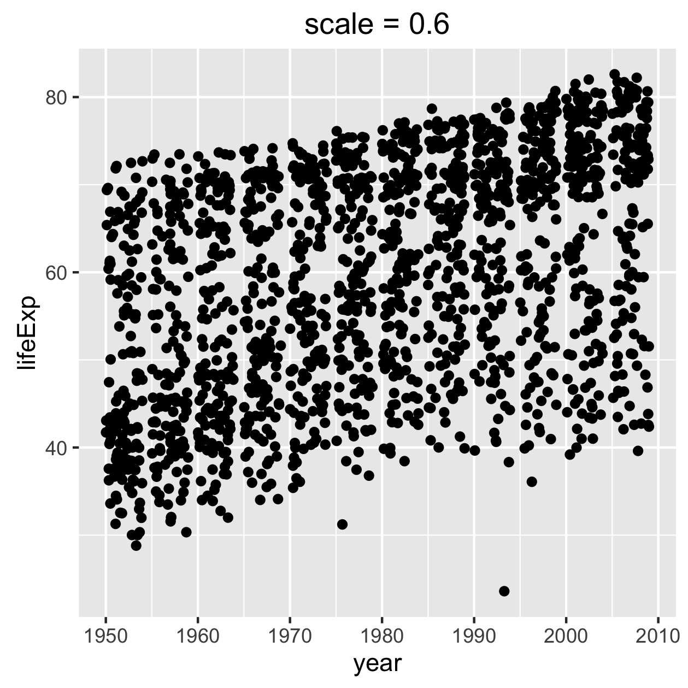
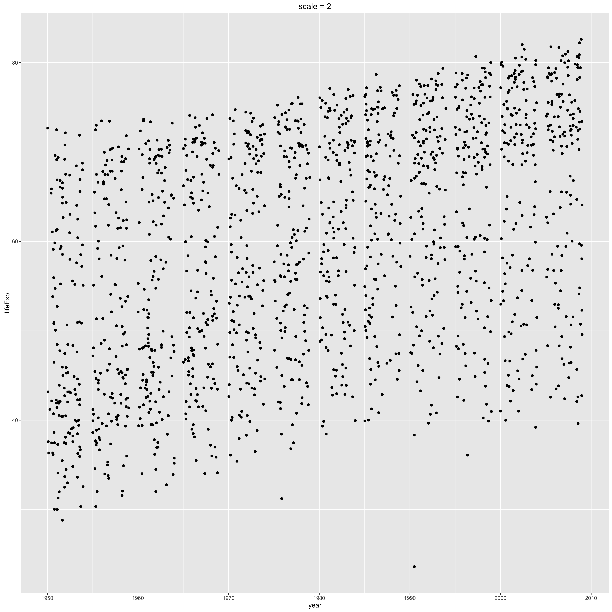
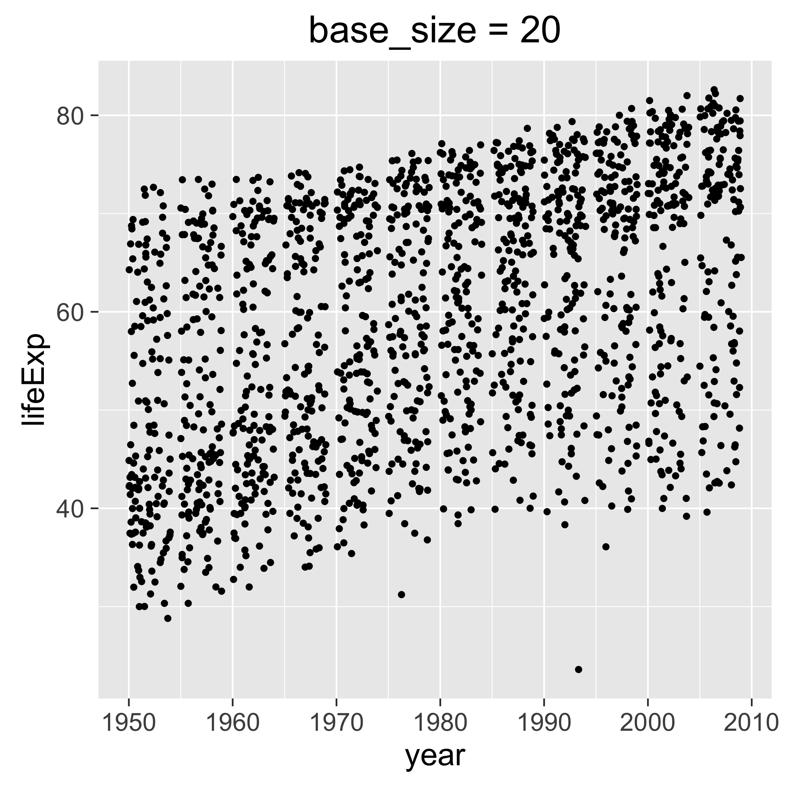
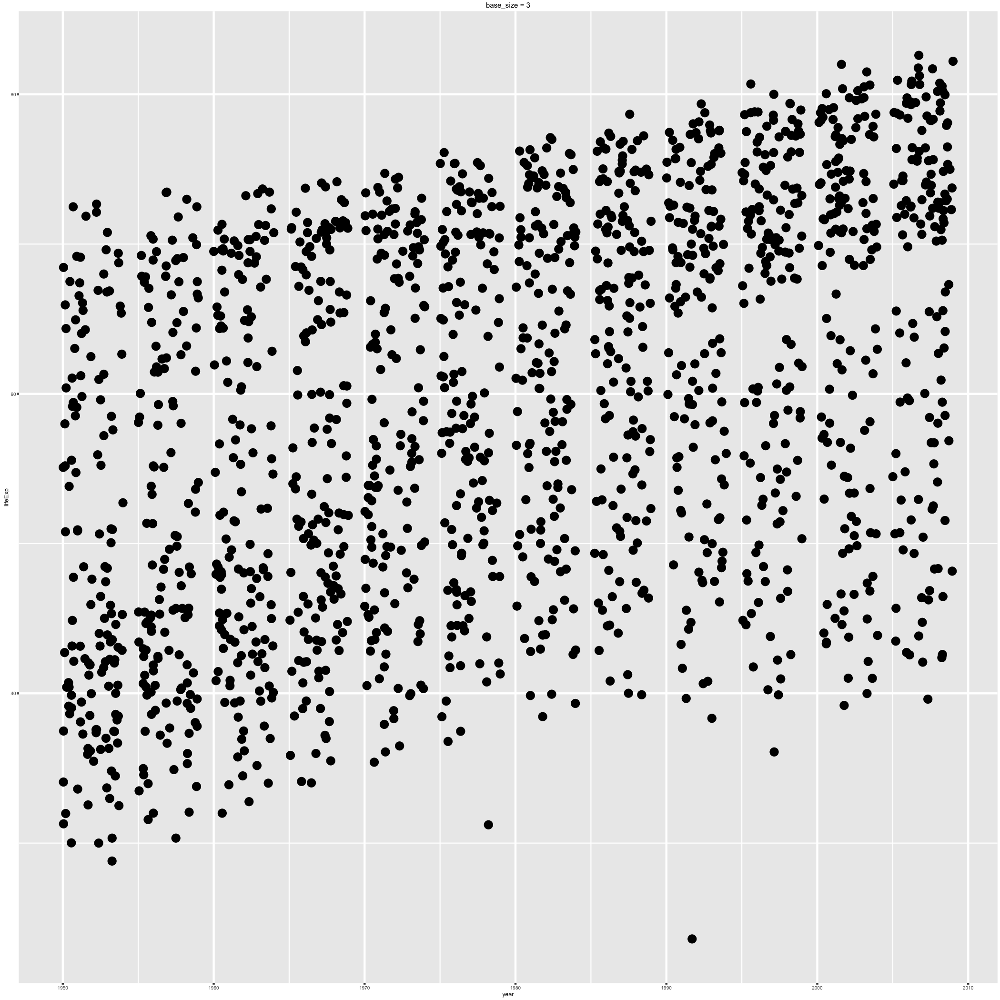

시간을 들여 작성한 시각화 산출물이 R 마크다운 문서 같은 동적문서 내부에만 존재하는 것으로 
항상 적절하거나 충분하지는 않다.
다양한 환경설정을 사용해서 다음 후속작업에 사용될 파일에 작업한 그림을 저장하는 방법을 익힐 필요가 있다.

시각화 산출물을 개발하는 동안에, `RStudio Plots` 창 같은 화면장치를 뿌려지는 그림을 보고 즉각적인 피드백을 받는다.
만족할만큼 작업이 완성되면 그림을 생성하는데 사용된 모든 명령어를 R 스크립트에 저장했는지 확실히 한다.
*모든 것*을 확인한다: 데이터 가져오기부터, 필요한 데이터 조작작업, 그래프 그리는 제도까지.

그림을 파일에 어떻게 저장할까요?

### 마우스에서 떨어져라 [^viz-save-plot]  

[^viz-save-plot]: [Writing figures to file](https://stat545-ubc.github.io/block017_write-figure-to-file.html)

마우스를 사용하는 작업 프로세스 유혹에 절대로 *굴복하지 마라*. 처음에는 마우스 사용이 편하다고 생각되지만,
곧 후회할 것이다. 이유는 마우스를 사용하게 되면 소스코드와 최종 그림 제품에 연결되는 링크가 없어진다.
다른 색상조합 혹은 종횡비, 그래픽장치로 그림을 재생성하고자 할 때, 적절한 소스코드를 까서 알아내야 된다.
이런 곤란한 상황을 타개하려면 아래 방법 중 하나를 사용한다.

### 좋은 명칭이 매우 중요하다.

그림을 생성하는 소스코드를 파일에 저장하려면, 
그림 파일에 컴퓨터가 읽을 수 있고, 문서가 필요없을 정도로 기억하기 좋은 명칭으로 작성한다면,
나중에 코드로 되돌아갈 수 있는 미래를 열게 된다.

[좀비 프로젝트](http://imgur.com/ewmBeQG)가 다시 살아나고, 동료 작업자가 [18개월 전에 생성한 그림](https://twitter.com/JohnDCook/status/522377493417033728)을
제시하는 상황을 상정하자. `fig08_scatterplot-lifeExp-vs-year.pdf` 파일을 평활회귀선을 넣은 TIFF 형식으로 다시 만들 수 있을까?

파일명을 통해 파일을 생성하는데 동원된 코드를 찾는데 도움이 되는 몇가지 속성을 넣을 수 있다:

- **인간-가독성**: 산점도와 더불어 중요한 변수가 어떤 것인지 알게 되는 것이 도움이 된다. 개인 고고학 발굴에 이런 정보가 중요한 맥락을 짚어준다.
- **구체성**: 그림파일 명칭이 얼마나 구체적이고 기술적인지 주목한다; `fig08.pdf` 혹은 `scatterplot.pdf` 같은 일반적인 
  파일명으로 끝나면 안된다. 파일명을 적어도 다수 유일무이한 특성이 갖도록 하는데,
  이렇게 하면 파일명 일부 혹은 전부가 담긴 파일을 검색하는데 도움이 된다.
- **컴퓨터-가독성**: 구체적 명칭 혹은 특정 문자열이 담긴 파일을 하드디스크에서 검색하는 기능을 최신 운영체제에서 제공한다.
  파일명에 공백, 구두점, 기타 이상한 것이 담겨있지 않게 되면, 파일 검색이 더 쉬워진다. 관례로 사용되는 확장자를 사용하게 되면,
  `.R` 혹은 `.Rmd`로 끝나는 파일로 검색범위를 좁힐 수 있다.

이 모든 선례를 참조하면 필요한 R코드를 겨냥해서 찾아내는데 도움이 된다.
이를 통해 코드를 변경하고, 재실행하고, 재사용할 수 있다.

### 그래픽 장치

일반적인 그래픽장치(graphic device) 학습을 하려면 
[`Device`에 대한 R 도움말](http://www.rdocumentation.org/packages/grDevices/functions/Devices)을 참조한다.    
R 도움말은 R이 설치된 로컬 컴퓨터에서도 이용가능하다.

[벡터 그래픽](https://ko.wikipedia.org/wiki/벡터_그래픽스)과 
[래스터(raster) 그래픽](https://ko.wikipedia.org/wiki/래스터_그래픽스) 차이를 이해하는 것이 매우 중요하다.
벡터 그래픽은 형태와 선으로 표현되는 반면에, 래스터 그래픽은 점(픽셀, pixel)을 기반으로 한다.

- 벡터 그래픽 사례: PDF, 포스트스크립트, SVG
    + 장점: 그래픽 디자인과 조판에 적합하고, 크기를 자유롭게 조절해도 깨지지 않음.
- 래스터 그래픽 사례: PNG, JPEG, BMP, GIF
    + 단점: 크기를 키우면 외양이 보기 좋지 않다.
    + 장점: 마이크로소프트 제품과 웹에서 잘 동작함.

벡터, 래스터, 단일 그래픽 장치를 선택해서 지속적으로 사용할 수는 없다.
후속작업에서 사용되는 활용사례를 생각하고 적절한 계획을 세워야 된다.
장래에 최대한 융통성을 발휘하려면 **한가지 형식 이상** 주요 그림을 저장할 수 있어야 된다.
최악의 경우, 여기서 제시되는 규칙을 따를 경우, 새로운 형식으로 저장할 파일을 항상 재생산할 수 있게 된다.

저자가 작성한 그림 대부분은 `pdf()`, `png()` 혹은 두가지 형식으로 되어있다.
아직 사실은 아닐지라도, SVG는 새로운 표준이 될 것이다.
이유는 벡터 그래픽의 크기 조절기능과 더불어 웹친화성이 좋기 때문이다.

'Revolution Analytics' 블로그에서 나온 그림을 파일에 저장하는 조언을 참고한다.

- [10 tips for making your R graphics look their best](http://blog.revolutionanalytics.com/2009/01/10-tips-for-making-your-r-graphics-look-their-best.html)
- [High-quality R graphics on the Web with SVG](http://blog.revolutionanalytics.com/2011/07/r-svg-graphics.html)

### `ggsave()` 명령어로 그림을 파일에 저장

`ggplot2` 팩키지를 사용하는 경우, 그림을 `ggsave()` 명령어로 파일에 저장한다.

컴퓨터 화면에 작성한 그래프를 `ggsave()` 명령어로 파일명만 명시하면 저장할 수 있다:

```r
ggsave("my-awesome-graph.png")
```

이런 접근법이 다른 곳에서도 의미가 있다. 특히, 관례로 사용되는 확장자를 사용하기만 한다면,
그래픽 파일 유형을 추측할 수도 있다.
폭, 높이, 화소수 등을 제어하려면 소매를 걷어붙이고 [인자를 사용](http://www.rdocumentation.org/packages/ggplot2/functions/ggsave)한다.


### `ggsave()` 함수에 그림 객체 전달

파일명 다음에, 가장 흔히 전달되는 인자는 `plot=`으로, 위치로 보면 두번째 인자에 해당된다.
전형적인 `ggplot2` 작업흐름에 따라 그림을 작성해 나가면, 작업결과 생성되는 객체를 `ggsave()` 함수에 전달한다. 예를 들면:


~~~{.r}
p <- ggplot(gapminder, aes(x = year, y = lifeExp)) + geom_jitter()
# during development, you will uncomment next line to print p to screen
# p
ggsave("fig-io-practice.png", p)
~~~

### 비례 축소 확대

그림을 발표자료, 포스터, 원고 목적에 맞춰 달리 준비해야만 한다.
전체 그림영역에 상대적으로 맞춰 그림 제목, 축라벨 등 텍스트 크기도 다뤄야 된다.
이런 작업을 수행하는 방식이 적어도 두가지 있는데 다소 차이나는 작업흐름과 효과를 갖는다.

**`ggsave()` 함수에 `sacle=` 인자 사용** : 
이 방식은 실제 그림 크기를 변경하지만, 부작용으로 그림 제목과 축라벨의 상대적인 크기도 변경한다.
따라서, 이렇게 크기를 변경하게 되면 약식으로 간단히 발표자료, 포스터, 원고 목적에 맞춰 다른 그림크기 버젼을 만들어 낸다.
다른 물리적 크기를 갖는 그림을 후속작업에 삽입할 수 있지만, 프론트엔드 DPI 화소수를 조절할 필요가 있다.
`scale < 1`로 설정하면, 다양한 그림 요소가 그림영역에 비교하여 더 커진다:
`scale > 1`로 설정하면, 반대로 그림 요소가 더 작아진다.
`scale = 0.8`로 설정하면 포스터나 발표자료 슬라이드에 적절히 먹힌다.
아래에 두가지 버젼 그림이 나와 있는데, 이런 효과를 시연하고자 `scale`에 과장된 값을 설정했다.

**활성화된 테마 `base_size` 인자 사용** : [ggplot theme](http://docs.ggplot2.org/dev/vignettes/themes.html)에
`base_size` 인자는 기본 글자체 크기를 참조한다. 
`ggplot(...) + theme(...)`을 통해 변경할 수 있는 테마 요소는 *아니고*,
그보다는 테마 요소를 설정하는데 사용되는 다양한 함수에 대한 인자다.
따라서, 희망하는 효과를 얻고자 한다면, 전체 테마를 생성해서 목적으로 하는 `base_size`를 명세한다.
기본디폴트 `base_size < 12`로 설정하면, 텍스트 요소 크기를 줄이게 되고, 
`base_size > 12`로 설정하면, 크기를 키우게 된다.
아래에 두가지 버젼 그림이 나와 있는데, 이런 효과를 시연하고자 `scale`에 과장된 값을 설정했다.


~~~{.r}
suppressPackageStartupMessages(library(ggplot2))
library(gapminder)
~~~


~~~{.output}
Error in library(gapminder): there is no package called 'gapminder'

~~~


~~~{.r}
p <- ggplot(gapminder, aes(x = year, y = lifeExp)) + geom_jitter()
~~~


~~~{.output}
Error in ggplot(gapminder, aes(x = year, y = lifeExp)): object 'gapminder' not found

~~~


~~~{.r}
p1 <- p + ggtitle("scale = 0.6")
~~~


~~~{.output}
Error in eval(expr, envir, enclos): object 'p' not found

~~~


~~~{.r}
p2 <- p + ggtitle("scale = 2")
~~~


~~~{.output}
Error in eval(expr, envir, enclos): object 'p' not found

~~~


~~~{.r}
p3 <- p + ggtitle("base_size = 20") + theme_grey(base_size = 20)
~~~


~~~{.output}
Error in eval(expr, envir, enclos): object 'p' not found

~~~


~~~{.r}
p4 <- p + ggtitle("base_size = 3") + theme_grey(base_size = 3)
~~~


~~~{.output}
Error in eval(expr, envir, enclos): object 'p' not found

~~~


~~~{.r}
ggsave("img/fig-io-practice-scale-0.3.png", p1, scale = 0.6)
~~~


~~~{.output}
Saving 4.2 x 4.2 in image

~~~


~~~{.output}
Error in grid.draw(plot): object 'p1' not found

~~~


~~~{.r}
ggsave("img/fig-io-practice-scale-2.png", p2, scale = 2)
~~~


~~~{.output}
Saving 14 x 14 in image

~~~


~~~{.output}
Error in grid.draw(plot): object 'p2' not found

~~~


~~~{.r}
ggsave("img/fig-io-practice-base-size-20.png", p3)
~~~


~~~{.output}
Saving 7 x 7 in image

~~~


~~~{.output}
Error in grid.draw(plot): object 'p3' not found

~~~


~~~{.r}
ggsave("img/fig-io-practice-base-size-3.png", p4)
~~~


~~~{.output}
Saving 7 x 7 in image

~~~


~~~{.output}
Error in grid.draw(plot): object 'p4' not found

~~~
<table width="800px" height="100%" border="1">
<tr><td></td>
<td></td></tr>
<tr><td></td>
<td></td></tr>
</table>

`base_size`에 대한 조언으로 [Zev Ross 커닝쪽지](http://zevross.com/blog/2014/08/04/beautiful-plotting-in-r-a-ggplot2-cheatsheet-3/)를 참조한다.


### `ggplot2` 팩키지가 아닌 그림을 파일에 저장

`ggplot2` 팩키지를 사용하고 있다면, `ggsave()` 저장함수를 추천한다.
기본 그래픽 혹은 `lattice` 팩키지를 사용한다면 여기에 나온 일반적인 방법으로 그림을 파일에 저정할 수 있다.
저자가 생각해도 왜 `ggsave()` 함수를 사용하지 않을 또다른 이유를 찾을 수 없다.
역자도 이런 생각에 동의해서 기본 그래픽 혹은 `lattice` 팩키지 사용하는 방법은 번역을 생략한다.

### FAQ에 대한 선수를 치는 대답

#### 존재하지 않거나 빈 그림에 대한 절망감

작업흐름이 인터랙티브 개발에는 잘 적합하지만, 인터랙티브 방식이 아니거나 적당히 거리를 둔 방식으로 
실행하게 되면 그림이 제대로 그려지지 않는 경우가 있다. 다음 경우에 해당되면 정신을 차리고 집중한다.

- 그래프를 생성하는 코드를 함수에 넣거나 루프에 넣어 돌리거나 다른 컴퓨터에서 반복을 돌릴 경우.
- R 스크립트를 인터랙티브가 아닌 방식으로 실행, 예를 들어 `source()`, `Rscript`, `R CMD batch`

**기본 문제제기** : 인터랙티브 방식으로 작업할 때, `p`를 명령라인에 입력해서 `p` 그림 객체를 검사하면,
그림이 화면에 출력된다.
`print(p)` 결과를 실제로 만들어 냈지만, 이를 실현하지 못하는 경우도 있다.
인터랙티브 방식인 아닌데 코드를 실행해서 동일한 결과를 얻으려면, `print()` 명식적으로 함수를 호출하면 된다.

다음에 시각화하는 명령어를 함수 내부에 감싸넣었다. 좌측 함수는 PNG를 생성하는데 실패한 반면에,
우측 함수는 PNG 파일을 생성해낸다. 
두가지 모두 데이터를 `gapminder`로, `ggplot2` 팩키지를 불러 메모리에 올린 것을 가정한다.

<table border = 1>
<tr>
<td valign="top">
```r
## implicit print --> no PNG
f_despair <- function() {
  png("test-fig-despair.png")
  p <- ggplot(gapminder,
     aes(x = year, y = lifeExp))
  p + geom_jitter()
  dev.off()    
}
f_despair()
```
</td>
<td valign="top">
```r
## explicit print --> good PNG
f_joy <- function() {
  png("test-fig-joy.png")
  p <- ggplot(gapminder,
     aes(x = year, y = lifeExp))
  p <- p + geom_jitter()
  print(p) ## <-- VERY IMPORTANT!!!
  dev.off()    
}
f_joy() 
```
</td>
</tr>
</table>


또다른 유형의 대실패는 아무 것도 없는 그림 파일로 저장되는 사례다.
그림을 예상하지만, 생략되었거나 아무 것도 없다면, **명시적으로 그림을 출력(`print()`)하는 것을 기억하라**.

스택오버플로우에 있는 연관된 질문과 답글은 다음과 같다

  * [Using png not working when called within a function](http://stackoverflow.com/questions/9206110/using-png-not-working-when-called-within-a-function)

  * [ggplot's qplot does not execute on sourcing](http://stackoverflow.com/questions/6675066/ggplots-qplot-does-not-execute-on-sourcing)

  * [Save ggplot within a function](http://stackoverflow.com/questions/7034647/save-ggplot-within-a-function)


### Chunk 명칭이 그림 파일명으로 결정된다.

R 마크다운 파일에서 R 코드덩어리(chunk)에서 생성된 파일 주제로 되돌아 가보자.
YAML 전문에 `keep_md: true`로 설정하면, 그림이 파일에 저장된다.
`foo.Rmd`를 렌더링하게 되면 `foo.md`, `foo.html` 파일과 더불어, 
문서에서 생성된 그림을 포함하는 `foo_files` 디렉토리가 생성된다.
기본디폴트 설정으로 그림파일명이 `unnamed-chunk-7.png` 처럼 무의미하게 붙는다.
이렇게 되면 특정 그림을 찾기가 쉽지 않게 된다.
하지만, R 코드덩어리에 명칭을 부여하면, 그 명칭이 그림파일명으로 자동 부여된다.

예를 들어, R 코드덩어리를 `scatterplot-lifeExp-vs-year` 이름으로 붙이게 되면,


~~~{.r}
p <- ggplot(gapminder, aes(x = year, y = lifeExp)) + geom_jitter()
~~~


~~~{.output}
Error in ggplot(gapminder, aes(x = year, y = lifeExp)): object 'gapminder' not found

~~~


~~~{.r}
p
~~~


~~~{.output}
Error in eval(expr, envir, enclos): object 'p' not found

~~~

상기 명령어를 실행하면 적합하게 명명된 그림 파일이 생성된다.


~~~{.r}
list.files("block017_write-figure-to-file_files/", recursive = TRUE)
~~~


~~~{.output}
character(0)

~~~

다른 곳에서도 그림을 사용할 계획이 있다면, 아마도 명시적으로 위에서 기술된 방법을 사용하여 그림을 파일에 저장해야 된다.
코드덩어리에 명칭을 붙이는 방법이 향후 유지보수 작업에 유연성을 제공할 것이다.

### 정리

지금까지 생성한 임시 파일을 삭제하자.


~~~{.r}
file.remove(list.files(pattern = "^test-fig*"))
~~~


~~~{.output}
logical(0)

~~~
