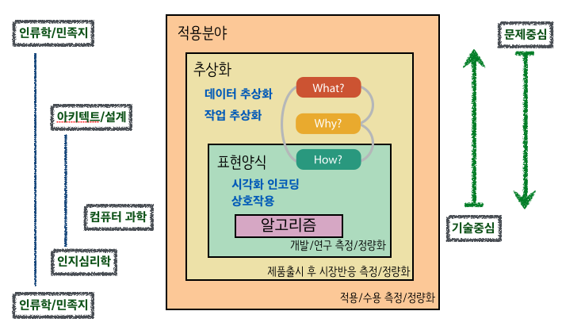

```{r  include = FALSE}
source("tools/chunk-options.R")
library(dplyr)
library(ggplot2)

# Multiple plot function
#
# ggplot objects can be passed in ..., or to plotlist (as a list of ggplot objects)
# - cols:   Number of columns in layout
# - layout: A matrix specifying the layout. If present, 'cols' is ignored.
#
# If the layout is something like matrix(c(1,2,3,3), nrow=2, byrow=TRUE),
# then plot 1 will go in the upper left, 2 will go in the upper right, and
# 3 will go all the way across the bottom.
#
multiplot <- function(..., plotlist=NULL, file, cols=1, layout=NULL) {
  library(grid)

  # Make a list from the ... arguments and plotlist
  plots <- c(list(...), plotlist)

  numPlots = length(plots)

  # If layout is NULL, then use 'cols' to determine layout
  if (is.null(layout)) {
    # Make the panel
    # ncol: Number of columns of plots
    # nrow: Number of rows needed, calculated from # of cols
    layout <- matrix(seq(1, cols * ceiling(numPlots/cols)),
                    ncol = cols, nrow = ceiling(numPlots/cols))
  }

 if (numPlots==1) {
    print(plots[[1]])

  } else {
    # Set up the page
    grid.newpage()
    pushViewport(viewport(layout = grid.layout(nrow(layout), ncol(layout))))

    # Make each plot, in the correct location
    for (i in 1:numPlots) {
      # Get the i,j matrix positions of the regions that contain this subplot
      matchidx <- as.data.frame(which(layout == i, arr.ind = TRUE))

      print(plots[[i]], vp = viewport(layout.pos.row = matchidx$row,
                                      layout.pos.col = matchidx$col))
    }
  }
}
````

> ## 학습 목표  {.objectives}
>
> * 데이터 시각화의 중요성을 이해한다.
> * 시각화 얼개를 통해 시각화를 목적과 방향을 이해한다.


### Anscombe 4종류 데이터(Anscombe's Quartet) [^anscombe] [^anscombe-jstor]

Anscombe는 1973년 동일한 통계량을 갖는 4종류 데이터셋을 만들어서 시각화의 중요성을 공개했다.

|  통계량     |   값  |
|-------------|-------|
|  평균(`x`)  |  9    |
|  분산(`x`)  |  11   |
|  평균(`y`)  |  7.5  |
|  분산(`y`)  |  4.1  |
|  상관계수   |  0.82  |
|  회귀식     |  y = 3.0 + 0.5*x |


[^anscombe]: [Anscombe quartet](https://en.wikipedia.org/wiki/Anscombe%27s_quartet)
[^anscombe-jstor]: Anscombe, F. J. (1973). "Graphs in Statistical Analysis". American Statistician 27 (1): 17–21.


``` {r}
data(anscombe)
anscombe <- tbl_df(anscombe)
anscombe
```

#### Anscombe 데이터셋 4종 기술통계량

```{r}
# x1, x2, x3, x4 평균
anscombe %>% select(x1,x2,x3,x4) %>% 
summarize(x1Mean=round(mean(x1),1), y2Mean=round(mean(x2),2), y3Mean=round(mean(x3),1), y4Mean=round(mean(x4),1))
# x1, x2, x3, x4 분산
anscombe %>% select(x1,x2,x3,x4) %>% 
summarize(x1Var=round(var(x1),1), x2Var=round(var(x2),1), x3Var=round(var(x3),1), x4Var=round(var(x4),1))
# y1, y2, y3, y4 평균
anscombe %>% select(y1,y2,y3,y4) %>% 
summarize(y1Mean=round(mean(y1),1), y2Mean=round(mean(y2),2), y3Mean=round(mean(y3),1), y4Mean=round(mean(y4),1))
# y1, y2, y3, y4 분산
anscombe %>% select(y1,y2,y3,y4) %>% 
summarize(y1Var=round(var(y1),1), y2Var=round(var(y2),1), y3Var=round(var(y3),1), y4Var=round(var(y4),1))
# x1:y1 ~ x4:y4 상관계수
anscombe %>% 
summarise(cor1=round(cor(x1,y1),2), cor2=round(cor(x2,y2),2), cor3=round(cor(x3,y3),2),cor4=round(cor(x4,y4),2))
# y1:x1-x4 ~ y1:x1-x4 회귀분석
lm_fit <- function(y1, x1, dat) {
  the_fit <- lm(y1 ~ x1, dat)
  setNames(data.frame(t(coef(the_fit))), c("intercept", "slope"))
}
gfits <- anscombe %>%
  do(reg1 = lm_fit(y1, x1, .), reg2=lm_fit(y2, x2, .), 
     reg3=lm_fit(y3, x3, .), reg4=lm_fit(y4, x4, .))

unlist(gfits$reg1)
unlist(gfits$reg2)
unlist(gfits$reg3)
unlist(gfits$reg4)
```


#### Anscombe 데이터셋 4종 시각화

``` {r}
p1 <- ggplot(anscombe) + geom_point(aes(x1, y1), color = "darkorange", size = 3) + theme_bw() + scale_x_continuous(breaks = seq(0, 20, 2)) + scale_y_continuous(breaks = seq(0, 12, 2)) + geom_abline(intercept = 3, slope = 0.5, color = "cornflowerblue") + expand_limits(x = 0, y = 0) + labs(title = "dataset 1")
p2 <- ggplot(anscombe) + geom_point(aes(x2, y2), color = "darkorange", size = 3) + theme_bw() + scale_x_continuous(breaks = seq(0, 20, 2)) + scale_y_continuous(breaks = seq(0, 12, 2)) + geom_abline(intercept = 3, slope = 0.5, color = "cornflowerblue") + expand_limits(x = 0, y = 0) + labs(title = "dataset 2")
p3 <- ggplot(anscombe) + geom_point(aes(x3, y3), color = "darkorange", size = 3) + theme_bw() + scale_x_continuous(breaks = seq(0, 20, 2)) + scale_y_continuous(breaks = seq(0, 12, 2)) + geom_abline(intercept = 3, slope = 0.5, color = "cornflowerblue") + expand_limits(x = 0, y = 0) + labs(title = "dataset 3")
p4 <- ggplot(anscombe) + geom_point(aes(x4, y4), color = "darkorange", size = 3) + theme_bw() + scale_x_continuous(breaks = seq(0, 20, 2)) + scale_y_continuous(breaks = seq(0, 12, 2)) + geom_abline(intercept = 3, slope = 0.5, color = "cornflowerblue") + expand_limits(x = 0, y = 0) + labs(title = "dataset 4")

multiplot(p1, p2, p3, p4, cols=2, main="Anscombe's Quartet")
```

### 시각화 [^tamara] 

컴퓨터를 기반으로 한 시각화 시스템은 시각적으로 데이터를 표현함으로 인해서 
사람들이 작업을 더욱 효율적으로 수행할 수 있도록 돕는다.

여기서 시각화가 적합한 상황은 인공지능 및 전사화를 통해 사람을 대체하기 보다는 인간능력을 증강시키는데 유용하다.
따라서, 완전 자동화 해결책이 존재하고 신뢰성이 있는 경우 시각화가 그다지 필요하지는 않는다.
또한, 많은 분석문제에는 어떤 질문을 던져야 되는지 사전에 알고 있는 경우가 적어, 명세가 분명하지 않는 경우가 있는데,
이런 목적에 유용하다.

> ### 시각화 {.callout}
> 
> "Computer-based visualization systems provide visual representations of datasets
 designed to help people carry out tasks more effectively" -- Tamara Munzner


[^tamara]: [Tamara Munzner. Visualization Analysis and Design. A K Peters Visualization Series, CRC Press, 2014](http://www.cs.ubc.ca/~tmm/vadbook/)

#### 시각화가 왜 필요한가?

**인지부하(cognitive load)**를 **시각적 지각(perception)**으로 바꿔 해당 작업을 더욱 효과적으로 처리하는데 시각화를 사용한다.

``` {r}
library(datasets)
women
```

`women` 데이터가 정렬이 되어 있어서, 신장이 커짐에 따라 체중이 증가하는 것을 알 수 있지만, 데이터만 보고 이해하려면
인지적으로 데이터 한줄을 읽고 머리속으로 생각하고, 두번째 줄을 읽고 생각하고, ... 이런 과정을 반복하면서 인지적 부하가 증가하게 된다.
하지만, 시각적으로 표현하게 되면 한눈에 신장과 체중 관계를 볼 수 있다.

``` {r}
women %>% ggplot(aes(y=weight, x=height)) + geom_point(color='blue', size=2) +
  geom_smooth(color='pink')
```

#### 시각화 분석 얼개 구성요소

시각화 분석 얼개는 4가지 부분으로 구성된다. 

- 전문영역 : 최종 사용자 고객이 누군인가?
- 추상화
    + 전문영역의 구체적인 점을 시각화 용어로 번역
        * **데이터 추상화** : 시각화하는 것이 무엇(what)인가?
        * **작업 추상화** : 왜(why) 사용자가 눈을 돌리는가?
- 표현양식(idiom)
    + 데이터가 어떻게(How) 시각화되는가?
    	* **시각적 인코딩 표현양식** : 시각화하는 방법
    	* **상호작용 표현양식** : 조작하는 방법
- 알고리즘
	+ 효율적 연산방법    	

[Munzner, Tamara. "A nested model for visualization design and validation." Visualization and Computer Graphics, IEEE Transactions on 15.6 (2009): 921-928.](http://www.cs.ubc.ca/~tmm/talks/iv09/nestedmodel-4x4.pdf)



#### 시각화 분석 접근방향

시각화 시스템 실행시간, 메모리 사용량 등을 측정하고, 연산 복잡성을 분석하는 알고리즘 작업은 컴퓨터 과학자의 몫이다.
여러가지 대안 시스템 아키텍처를 정당화하고 시각적 인코딩 방법과 상호작용하는 표현양식을 설계하는 것은 시스템 설계자의 몫이다.
시각화 시스템 결과물을 정량적으로 분석하고, 사용자 인간에 대한 실험을 추진하는 것은 인지심리학자의 몫이다.
이를 감싸고 있는 데이터 추상화와 작업추상화가 있는데, 시스템 설계자가 앞단에서 설계하면 후행단에서 인지심리학자가 검증하고,
컴퓨터 과학자가 개발하는 구조를 갖는다.

이 모든 시작은 전문영역에서 문제점을 인식하고 기존의 도구를 사용하는 목표 사용자를 관측하는 것에서 시작되는데 이는 인류학자, 민족지라는 분야와 연관된다.
따라서, 기술중심으로 밖으로 퍼져나갈 수도 있지만, 문제해결작업으로 시각화를 활용하는 것도 가능한 접근법이다.

> ### 시각화 도구{.callout}
> 
> - **명령형(imperative)**: "방법(how)"에 초점, Processing, OpenGL, prefuse
> - **선언형(declarative)**: "무엇(what)"에 초점, D3, ggplot2, Protovis 

